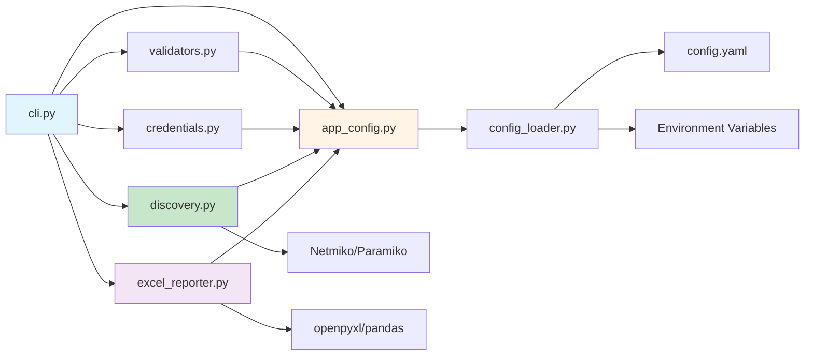

# Deep Dive: CDP Network Audit Tool

## "Production-Ready Python Automation, Built for Scale."

A **modular, enterprise-grade** network discovery utility that crawls Cisco network topologies via **Cisco Discovery Protocol (CDP)**. It connects (optionally through an SSH jump/bastion host), collects `show cdp neighbors detail` and `show version`, parses outputs with **TextFSM**, enriches with **DNS resolution**, and writes structured **Excel reports** from pre-formatted templates. 

**What's New:** The tool has undergone a **complete architectural restructure** — migrated from a monolithic script to a **modular Python package** with YAML-based configuration, dedicated modules for each concern, and enhanced maintainability for enterprise deployments.

[:material-github: View Source Code on GitHub](https://github.com/Nautomation-Prime/Cisco_CDP_Network_Audit){ .md-button .md-button--primary }

---

## ✨ Highlights

- **Modular architecture** — Separation of concerns with dedicated modules for credentials, discovery, reporting, and validation
- **YAML configuration** — Human-readable `config.yaml` for easy customization without touching code
- **Parallel discovery** with a worker pool (configurable via environment variables or YAML config)
- **Two-tier authentication** — Primary user first, then customizable fallback user if primary fails
- **Jump server / bastion support** — Paramiko channel + Netmiko sock for secure proxy connections
- **DNS enrichment** — Parallel DNS resolution for discovered hostnames
- **Professional Excel reporting** — Template-driven reports with multiple sheets and metadata stamping
- **Comprehensive validation** — Pre-flight checks for templates, Excel files, and configuration
- **Package-based execution** — Run as `python -m cdp_audit` or use the included launcher script

---

## 🎯 The Nautomation Prime Philosophy in Action

Before diving into the code, understand how every design decision reflects our three core principles:

### **Principle 1: Modular, Maintainable Architecture**

Every component has a **single, clear responsibility**. Credentials are handled by `credentials.py`, discovery by `discovery.py`, validation by `validators.py`. This isn't just good practice — it's **essential for team collaboration and long-term maintenance**. When a bug appears in credential handling, you know exactly where to look.

### **Principle 2: Configuration as Code (the Right Way)**

Configuration migrated from hardcoded Python to **human-readable YAML**. Network engineers can customize worker threads, timeouts, and credential targets **without touching Python code**. Version control tracks configuration changes. Rollbacks are simple: `git revert`.

### **Principle 3: Production-Hardened Design**

You'll notice patterns like thread locks, exception handling, retry logic, comprehensive validation, and graceful cleanup. These aren't "nice to have" — they're **essential for running automation on critical infrastructure** without surprises at 3 AM.

### **Principle 4: Vendor-Neutral Foundation**

Built on industry-standard libraries: **Netmiko** (SSH connection handling), **Paramiko** (SSH tunnelling), **Pandas & OpenPyXL** (Excel reporting), **TextFSM** (parsing), **PyYAML** (configuration). Your skills remain portable.

---

## 🧱 Repository Architecture (Modular Structure)

```text
.
├── cdp_audit/                   # Main Python package (NEW!)
│   ├── __init__.py              # Package initialization
│   ├── __main__.py              # Package entry point
│   ├── app_config.py            # Centralized config access
│   ├── cli.py                   # Command-line interface
│   ├── credentials.py           # Credential management
│   ├── discovery.py             # Network discovery engine
│   ├── excel_reporter.py        # Excel report generation
│   ├── logging_setup.py         # Logging configuration
│   └── validators.py            # Pre-flight validations
├── ProgramFiles/
│   ├── textfsm/
│   │   ├── cisco_ios_show_cdp_neighbors_detail.textfsm
│   │   └── cisco_ios_show_version.textfsm
│   └── config_files/
│       ├── config_loader.py     # YAML config loader class
│       ├── config.py            # Backward compatibility wrapper
│       ├── 1 - CDP Network Audit _ Template.xlsx
│       └── logging.conf         # Optional logging config
├── config.yaml                  # Main configuration file
├── requirements.txt             # Python dependencies
├── run.bat                      # Windows launcher script
└── portable_env/                # Portable Python environment (optional)
```

> **Key Architectural Change:** Migrated from monolithic `main.py` to a **modular package structure** (`cdp_audit/`) with separation of concerns, enabling easier testing, maintenance, and team collaboration.
>
> **Paths are case-sensitive** on Linux/macOS; keep names exactly as shown.

---

## 📦 Requirements

- **Python:** 3.8+
- **Python packages:** `pandas`, `openpyxl`, `textfsm`, `paramiko`, `netmiko`
- **(Windows only, optional)** `pywin32` for Windows Credential Manager integration

Install in one go:

```bash
pip install pandas openpyxl textfsm paramiko netmiko pywin32
```

### Tested Devices

This tool has been tested and verified on the following Cisco IOS and IOS-XE platforms:

- **Catalyst 9200 Series**
- **Catalyst 3650 Series**
- **Catalyst 3650C**
- **Catalyst 3650CG**
- **Catalyst 3650CX**
- **Catalyst 2960X Series**
- **Catalyst 2960 Series**

> **Note:** The tool should work with any Cisco IOS/IOS-XE device that supports CDP and the required show commands. The devices listed above have been explicitly tested and validated.

### Required Support Files

- **TextFSM templates:**
  - `ProgramFiles/textfsm/cisco_ios_show_cdp_neighbors_detail.textfsm`
  - `ProgramFiles/textfsm/cisco_ios_show_version.textfsm`
- **Excel template:**
  - `ProgramFiles/config_files/1 - CDP Network Audit _ Template.xlsx`

The script validates presence of these files at startup and exits if any are missing.

---

## ⚙️ Configuration System

The tool uses a **modern, layered configuration system** with three configuration sources (in priority order):

### Layer 1: config.yaml (Primary Configuration)

**All default settings are defined in a human-readable YAML file** at the project root.

The `config.yaml` file provides version-control-friendly configuration that **non-programmers can edit**. Settings are loaded by `ProgramFiles/config_files/config_loader.py`, which provides the `Config` class with type-safe property accessors and validation.

**Network Connection Settings:**

```yaml
network:
  jump_host: "192.0.2.10"     # Default jump/bastion server (empty = direct)
  device_type: "cisco_ios"    # Netmiko device type
  ssh_port: 22                # SSH port for connections
  default_limit: 10           # Max concurrent worker threads
  default_timeout: 10         # SSH/auth/read timeouts (seconds)
  max_retry_attempts: 3       # Connection retries per device
  dns_max_workers: 32         # Max DNS resolution threads
  dns_min_workers: 4          # Min DNS resolution threads
```

**Credential Settings:**

```yaml
credentials:
  cred_target: "MyApp/ADM"         # Primary credential target (Windows Credential Manager)
  alt_creds: "MyApp/Answer"        # Fallback credential target
```

**File Paths (Auto-Resolved from Project Root):**

```yaml
file_paths:
  base_dir: "."  # Project root
  cdp_template: "ProgramFiles/textfsm/cisco_ios_show_cdp_neighbors_detail.textfsm"
  ver_template: "ProgramFiles/textfsm/cisco_ios_show_version.textfsm"
  excel_template: "ProgramFiles/config_files/1 - CDP Network Audit _ Template.xlsx"
  logging_config: "ProgramFiles/config_files/logging.conf"
```

**Excel Report Customization:**

```yaml
excel:
  sheets:
    audit: "Audit"
    dns: "DNS Resolved"
    auth_errors: "Authentication Errors"
    conn_errors: "Connection Errors"
  metadata_cells:
    site_name: "B4"
    date: "B5"
    time: "B6"
    primary_seed: "B7"
    secondary_seed: "B8"
  data_start_rows:
    audit: 12        # Data appends starting at row 12
    other: 2         # DNS/errors start at row 2
```

**Why YAML Configuration?**

!!! success "YAML Benefits"
    - **Human-Readable**: Edit settings without Python knowledge
    - **Version Control Friendly**: Plain text, works seamlessly with Git
    - **Hierarchical Structure**: Logical grouping (network/credentials/paths)
    - **Comment Support**: Inline documentation stays with config
    - **Type Safety**: Config loader validates and provides defaults
    - **Data-Only**: No code execution (safer than Python config files)
    - **Team Collaboration**: Network engineers can customize without developer involvement

### Layer 2: Environment Variables (Runtime Overrides)

Environment variables **override** config.yaml settings at runtime:

| Variable | Description | config.yaml Default |
| :--------- | :------------ | :-------------------- |
| `CDP_LIMIT` | Max concurrent worker threads | 10 |
| `CDP_TIMEOUT` | SSH/auth/read timeouts (seconds) | 10 |
| `CDP_JUMP_SERVER` | Jump host (IP/hostname). Empty = direct | `""` |
| `CDP_PRIMARY_CRED_TARGET` | CredMan target for primary creds | `MyApp/ADM` |
| `CDP_ANSWER_CRED_TARGET` | CredMan target for fallback creds | `MyApp/Answer` |
| `LOGGING_CONFIG` | Path to INI logging config | `ProgramFiles/config_files/logging.conf` |

**Example (Windows PowerShell):**

```powershell
# Override YAML defaults for this session
$env:CDP_LIMIT = "20"                   # Use 20 concurrent workers
$env:CDP_TIMEOUT = "15"                 # 15-second timeouts
$env:CDP_JUMP_SERVER = "bastion.corp.local"  # Use this jump server
$env:CDP_PRIMARY_CRED_TARGET = "MyApp/NetworkAdmin"
$env:CDP_ANSWER_CRED_TARGET = "MyApp/LocalAdmin"
```

**When to Use Environment Variables:**

- **Testing**: Temporary overrides without modifying config.yaml
- **Multi-Environment Deployments**: Different settings for dev/staging/prod
- **CI/CD Pipelines**: Dynamic configuration from build systems
- **Per-Instance Customization**: Running multiple instances with different settings

### Layer 3: Config Loader (`config_loader.py`)

The `Config` class handles all configuration access with validation:

**Key Features:**

- **Automatic Search**: Looks for `config.yaml` in project root, module directory, and current directory
- **Environment Variable Priority**: Env vars override YAML settings
- **Type Conversion**: Automatically converts strings to int/bool/Path
- **Default Values**: Provides sensible defaults if YAML keys missing
- **Validation**: Fails fast if config file is malformed or missing required files
- **Property-Based Access**: Use `config.JUMP_HOST` instead of dict lookups

**Example Usage in Code:**

```python
from cdp_audit.app_config import config

# Access configuration values
jump_host = config.JUMP_HOST           # "192.0.2.10" or env override
timeout = config.DEFAULT_TIMEOUT        # 10 or env override
cdp_template = config.CDP_TEMPLATE      # Path object, validated

# Config loader has already validated these exist
print(f"Using jump host: {jump_host}")
print(f"Timeout: {timeout} seconds")
```

!!! tip "Best Practice: Configuration Priority"
    Use **config.yaml** for persistent organizational defaults that should be version-controlled. Use **environment variables** for runtime-specific overrides (testing, different environments) or secrets that shouldn't be committed to Git.

---

## 🏗️ Technical Architecture

The tool operates as a **modular Python package** with eight primary modules, each with clear responsibilities:

| Module | Responsibility | Why It Matters |
| :--- | :--- | :--- |
| **`cli.py`** | Command-line interface and program entry point | Clean separation of CLI logic from business logic |
| **`credentials.py`** | Secure credential collection and OS integration | Passwords stay out of code and config files |
| **`discovery.py`** | Multi-threaded topology crawling via CDP | Discovers 50+ devices in seconds, not minutes |
| **`excel_reporter.py`** | Professional, templated report generation | Maintains business branding and formatting |
| **`validators.py`** | Pre-flight checks for templates and configuration | Catches problems early; prevents mid-run failures |
| **`logging_setup.py`** | Logging configuration bootstrap | Consistent logging across all modules |
| **`app_config.py`** | Centralized configuration access point | Single source of truth for config values |
| **`config_loader.py`** | YAML configuration loading and validation | Type-safe config with defaults and env overrides |

### Architectural Principles

!!! quote "Design Philosophy"
    **Separation of Concerns**: Each module has a single, well-defined responsibility. Changes to Excel formatting don't affect discovery logic.
    
    **Dependency Injection**: Modules receive configuration objects rather than reading global state. Easier to test and reason about.
    
    **Fail-Fast Validation**: The `validators.py` module checks all prerequisites **before** discovery starts. No more failures after 10 minutes of crawling.
    
    **Testability**: Each module can be imported and tested independently. Mock the config, test credential logic in isolation.

### Module Interaction Flow



**Execution Flow:**

1. **`cli.py`** loads configuration via **`app_config.py`**
2. **`validators.py`** performs pre-flight checks (templates exist, Excel valid)
3. **`credentials.py`** collects and validates authentication credentials
4. **`discovery.py`** executes threaded network crawling
5. **`excel_reporter.py`** generates professional report from template
6. **`cli.py`** displays summary and exit status

### Package Entry Points

The tool can be executed in **three ways**:

**1. As a Python Package (Recommended):**

```bash
python -m cdp_audit
```

Uses `cdp_audit/__main__.py` as the entry point, which calls `cli.main()`.

**2. Via Windows Launcher (Easiest for Non-Developers):**

```batch
run.bat
```

Validates environment, activates portable venv, runs the package.

**3. Direct Module Execution (Development):**

```bash
python -m cdp_audit.cli
```

Directly calls the CLI module (useful for debugging).

---

## 🔐 Credentials Model

This tool supports a **primary credential** and a **fully customizable fallback credential**:

- **Primary credentials** (used for the jump and the device): read from Windows Credential Manager if present (default target `MyApp/ADM`), else prompted. You can optionally save what you type back to Credential Manager.
- **Fallback credentials** (device hop only, jump still uses primary): **username is fully customizable via config.yaml** (default: `answer`). Password is read from Credential Manager (default target `MyApp/Answer`) or prompted; you may choose to save it.

> **Note:** On non-Windows platforms, prompts are used (no Credential Manager).
>
> **Customization:** Change the fallback username in `config.yaml` by setting `cdp_fallback_username` under the `credentials` section to match your environment (e.g., `localadmin`, `backup`, `netops`, `svc_network`).

### Why Credential Management Matters

**The Problem:** Network automation requires credentials. Storing them in plaintext files or hardcoding them in scripts is a security nightmare. Even prompting users every time is error-prone and doesn't scale to 10+ discovery jobs daily.

**The Solution:** Leverage native OS credential stores. Windows has Credential Manager, macOS has Keychain, Linux has pass. These are designed for exactly this use case and integrate with enterprise SSO/password managers.

**User Experience:** When you run CDP Network Audit for the first time, the script checks Windows Credential Manager for stored credentials. If none are found, it prompts you to enter your username and password. Once you provide them, the script saves them to Windows Credential Manager and uses them for the discovery process. On subsequent runs, the script retrieves the stored credentials automatically without prompting you again.

### `CredentialManager.__init__()`

```python
def __init__(self):
    # Load YAML config via config_loader module
    from ProgramFiles.config_files.config_loader import Config
    config = Config()
    
    # Read from environment variables (override) or config.yaml (default)
    self.primary_target = os.getenv("CDP_PRIMARY_CRED_TARGET", config.CRED_TARGET)
    self.fallback_target = os.getenv("CDP_FALLBACK_CRED_TARGET", config.ALT_CREDS)
    self.fallback_username = os.getenv("CDP_FALLBACK_USERNAME", config.CDP_FALLBACK_USERNAME)
```

**Line-by-Line:**

- Import the Config class from `config_loader.py` which parses `config.yaml`
- Instantiate Config to load YAML settings with validation and type safety
- Environment variables override YAML config if set (for runtime flexibility)
- Three configurable values: primary target, fallback target, and fallback username
- The config loader validates YAML syntax and provides defaults for missing values

**Why This Matters:**

- **config.yaml**: Human-readable, persistent, version-controlled settings that match your organization's standards
- **Environment variables**: Runtime overrides for different environments (dev/prod) or testing
- **Config loader**: Provides type-safe property accessors and validation
- **Fallback username**: No longer hardcoded—customize in config.yaml to match your local accounts (e.g., `localadmin`, `netops`, `backup`)
- **Separation of concerns**: Configuration data (YAML) is separate from configuration logic (Python class)
- Credentials themselves are still stored securely in Credential Manager (Windows) or prompted on other platforms

### `_read_win_cred(target_name: str)`

Reads encrypted credentials from Windows Credential Manager. Returns `(username, password)` tuple or `(None, None)` if not found.

**Key Points:**

- Only imports `win32cred` if available (Windows only)
- Handles both bytes and string returns for compatibility
- Decodes password from UTF-16LE (Windows internal format)
- Gracefully fails and returns None instead of crashing

**Why This Approach:**

- **No plaintext storage:** Credentials are encrypted by Windows
- **Cross-platform:** Non-Windows systems skip this and use prompts
- **Version-agnostic:** Works with multiple pywin32 versions

### `_write_win_cred(target: str, username: str, password: str) -> bool`

Writes credentials to Windows Credential Manager for future reuse. Users can optionally save credentials after first prompt.

**Key Points:**

- Password is encoded to UTF-16LE before storage (Windows requirement)
- `CRED_PERSIST_LOCAL_MACHINE` means credentials persist across sessions
- Failures are logged at DEBUG level (not alarming)
- Returns `True` on success, `False` on failure

**Why This Matters:**

- Users can avoid re-prompting on subsequent runs
- Credentials are encrypted and protected by Windows
- Optional save means users control persistence

### `get_secret_with_fallback(...) -> Tuple[str, str]`

The credential retrieval orchestrator with multi-step fallback:

1. **Try Credential Manager first** (if Windows)
2. **Fall back to interactive prompt**
3. **Optionally save to Credential Manager**

**Two-Credential Model:**

- **Primary:** Your main automation account (flexible username, likely AD-backed)
- **Fallback:** A secondary user on each device (username customisable in `config.py`, typically a local account)

**Why This Design:**

- Zero installation friction - first run prompts, subsequent runs use saved credentials
- Two credentials maximise success: primary fails → retry with fallback
- Jump host always uses primary (tighter control)
- Device can fall back to secondary user (local account)
- Fully customisable to match your organisation's account naming standards

---

## 🌐 Jump Server Behaviour

- Set `jump_host` in the `network` section of `config.yaml` to specify a default jump host.
- Alternatively, use the `CDP_JUMP_SERVER` environment variable to override at runtime.
- If empty, you will be prompted during runtime; leaving it blank uses direct device connections.
- The jump is created with Paramiko and a `direct-tcpip` channel; Netmiko is then bound to that channel (no local listener required).

> **Note:** Host key policy defaults to a warning (accepts unknown keys but logs a warning). For production environments, prefer strict host key checking via `known_hosts` management.
>
> **Tip:** Configure your jump server in `config.yaml` (`jump_host: "192.0.2.10"`) for permanent use, or leave it empty to be prompted each time for flexibility.

---

## 🚀 Quick Start: Using the Launcher (Recommended)

The repository now includes a **professional Windows batch launcher** (`run.bat`) that provides the easiest way to run the tool with default settings.

### Why Use the Launcher?

- **Zero configuration required** - Just double-click or run from command line
- **Automatic validation** - Checks for Python environment and required files before execution
- **Helpful diagnostics** - Clear error messages if something is missing
- **Professional interface** - Clean output with status indicators and progress messages
- **Safe execution** - Validates environment before running the script

### Using run.bat

## **Option 1: Double-click**

Simply double-click `run.bat` in Windows Explorer to launch the tool with default behavior.

## **Option 2: Command Line (Default Behavior)**

```cmd
run.bat
```

This runs the CDP Network Audit with all default settings from `config.yaml`.

### What the Launcher Does

1. **Validates the environment:**
   - Checks that the `portable_env` virtual environment exists
   - Verifies Python executable is present
   - Confirms `main.py` exists
   - Validates required TextFSM templates are present
   - Validates Excel template exists

2. **Provides clear feedback:**
   - Shows [OK] for successful checks
   - Shows [WARNING] for missing optional files
   - Shows [ERROR] for critical missing components
   - Displays helpful troubleshooting tips on failure

3. **Runs the tool:**
   - Activates the virtual environment
   - Executes the main script
   - Captures and displays the exit code
   - Provides common troubleshooting tips if errors occur

### Example Output

```batch
================================================================================
                    CDP NETWORK AUDIT TOOL
================================================================================

Starting validation checks...

[OK] Python Environment: Found at portable_env\Scripts\python.exe
[OK] Required support files found
[OK] All validation checks passed

================================================================================

Running CDP Network Audit...

================================================================================

[Script output appears here]

================================================================================

[SUCCESS] Script completed successfully

================================================================================
```

---

## 🚀 Advanced: Command Line with Arguments

For advanced users who need to **customize behavior beyond the defaults**, you can still run the tool directly with Python and command-line arguments.

### When to Use Command Line Arguments

Use `python main.py` with arguments when you need to:

- Override default settings from `config.yaml`
- Run with different parameters for testing
- Integrate with automation scripts
- Pass runtime-specific configuration

### Method 1: Using the Launcher with Arguments

You can pass arguments to `run.bat` and they will be forwarded to the Python script:

```cmd
run.bat --timeout 20 --workers 15
```

### Method 2: Direct Python Execution

## 🚀 How to Run (Interactive Flow)

1. Ensure templates and Excel file exist under `ProgramFiles/...` (see above).
2. (Optional) Customize `config.yaml` with your organization's defaults.
3. (Optional) Set environment variables as needed for runtime overrides.
4. Run:

```bash
python -m main
# or: python main.py
```

5. Follow prompts:
   - Site name (used in the output filename)
   - Seed devices (comma-separated IPv4 / resolvable hostnames)
   - Primary credentials (reads from CredMan if present; else prompts; optional save)
   - Fallback password (username from `config.yaml`; reads from CredMan if present; else prompts; optional save)
   - Jump server (from `config.yaml`, env var, or prompt; blank = direct)

The tool validates/normalises seeds to IP addresses, de-duplicates them, then starts the threaded discovery.

---

## 🧪 What Gets Collected

For each visited device the tool attempts to collect:

- `show version` (hostname, serials, uptime) — for local context.
- `show cdp neighbors detail` — parsed into structured rows.
- DNS resolution for all discovered hostnames (best-effort), in parallel.

### Discovery Heuristics

- Only Switch-capable CDP entries (and not hosts) with a management IP are queued as crawl candidates.
- Deduplication is performed by hostname and IP to reduce churn.
- Each target is retried up to 3 times for transient connectivity issues.

---

### `prompt_for_inputs()`

Orchestrates all interactive input collection in one flow:

1. **Site name** - Used in Excel filename (max 50 chars)
2. **Seed devices** - Comma-separated IPs or hostnames
3. **Primary credentials** - Main automation account
4. **Fallback credentials** - Fallback device account (username from `config.py`, default: `answer`)

---

## 🔌 NetworkDiscoverer: The Threaded Discovery Engine

### Why Parallel Discovery is Essential

**The Problem:** Discovering 50+ switches serially takes 10+ minutes. Each SSH connection is a round-trip: connect, execute, disconnect.

**The Solution:** Thread pool with 10 concurrent workers = 5x faster. 10 simultaneous connections instead of waiting for each one.

### Thread-Safe Data Accumulators

```python
# What we track (all thread-safe)
self.cdp_neighbor_details = []  # Parsed CDP entries
self.hostnames = set()           # Discovered hostnames for DNS
self.visited = set()             # IPs we've already audited
self.authentication_errors = set() # Auth failures
self.connection_errors = {}      # {IP: error_message}
self.dns_ip = {}                 # {hostname: resolved_ip}

# Protection mechanisms
self.visited_lock = threading.Lock()  # Protects queue management
self.data_lock = threading.Lock()     # Protects result accumulators
```

**Why Two Locks?**

- If we used one lock for everything, threads would block each other constantly
- Granular locks allow more independent work
- `visited_lock` for quick "is this already being processed?" checks
- `data_lock` for appending results

### `parse_outputs_and_enqueue_neighbors(...)`

This is the **intelligence** of the discovery engine. It decides which devices to audit next.

**Three-Step Process:**

### **Step 1: Parse Device Context**

- Extract hostname, serial, uptime from `show version`
- Fall back to IP if parsing fails

### **Step 2: Parse CDP Neighbors**

- Extract each neighbor's details (ports, capabilities, management IP)
- Store in thread-safe list

### **Step 3: Apply Queueing Heuristic**

Only enqueue if ALL three conditions are true:

```python
if "Switch" in caps and "Host" not in caps and mgmt_ip:
```

**Why "Switch" in caps?**

- CDP capability strings like "Switch Router" identify infrastructure
- We only want to audit infrastructure nodes, not endpoints

**Why "Host" not in caps?**

- IP phones, printers, cameras also show up in CDP
- Their capability includes "Host" but we can't/shouldn't manage them

**Why mgmt_ip?**

- If a device doesn't advertise a management IP, we have no way to SSH to it
- Queueing it would just cause failures

**Example:**

```batch
Router (Switch, Router) + 192.0.2.5  → Queue it
IP Phone (Host) + 192.0.2.50         → Skip (endpoint)
Access Point (Host) + no Mgmt IP     → Skip (non-addressable)
```

### `_paramiko_jump_client(...) -> paramiko.SSHClient`

Creates a secure SSH connection to a jump/bastion host.

**Key Design Choices:**

- `WarningPolicy()` - Log warnings for unknown hosts (safer than AutoAddPolicy)
- Explicit password auth only - No SSH keys or agent (easier to audit)
- Consistent timeouts - All operations respect `CDP_TIMEOUT` setting
- Re-raise auth failures - Let caller handle credential issues

**Why WarningPolicy?**

- Accepts unknown hosts but logs warnings
- Catches potential man-in-the-middle attacks without crashing
- Production-ready security posture

### `_netmiko_via_jump(...)  -> ConnectHandler`

The **core connection function**. Handles both direct and jump-host connections.

**Credential Logic:**

```python
if primary:
    jump_user, jump_pass = primary_user, primary_pass
    device_user, device_pass = primary_user, primary_pass
else:
    jump_user, jump_pass = primary_user, primary_pass  # Jump always uses primary
    device_user, device_pass = fallback_user, fallback_pass  # Device uses fallback
```

**Why This Two-Credential Model:**

- Jump host always uses primary (tightest control)
- Device can use fallback if primary fails (username customisable in `config.py`)
- Resilience: if your primary account is locked, fallback account can still work
- Flexibility: adapt to your organisation's local account naming conventions

**Direct Connection:**
Simply pass device IP to Netmiko.

**Jump-Mediated Connection:**

1. Open Paramiko SSH to jump host
2. Create `direct-tcpip` channel (SSH tunnel) through jump to target
3. Wrap channel as socket
4. Pass socket to Netmiko for SSH auth

**Why direct-tcpip?**

- No need to open a listener on the jump host
- No port forwarding configuration required
- All traffic is inside the already-authenticated SSH session
- Secure and clean

### `run_device_commands(...) -> Tuple[str, str]`

Executes CDP and version commands on target device with fallback credentials.

**Strategy:**

1. Try with primary credentials
2. On auth failure, catch and retry with fallback (customisable fallback user on device)
3. Don't retry auth failures (credentials won't change between attempts)
4. Do retry transient errors (timeouts, SSH glitches) up to 3 times
5. Always disconnect in finally block (prevent socket leaks)

**Why This Approach:**

- Maximizes success rate with two-credential strategy
- Transient timeouts are retried (network glitches happen)
- Auth failures fail-fast (no point retrying)
- Finally block ensures resource cleanup

### `discover_worker(...) -> None`

The worker thread function. Multiple instances run concurrently.

**Loop:**

1. Get next host from queue (timeout=1.0 prevents hangs)
2. Recognize sentinel (None = shutdown signal)
3. Check if already visited (prevent duplicate work)
4. Execute discovery with up to 3 retries
5. Parse outputs and enqueue new neighbors
6. Always call `task_done()` or queue.join() will hang

**Why Sentinel Pattern?**

- None signals worker to exit gracefully
- Main thread sends one sentinel per worker
- Coordinated shutdown without races

**Why Check If Already Visited?**

- Concurrent workers might both process same IP
- Prevent duplicate discovery work
- Track with hostname and IP

**Why task_done() Is Critical:**
Without `task_done()`, `queue.join()` waits forever on main thread. This is a common source of hangs in multi-threaded code!

### `resolve_dns_parallel() -> None`

After discovery, resolve all discovered hostnames to IPs in parallel.

**Design:**

- ThreadPoolExecutor with 4-32 workers (based on CDP_LIMIT)
- Submit all resolutions concurrently
- Collect results as they complete (don't wait for slowest)
- Best-effort - failures are logged but don't block

**Why Separate from Discovery?**

- DNS lookups are independent
- Can run in smaller thread pool (4-32 vs. 10)
- Doesn't block discovery if DNS is slow

---

## 📊 ExcelReporter: Professional Reporting

### Why Professional Reporting Matters

**The Problem:** Raw CSV or unformatted Excel is not useful for business. Reports need context, formatting, branding.

**The Solution:** Use a pre-formatted Excel template. Write data into it while preserving all formatting, charts, filters, and branding.

### Template-Driven Approach

### **Step 1: Copy Template**

```python
shutil.copy2(template, output_filename)
```

Preserve metadata (timestamps, permissions).

### **Step 2: Stamp Metadata**

```python
ws["B4"] = site_name
ws["B5"] = date
ws["B6"] = time
ws["B7"] = seed1
ws["B8"] = seed2
```

Fill cells B4-B8 with audit metadata.

### **Step 3: Append Data**

```python
df.to_excel(writer, sheet_name="Audit", startrow=11, header=False)
```

Use `if_sheet_exists="overlay"` mode to append without destroying template.

Data starts at row 12 (after headers and metadata).

**Why This Approach:**

- **Template-driven:** Business controls formatting without touching code
- **Non-destructive:** Data is appended, template is preserved
- **Professional:** Charts, filters, styling all maintained
- **Automated:** No manual Excel editing required

### Output File Details

An output file named `<site_name>_CDP_Network_Audit.xlsx` is created by copying the template.

### Sheets

- **Audit** — Main CDP dataset. Also stamped with metadata:
  - `B4`: Site name
  - `B5`: Date
  - `B6`: Time
  - `B7`: Primary seed
  - `B8`: Secondary seed (or "Secondary Seed device not given")
- **DNS Resolved** — Two columns: `Hostname`, `IP Address`
- **Authentication Errors** — One column: `Authentication Errors` (IP list)
- **Connection Errors** — Two columns: `IP Address`, `Error`

### Columns in Audit (Data Rows)

`LOCAL_HOST`, `LOCAL_IP`, `LOCAL_PORT`, `LOCAL_SERIAL`, `LOCAL_UPTIME`, `DESTINATION_HOST`, `REMOTE_PORT`, `MANAGEMENT_IP`, `PLATFORM`.

> **Note:** The template governs formatting/filters/charts (if any). The writer appends data starting at the appropriate row offsets to preserve the layout.

---

## 🔑 Key Design Patterns

### Pattern 1: Thread-Safe Data Accumulation

```python
with self.data_lock:
    self.results.append(new_data)
```

Only one thread updates shared data at a time.

### Pattern 2: Graceful Worker Shutdown

```python
for _ in range(num_workers):
    queue.put(None)  # Sentinel

# In worker
if item is None:
    return  # Exit gracefully
```

### Pattern 3: Retry with Fallback Credentials

```python
try:
    conn = connect(primary_user, primary_pass)
except AuthenticationException:
    conn = connect(answer_user, answer_pass)  # Fallback
```

### Pattern 4: Resource Cleanup in Finally

```python
try:
    conn = connect()
finally:
    if conn:
        conn.disconnect()  # ALWAYS happens
```

### Pattern 5: Template-Driven Reporting

Copy → stamp metadata → append data using overlay mode.

---

## 🧰 Logging

- If a config file is present, logging is configured via `logging.config.fileConfig()`.
- Otherwise, a basic console logger is configured at INFO with timestamps.
- You can set `LOGGING_CONFIG` to point to an INI file anywhere; if not set, the tool looks for `ProgramFiles/Config_Files/logging.conf`.

---

## 🧯 Errors & Retry Behaviour

- **Authentication failures**: the host is recorded under Authentication Errors.
- **Connectivity/timeouts**: the host is recorded under Connection Errors with the last error tag (e.g., `NetmikoTimeoutException`, `SSHException`, `socket.timeout`).
- **Retries**: up to 3 attempts for each device before recording a connection error.
- **Graceful exit**: workers always `task_done()` to avoid queue hangs.

---

## 📈 Performance

- Worker threads = `CDP_LIMIT` (default 10).
- DNS resolution runs in a small parallel pool after discovery.
- Use a conservative limit on older/CPU-bound platforms; increase on fast links.

---

## 🔒 Security Considerations

- Prefer Credential Manager (Windows) or other secret stores instead of plaintext.
- Ensure jump host is hardened; consider strict host key verification.
- Output workbooks can contain sensitive topology data — share on a need-to-know basis.

---

## ❌ Exit Codes

- **0** — Success
- **1** — Required TextFSM or Excel template missing / invalid
- **130** — Interrupted by user (Ctrl+C)

---

## ✅ Example Session

```batch
=== CDP Network Audit ===
Enter site name (used in Excel filename, max 50 chars): HQ-Campus
Enter one or more seed device IPs or hostnames (comma-separated, max 500): 192.0.2.11, core-sw-1
...
Press Enter to accept, or type a different username: netadmin
Enter switch/jump password (Primary): ********
Store Primary creds in Credential Manager as 'MyApp/ADM'? [y/N]
Enter 'answer' password (fallback user from config.yaml): ********
Store 'answer' password in Credential Manager as 'MyApp/Answer'? [y/N]

Use jump host '192.0.2.10'? [Y/n]
Press Enter to accept the default shown.

INFO Validated 2 seed device(s) for discovery
INFO Using jump server: 192.0.2.10
... (threaded discovery logs) ...
Done!
 Discovered devices: 42
 CDP entries: 314
 Auth errors: 1
 Conn errors: 3
```

> **Note:** The fallback username shown in the prompt reflects your `config.yaml` setting. Default is 'answer', but you can customise it to 'localadmin', 'backup', etc. by editing the `credentials` section of `config.yaml`.

**If you had customized your config.yaml:**

```yaml
credentials:
  cdp_fallback_username: "localadmin"
```

The prompt would show:

```batch
Enter 'localadmin' password (fallback user from config.yaml): ********
```

---

## 🛠️ Customisation Points

- **User settings**: Edit `config.yaml` to customise worker threads, timeouts, jump server, credential targets, and fallback username.
- **Template paths**: Adjust in `config.yaml` under the `paths` section.
- **Queueing heuristics** (which neighbors to crawl): Modify `parse_outputs_and_enqueue_neighbors()` in `main.py`.
- **Retry counts / timeouts**: Configure in `config.yaml` under `performance` or override via environment variables.
- **Logging**: Provide a `logging.conf` that matches your standards (path configurable in `config.yaml`).
- **Fallback account**: Set `cdp_fallback_username` in `config.yaml` (under `credentials`) to match your local admin account naming.
- **Excel formatting**: Customize cell locations and sheet names in `config.yaml` under `excel`.

**Example config.yaml Customization:**

```yaml
credentials:
  cdp_fallback_username: "localadmin"  # Change from default 'answer'
  
network:
  jump_host: "bastion.corp.local"  # Set your default jump host
  
performance:
  default_limit: 15  # Increase concurrent workers for faster discovery
  default_timeout: 15  # Increase timeout for slower networks
```

---

## 🎓 Learning Outcomes

After studying this code, you should understand:

✅ **Concurrent programming** — How thread pools and locks prevent race conditions  
✅ **SSH tunnelling** — How direct-tcpip channels work and why they're safer  
✅ **Credential management** — OS-level credential stores vs. plaintext files  
✅ **TextFSM parsing** — How to extract structured data from CLI output  
✅ **Error handling** — Retry strategies and graceful degradation  
✅ **Excel automation** — Template-driven reporting with data overlay  
✅ **Network discovery** — CDP heuristics and neighbor crawling logic  

---

## 🚀 Distribution & Execution

Consistent with the **Nautomation Prime** delivery model, this tool is available in multiple formats:

- **Zero-Install Portable Bundle:** A self-contained package including the Python interpreter and all libraries (Netmiko, Pandas, TextFSM) for use on restricted Windows jump boxes.

- **Scheduled Docker Appliance:** A pre-built container designed for autonomous execution and periodic auditing.

---

## 📁 Repository & Downloads

Ready to audit your own network? Access the hardened source code and pre-configured templates below.

- **[:material-github: View Full Repository](https://github.com/Nautomation-Prime/Cisco_CDP_Network_Audit)**: Access the code, TextFSM templates, and Excel master.
- **[:material-download: Download Latest Release](https://github.com/Nautomation-Prime/Cisco_CDP_Network_Audit/archive/refs/heads/main.zip)**: Get a clean ZIP of the production-ready files.

---

## 📈 Performance Tuning

| Scenario | Configuration | Rationale |
| :--- | :--- | :--- |
| Fast LAN, many devices | `CDP_LIMIT=20`, `CDP_TIMEOUT=5` | High concurrency, short timeouts work |
| Slow WAN link | `CDP_LIMIT=5`, `CDP_TIMEOUT=30` | Fewer threads prevent overwhelming network; higher timeout for round-trip delay |
| Mixed (some LAN, some WAN) | `CDP_LIMIT=10`, `CDP_TIMEOUT=10` | Balanced defaults |
| Device with high CPU | `CDP_LIMIT=3-5` | Fewer threads prevent overwhelming device |

---

## 🎬 Next Steps

1. **Clone the repository:** `git clone https://github.com/Nautomation-Prime/Cisco_CDP_Network_Audit`
2. **Customise config.yaml** to match your environment:
   - Set `jump_host` under `network` section
   - Customize `cdp_fallback_username` under `credentials` section
   - Adjust `default_limit` and `default_timeout` under `performance` section
   - Configure credential targets if different from defaults
3. **Read the README** for installation and configuration details
4. **Set up credentials** in Windows Credential Manager (or let the script prompt you on first run)
5. **Run your first discovery** against a test device
6. **Review the Excel output** to understand the report format

Once comfortable, customise the discovery heuristics and template for your specific topology.

**Example config.yaml for Enterprise Use:**

```yaml
network:
  jump_host: "bastion.corp.example.com"
  
credentials:
  cdp_fallback_username: "svc_network"  # Enterprise service account
  cred_target: "NetworkAudit/Primary"
  alt_creds: "NetworkAudit/Fallback"
  
performance:
  default_limit: 20  # Faster discovery for large environments
  default_timeout: 15  # Accommodate slower WAN links
```

---

## 📋 Licence

GNU General Public Licence v3.0

## 👤 Author

Christopher Davies

---

> **Mission Statement:** To empower engineers through Python-driven transparency and provide enterprises with hardened automation that eliminates error and accelerates growth.
