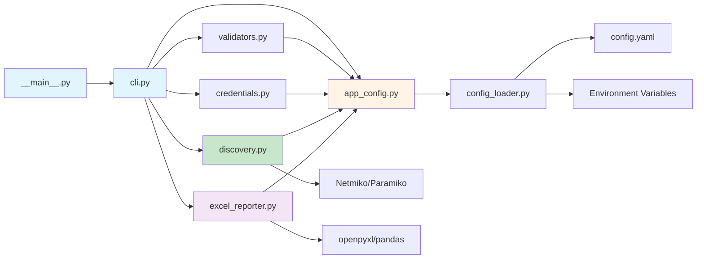

# Deep Dive: CDP Network Audit Tool

## "Production-Ready Python Automation, Built for Scale."

A **modular, enterprise-grade** network discovery utility that crawls Cisco network topologies via **Cisco Discovery Protocol (CDP)**. It connects (optionally through an SSH jump/bastion host), collects `show cdp neighbors detail` and `show version`, parses outputs with **TextFSM**, enriches with **DNS resolution**, and writes structured **Excel reports** from pre-formatted templates. 

**What's New:** The tool has undergone a **complete architectural restructure** — migrated from a monolithic script to a **modular Python package** with YAML-based configuration, dedicated modules for each concern, and enhanced maintainability for enterprise deployments.

[:material-github: View Source Code on GitHub](https://github.com/Nautomation-Prime/Cisco_CDP_Network_Audit){ .md-button .md-button--primary }

---

## ✨ Highlights

- **Modular Python package** — Clean separation of concerns with `cdp_audit/` package structure
- **Package-based execution** — Run as `python -m cdp_audit` for proper module resolution
- **YAML configuration** — Human-readable `config.yaml` for easy customization without touching code
- **Parallel discovery** with a worker pool (configurable via environment variables or YAML config)
- **Two-tier authentication** — Primary user first, then customizable fallback user if primary fails
- **Jump server / bastion support** — Paramiko channel + Netmiko sock for secure proxy connections
- **DNS enrichment** — Parallel DNS resolution for discovered hostnames
- **Professional Excel reporting** — Template-driven reports with multiple sheets and metadata stamping
- **Comprehensive validation** — Pre-flight checks for templates, Excel files, and configuration
- **Dedicated modules** — Each module has a single, well-defined responsibility

---

## 🎯 The Nautomation Prime Philosophy in Action

Before diving into the code, understand how every design decision reflects our three core principles:

### **Principle 1: Modular, Maintainable Architecture**

Every component has a **single, clear responsibility**. Credentials are handled by `credentials.py`, discovery by `discovery.py`, validation by `validators.py`. This isn't just good practice — it's **essential for team collaboration and long-term maintenance**. When a bug appears in credential handling, you know exactly where to look.

The entire application is now a **proper Python package** (`cdp_audit/`) with:

- Clean imports (`from cdp_audit.credentials import CredentialManager`)
- Package-level execution (`python -m cdp_audit`)
- Isolated concerns (each module can be tested independently)

### **Principle 2: Configuration as Code (the Right Way)**

Configuration migrated from hardcoded Python to **human-readable YAML**. Network engineers can customize worker threads, timeouts, and credential targets **without touching Python code**. Version control tracks configuration changes. Rollbacks are simple: `git revert`.

The `config_loader.py` module provides a clean interface between YAML configuration and Python code, with type safety and validation built in.

### **Principle 3: Production-Hardened Design**

You'll notice patterns like thread locks, exception handling, retry logic, comprehensive validation, and graceful cleanup. These aren't "nice to have" — they're **essential for running automation on critical infrastructure** without surprises at 3 AM.

The new modular structure makes these patterns **easier to implement and maintain**:

- Validators run before discovery starts (fail-fast)
- Logging is centralized in `logging_setup.py`
- Configuration access is centralized in `app_config.py`
- Each module handles its own error scenarios

### **Principle 4: Vendor-Neutral Foundation**

Built on industry-standard libraries: **Netmiko** (SSH connection handling), **Paramiko** (SSH tunnelling), **Pandas & OpenPyXL** (Excel reporting), **TextFSM** (parsing), **PyYAML** (configuration). Your skills remain portable.

---

## 🧱 Repository Architecture (Modular Package Structure)

```text
.
├── cdp_audit/                   # Main Python package
│   ├── __init__.py              # Package initialization and version
│   ├── __main__.py              # Package entry point (python -m cdp_audit)
│   ├── app_config.py            # Centralized configuration access
│   ├── cli.py                   # Command-line interface and main flow
│   ├── credentials.py           # Credential management (Cred Manager integration)
│   ├── discovery.py             # Network discovery engine (threading, CDP crawl)
│   ├── excel_reporter.py        # Excel report generation (template-driven)
│   ├── logging_setup.py         # Logging configuration bootstrap
│   └── validators.py            # Pre-flight validation (templates, config)
├── ProgramFiles/
│   ├── textfsm/
│   │   ├── cisco_ios_show_cdp_neighbors_detail.textfsm
│   │   └── cisco_ios_show_version.textfsm
│   └── config_files/
│       ├── config_loader.py     # YAML config loader class
│       ├── config.py            # Backward compatibility wrapper
│       ├── 1 - CDP Network Audit _ Template.xlsx
│       └── logging.conf         # Optional logging configuration
├── config.yaml                  # Main configuration file (YAML)
├── requirements.txt             # Python dependencies
├── run.bat                      # Windows launcher script
└── portable_env/                # Portable Python environment (optional)
```

> **Key Architectural Change:** Migrated from monolithic `main.py` to a **modular package structure** (`cdp_audit/`) with separation of concerns, enabling easier testing, maintenance, and team collaboration.
>
> **Package Execution:** The tool now runs as `python -m cdp_audit`, which invokes `cdp_audit/__main__.py`, ensuring proper module resolution and import paths.

---

## 📦 Requirements

- **Python:** 3.8+
- **Python packages:** `pandas`, `openpyxl`, `textfsm`, `paramiko`, `netmiko`, `pyyaml`
- **(Windows only, optional)** `pywin32` for Windows Credential Manager integration

Install in one go:

```bash
pip install pandas openpyxl textfsm paramiko netmiko pyyaml pywin32
```

### Tested Devices

This tool has been tested and verified on the following Cisco IOS and IOS-XE platforms:

- **Catalyst 9200 Series**
- **Catalyst 3650 Series**
- **Catalyst 3650C**
- **Catalyst 3650CG**
- **Catalyst 3650CX**
- **Catalyst 2960X Series**
- **Catalyst 2960 Series**

> **Note:** The tool should work with any Cisco IOS/IOS-XE device that supports CDP and the required show commands. The devices listed above have been explicitly tested and validated.

### Required Support Files

- **TextFSM templates:**
  - `ProgramFiles/textfsm/cisco_ios_show_cdp_neighbors_detail.textfsm`
  - `ProgramFiles/textfsm/cisco_ios_show_version.textfsm`
- **Excel template:**
  - `ProgramFiles/config_files/1 - CDP Network Audit _ Template.xlsx`

The `validators.py` module validates presence of these files at startup and exits if any are missing.

---

## ⚙️ Configuration System

The tool uses a **modern, layered configuration system** with three configuration sources (in priority order):

### Layer 1: config.yaml (Primary Configuration)

**All default settings are defined in a human-readable YAML file** at the project root.

The `config.yaml` file provides version-control-friendly configuration that **non-programmers can edit**. Settings are loaded by `ProgramFiles/config_files/config_loader.py`, which provides the `Config` class with type-safe property accessors and validation.

**Network Connection Settings:**

```yaml
network:
  jump_host: "192.0.2.10"     # Default jump/bastion server (empty = direct)
  device_type: "cisco_ios"    # Netmiko device type
  ssh_port: 22                # SSH port for connections
  default_limit: 10           # Max concurrent worker threads
  default_timeout: 10         # SSH/auth/read timeouts (seconds)
  max_retry_attempts: 3       # Connection retries per device
  dns_max_workers: 32         # Max DNS resolution threads
  dns_min_workers: 4          # Min DNS resolution threads
```

**Credential Settings:**

```yaml
credentials:
  cred_target: "MyApp/ADM"         # Primary credential target (Windows Credential Manager)
  alt_creds: "MyApp/Answer"        # Fallback credential target
  cdp_fallback_username: "answer"  # Fallback username (customizable)
```

**File Paths (Auto-Resolved from Project Root):**

```yaml
file_paths:
  base_dir: "."  # Project root
  cdp_template: "ProgramFiles/textfsm/cisco_ios_show_cdp_neighbors_detail.textfsm"
  ver_template: "ProgramFiles/textfsm/cisco_ios_show_version.textfsm"
  excel_template: "ProgramFiles/config_files/1 - CDP Network Audit _ Template.xlsx"
  logging_config: "ProgramFiles/config_files/logging.conf"
```

**Excel Report Customization:**

```yaml
excel:
  sheets:
    audit: "Audit"
    dns: "DNS Resolved"
    auth_errors: "Authentication Errors"
    conn_errors: "Connection Errors"
  metadata_cells:
    site_name: "B4"
    date: "B5"
    time: "B6"
    primary_seed: "B7"
    secondary_seed: "B8"
  data_start_rows:
    audit: 12        # Data appends starting at row 12
    other: 2         # DNS/errors start at row 2
```

**Why YAML Configuration?**

!!! success "YAML Benefits"
    - **Human-Readable**: Edit settings without Python knowledge
    - **Version Control Friendly**: Plain text, works seamlessly with Git
    - **Hierarchical Structure**: Logical grouping (network/credentials/paths)
    - **Comment Support**: Inline documentation stays with config
    - **Type Safety**: Config loader validates and provides defaults
    - **Data-Only**: No code execution (safer than Python config files)
    - **Team Collaboration**: Network engineers can customize without developer involvement

### Layer 2: Environment Variables (Runtime Overrides)

Environment variables **override** config.yaml settings at runtime:

| Variable | Description | config.yaml Default |
| :--------- | :------------ | :-------------------- |
| `CDP_LIMIT` | Max concurrent worker threads | 10 |
| `CDP_TIMEOUT` | SSH/auth/read timeouts (seconds) | 10 |
| `CDP_JUMP_SERVER` | Jump host (IP/hostname). Empty = direct | `""` |
| `CDP_PRIMARY_CRED_TARGET` | CredMan target for primary creds | `MyApp/ADM` |
| `CDP_ANSWER_CRED_TARGET` | CredMan target for fallback creds | `MyApp/Answer` |
| `LOGGING_CONFIG` | Path to INI logging config | `ProgramFiles/config_files/logging.conf` |

**Example (Windows PowerShell):**

```powershell
# Override YAML defaults for this session
$env:CDP_LIMIT = "20"                   # Use 20 concurrent workers
$env:CDP_TIMEOUT = "15"                 # 15-second timeouts
$env:CDP_JUMP_SERVER = "bastion.corp.local"  # Use this jump server
$env:CDP_PRIMARY_CRED_TARGET = "MyApp/NetworkAdmin"
$env:CDP_ANSWER_CRED_TARGET = "MyApp/LocalAdmin"
```

**When to Use Environment Variables:**

- **Testing**: Temporary overrides without modifying config.yaml
- **Multi-Environment Deployments**: Different settings for dev/staging/prod
- **CI/CD Pipelines**: Dynamic configuration from build systems
- **Per-Instance Customization**: Running multiple instances with different settings

### Layer 3: Config Loader (`config_loader.py`)

The `Config` class handles all configuration access with validation:

**Key Features:**

- **Automatic Search**: Looks for `config.yaml` in project root, module directory, and current directory
- **Environment Variable Priority**: Env vars override YAML settings
- **Type Conversion**: Automatically converts strings to int/bool/Path
- **Default Values**: Provides sensible defaults if YAML keys missing
- **Validation**: Fails fast if config file is malformed or missing required files
- **Property-Based Access**: Use `config.JUMP_HOST` instead of dict lookups

**Example Usage in Code:**

```python
from cdp_audit.app_config import config

# Access configuration values
jump_host = config.JUMP_HOST           # "192.0.2.10" or env override
timeout = config.DEFAULT_TIMEOUT        # 10 or env override
cdp_template = config.CDP_TEMPLATE      # Path object, validated

# Config loader has already validated these exist
print(f"Using jump host: {jump_host}")
print(f"Timeout: {timeout} seconds")
```

!!! tip "Best Practice: Configuration Priority"
    Use **config.yaml** for persistent organizational defaults that should be version-controlled. Use **environment variables** for runtime-specific overrides (testing, different environments) or secrets that shouldn't be committed to Git.

---

## 🏗️ Technical Architecture

The tool operates as a **modular Python package** with eight primary modules, each with clear responsibilities:

| Module | Responsibility | Why It Matters |
| :--- | :--- | :--- |
| **`__main__.py`** | Package entry point for `python -m cdp_audit` | Enables proper package execution and import resolution |
| **`cli.py`** | Command-line interface and orchestration | Clean separation of CLI logic from business logic |
| **`credentials.py`** | Secure credential collection and OS integration | Passwords stay out of code and config files |
| **`discovery.py`** | Multi-threaded topology crawling via CDP | Discovers 50+ devices in seconds, not minutes |
| **`excel_reporter.py`** | Professional, templated report generation | Maintains business branding and formatting |
| **`validators.py`** | Pre-flight checks for templates and configuration | Catches problems early; prevents mid-run failures |
| **`logging_setup.py`** | Logging configuration bootstrap | Consistent logging across all modules |
| **`app_config.py`** | Centralized configuration access point | Single source of truth for config values |

**Additional Support Modules:**

| Module | Responsibility | Location |
| :--- | :--- | :--- |
| **`config_loader.py`** | YAML configuration loading and validation | `ProgramFiles/config_files/` |
| **`config.py`** | Backward compatibility wrapper | `ProgramFiles/config_files/` |

### Architectural Principles

!!! quote "Design Philosophy"
    **Separation of Concerns**: Each module has a single, well-defined responsibility. Changes to Excel formatting don't affect discovery logic.
    
    **Package-Based Organization**: The `cdp_audit/` package structure enables clean imports, testability, and proper Python packaging.
    
    **Dependency Injection**: Modules receive configuration objects rather than reading global state. Easier to test and reason about.
    
    **Fail-Fast Validation**: The `validators.py` module checks all prerequisites **before** discovery starts. No more failures after 10 minutes of crawling.
    
    **Testability**: Each module can be imported and tested independently. Mock the config, test credential logic in isolation.

### Module Interaction Flow



**Execution Flow:**

1. **`__main__.py`** is invoked by `python -m cdp_audit`
2. **`__main__.py`** calls `cli.main()` to start the application
3. **`cli.py`** loads configuration via **`app_config.py`**
4. **`validators.py`** performs pre-flight checks (templates exist, Excel valid)
5. **`credentials.py`** collects and validates authentication credentials
6. **`discovery.py`** executes threaded network crawling
7. **`excel_reporter.py`** generates professional report from template
8. **`cli.py`** displays summary and exit status

### Package Entry Points

The tool is executed as a **Python package**:

**1. Package Execution (Recommended):**

```bash
python -m cdp_audit
```

Uses `cdp_audit/__main__.py` as the entry point, which calls `cli.main()`.

**2. Via Windows Launcher (Easiest for Non-Developers):**

```batch
run.bat
```

Validates environment, activates portable venv, runs the package via `python -m cdp_audit`.

**3. Direct CLI Module Execution (Development/Debug):**

```bash
python -m cdp_audit.cli
```

Directly calls the CLI module (useful for debugging).

**Why Package Execution?**

- **Proper Import Resolution**: Python resolves relative imports correctly
- **Standard Practice**: Follows Python packaging best practices
- **Installable**: Can be installed with `pip install -e .` for development
- **Distribution**: Can be packaged and distributed via PyPI or private repos

---

## 🔐 Credentials Model (`credentials.py`)

This module handles all credential management with secure OS integration.

### The Two-Credential Strategy

The tool supports a **primary credential** and a **fully customizable fallback credential**:

- **Primary credentials** (used for jump and device): Read from Windows Credential Manager if present (default target `MyApp/ADM`), else prompted. You can optionally save what you type back to Credential Manager.
- **Fallback credentials** (device hop only, jump still uses primary): **Username is fully customizable via config.yaml** (default: `answer`). Password is read from Credential Manager (default target `MyApp/Answer`) or prompted; you may choose to save it.

> **Note:** On non-Windows platforms, prompts are used (no Credential Manager).
>
> **Customization:** Change the fallback username in `config.yaml` by setting `cdp_fallback_username` under the `credentials` section to match your environment (e.g., `localadmin`, `backup`, `netops`, `svc_network`).

### Why Credential Management Matters

**The Problem:** Network automation requires credentials. Storing them in plaintext files or hardcoding them in scripts is a security nightmare. Even prompting users every time is error-prone and doesn't scale to 10+ discovery jobs daily.

**The Solution:** Leverage native OS credential stores. Windows has Credential Manager, macOS has Keychain, Linux has pass. These are designed for exactly this use case and integrate with enterprise SSO/password managers.

**User Experience:** When you run CDP Network Audit for the first time, the script checks Windows Credential Manager for stored credentials. If none are found, it prompts you to enter your username and password. Once you provide them, the script saves them to Windows Credential Manager and uses them for the discovery process. On subsequent runs, the script retrieves the stored credentials automatically without prompting you again.

### Module Architecture

The `credentials.py` module exports a single class: `CredentialManager`.

**Key Methods:**

| Method | Purpose | Returns |
| :--- | :--- | :--- |
| `__init__()` | Initialize with config values | N/A |
| `_read_win_cred(target)` | Read from Windows Credential Manager | `(username, password)` or `(None, None)` |
| `_write_win_cred(target, user, pass)` | Write to Windows Credential Manager | `bool` |
| `get_secret_with_fallback(...)` | Orchestrate credential retrieval | `(username, password)` |
| `collect_all_credentials()` | Collect both primary and fallback creds | `dict` |

### `CredentialManager.__init__()`

```python
class CredentialManager:
    """Handles credential collection with OS integration and fallback."""
    
    def __init__(self):
        """Initialize credential manager with config values."""
        from cdp_audit.app_config import config
        
        # Read from environment variables (override) or config.yaml (default)
        self.primary_target = os.getenv("CDP_PRIMARY_CRED_TARGET", config.CRED_TARGET)
        self.fallback_target = os.getenv("CDP_ANSWER_CRED_TARGET", config.ALT_CREDS)
        self.fallback_username = os.getenv("CDP_FALLBACK_USERNAME", config.CDP_FALLBACK_USERNAME)
        
        self.logger = logging.getLogger(__name__)
```

**Line-by-Line:**

- Import centralized config from `app_config.py` (single source of truth)
- Environment variables override YAML config if set (runtime flexibility)
- Three configurable values: primary target, fallback target, and fallback username
- Logger uses `__name__` for proper module-level logging

**Why This Matters:**

- **Centralized config access**: Uses `app_config.py` instead of direct Config() instantiation
- **config.yaml**: Human-readable, persistent, version-controlled settings that match your organization's standards
- **Environment variables**: Runtime overrides for different environments (dev/prod) or testing
- **Fallback username**: No longer hardcoded—customize in config.yaml to match your local accounts
- **Module-level logging**: Each module logs with its own name for easy filtering

### `_read_win_cred(target_name: str) -> Tuple[str, str]`

Reads encrypted credentials from Windows Credential Manager. Returns `(username, password)` tuple or `(None, None)` if not found.

```python
def _read_win_cred(self, target_name: str) -> Tuple[str, str]:
    """Read credentials from Windows Credential Manager."""
    try:
        import win32cred
    except ImportError:
        self.logger.debug("win32cred not available (non-Windows platform)")
        return None, None
    
    try:
        cred = win32cred.CredRead(target_name, win32cred.CRED_TYPE_GENERIC)
        username = cred['UserName']
        password_bytes = cred['CredentialBlob']
        
        # Handle both bytes and string returns
        if isinstance(password_bytes, bytes):
            password = password_bytes.decode('utf-16-le')
        else:
            password = str(password_bytes)
        
        self.logger.debug(f"Retrieved credentials from Credential Manager: {target_name}")
        return username, password
        
    except Exception as e:
        self.logger.debug(f"Could not read '{target_name}' from Credential Manager: {e}")
        return None, None
```

**Key Points:**

- Only imports `win32cred` if available (Windows only)
- Handles both bytes and string returns for compatibility
- Decodes password from UTF-16LE (Windows internal format)
- Gracefully fails and returns None instead of crashing
- Uses module-level logger for consistent logging

**Why This Approach:**

- **No plaintext storage:** Credentials are encrypted by Windows
- **Cross-platform:** Non-Windows systems skip this and use prompts
- **Version-agnostic:** Works with multiple pywin32 versions
- **Graceful degradation:** Fails quietly and falls back to prompts

### `_write_win_cred(target: str, username: str, password: str) -> bool`

Writes credentials to Windows Credential Manager for future reuse.

```python
def _write_win_cred(self, target: str, username: str, password: str) -> bool:
    """Write credentials to Windows Credential Manager."""
    try:
        import win32cred
    except ImportError:
        self.logger.debug("win32cred not available (non-Windows platform)")
        return False
    
    try:
        password_bytes = password.encode('utf-16-le')
        cred = {
            'Type': win32cred.CRED_TYPE_GENERIC,
            'TargetName': target,
            'UserName': username,
            'CredentialBlob': password_bytes,
            'Persist': win32cred.CRED_PERSIST_LOCAL_MACHINE,
            'Comment': 'Stored by CDP Network Audit'
        }
        win32cred.CredWrite(cred, 0)
        self.logger.info(f"Stored credentials in Credential Manager: {target}")
        return True
        
    except Exception as e:
        self.logger.debug(f"Could not save credentials to Credential Manager: {e}")
        return False
```

**Key Points:**

- Password is encoded to UTF-16LE before storage (Windows requirement)
- `CRED_PERSIST_LOCAL_MACHINE` means credentials persist across sessions
- Failures are logged at DEBUG level (not alarming)
- Returns `True` on success, `False` on failure

**Why This Matters:**

- Users can avoid re-prompting on subsequent runs
- Credentials are encrypted and protected by Windows
- Optional save means users control persistence
- Professional metadata (Comment field) for audit trails

### `get_secret_with_fallback(...) -> Tuple[str, str]`

The credential retrieval orchestrator with multi-step fallback:

```python
def get_secret_with_fallback(
    self,
    prompt_user: str,
    prompt_pass: str,
    target_name: str,
    allow_custom_username: bool = True
) -> Tuple[str, str]:
    """
    Retrieve credentials with Credential Manager fallback.
    
    1. Try reading from Windows Credential Manager
    2. Fall back to interactive prompt
    3. Optionally save to Credential Manager
    
    Args:
        prompt_user: Username prompt text
        prompt_pass: Password prompt text
        target_name: Credential Manager target name
        allow_custom_username: Whether to allow username customization
        
    Returns:
        (username, password) tuple
    """
    # Try Credential Manager first
    username, password = self._read_win_cred(target_name)
    
    if username and password:
        self.logger.info(f"Using stored credentials from Credential Manager: {target_name}")
        return username, password
    
    # Fall back to interactive prompt
    self.logger.info("Credentials not found, prompting user...")
    
    if allow_custom_username:
        username = input(prompt_user).strip()
        if not username:
            raise ValueError("Username cannot be empty")
    else:
        # Use pre-configured fallback username
        username = self.fallback_username
        print(f"Using fallback username from config: {username}")
    
    password = getpass.getpass(prompt_pass).strip()
    if not password:
        raise ValueError("Password cannot be empty")
    
    # Ask to save credentials
    save = input(f"Store credentials in Credential Manager as '{target_name}'? [y/N]: ").strip().lower()
    if save == 'y':
        success = self._write_win_cred(target_name, username, password)
        if success:
            print(f"✓ Credentials saved to Credential Manager: {target_name}")
        else:
            print("⚠ Could not save credentials (non-Windows platform or error)")
    
    return username, password
```

**Two-Credential Model:**

- **Primary:** Your main automation account (flexible username, likely AD-backed)
- **Fallback:** A secondary user on each device (username customizable in config.yaml, typically a local account)

**Why This Design:**

- Zero installation friction - first run prompts, subsequent runs use saved credentials
- Two credentials maximize success: primary fails → retry with fallback
- Jump host always uses primary (tighter control)
- Device can fall back to secondary user (local account)
- Fully customizable to match your organization's account naming standards

### `collect_all_credentials() -> dict`

High-level method to collect all required credentials:

```python
def collect_all_credentials(self) -> dict:
    """
    Collect both primary and fallback credentials.
    
    Returns:
        dict with keys: primary_user, primary_pass, fallback_user, fallback_pass
    """
    print("=== Credential Collection ===\n")
    
    # Collect primary credentials
    print("Collecting primary credentials (used for jump and devices)...")
    primary_user, primary_pass = self.get_secret_with_fallback(
        prompt_user="Enter primary username: ",
        prompt_pass="Enter primary password: ",
        target_name=self.primary_target,
        allow_custom_username=True
    )
    
    # Collect fallback credentials
    print(f"\nCollecting fallback credentials (username: {self.fallback_username})...")
    fallback_user = self.fallback_username
    _, fallback_pass = self.get_secret_with_fallback(
        prompt_user=f"Enter fallback username (default: {self.fallback_username}): ",
        prompt_pass=f"Enter '{self.fallback_username}' password: ",
        target_name=self.fallback_target,
        allow_custom_username=False
    )
    
    return {
        'primary_user': primary_user,
        'primary_pass': primary_pass,
        'fallback_user': fallback_user,
        'fallback_pass': fallback_pass
    }
```

**Returns a clean dictionary** that discovery modules can consume without understanding credential logic.

---

## 🔍 Validators Module (`validators.py`)

The `validators.py` module performs **pre-flight checks** before discovery begins.

### Why Pre-Flight Validation Matters

**The Problem:** Discovering 50+ devices over 10 minutes, then failing because an Excel template is missing or corrupt is frustrating and wastes time.

**The Solution:** Validate everything **before** discovery starts. Fail fast with helpful error messages.

### Module Functions

```python
"""Pre-flight validation for templates and configuration."""

import sys
import logging
from pathlib import Path
from openpyxl import load_workbook
from cdp_audit.app_config import config


def validate_textfsm_templates() -> bool:
    """
    Validate TextFSM templates exist and are readable.
    
    Returns:
        True if all templates valid, False otherwise
    """
    logger = logging.getLogger(__name__)
    
    templates = {
        'CDP Template': config.CDP_TEMPLATE,
        'Version Template': config.VER_TEMPLATE
    }
    
    all_valid = True
    for name, path in templates.items():
        if not path.exists():
            logger.error(f"❌ {name} not found: {path}")
            all_valid = False
        elif not path.is_file():
            logger.error(f"❌ {name} is not a file: {path}")
            all_valid = False
        else:
            logger.info(f"✓ {name} found: {path}")
    
    return all_valid


def validate_excel_template() -> bool:
    """
    Validate Excel template exists and is loadable.
    
    Returns:
        True if template valid, False otherwise
    """
    logger = logging.getLogger(__name__)
    template_path = config.EXCEL_TEMPLATE
    
    if not template_path.exists():
        logger.error(f"❌ Excel template not found: {template_path}")
        return False
    
    if not template_path.is_file():
        logger.error(f"❌ Excel template is not a file: {template_path}")
        return False
    
    # Try loading the template
    try:
        wb = load_workbook(template_path) wb.close()
        logger.info(f"✓ Excel template valid: {template_path}")
        return True
    except Exception as e:
        logger.error(f"❌ Excel template is corrupt or invalid: {e}")
        return False


def validate_all() -> bool:
    """
    Run all validation checks.
    
    Returns:
        True if all validations pass, False otherwise
    """
    logger = logging.getLogger(__name__)
    logger.info("=== Running Pre-Flight Validation ===\n")
    
    textfsm_valid = validate_textfsm_templates()
    excel_valid = validate_excel_template()
    
    if textfsm_valid and excel_valid:
        logger.info("\n✓ All validation checks passed")
        return True
    else:
        logger.error("\n❌ Validation failed - please fix the above errors")
        return False
```

**When Used:**

The `cli.py` module calls `validate_all()` before proceeding with credential collection and discovery:

```python
from cdp_audit import validators

if not validators.validate_all():
    sys.exit(1)
```

**Benefits:**

- Catches configuration errors immediately
- Provides clear, actionable error messages
- Prevents wasted time on doomed discovery runs
- Professional UX with checkmarks and crosses

---

## 🌐 Discovery Module (`discovery.py`)

The heart of the tool: **multi-threaded network discovery via CDP**.

### Why Parallel Discovery is Essential

**The Problem:** Discovering 50+ switches serially takes 10+ minutes. Each SSH connection is a round-trip: connect, execute, disconnect.

**The Solution:** Thread pool with 10 concurrent workers = 5x faster. 10 simultaneous connections instead of waiting for each one.

### Module Architecture

The `discovery.py` module exports a single class: `NetworkDiscoverer`.

**Key Components:**

- Thread-safe data structures (locks protect shared state)
- Worker thread pool for parallel device connections
- CDP parsing and intelligent queueing heuristics
- Jump server support (Paramiko + Netmiko)
- Retry logic for transient failures
- DNS resolution in parallel

### Thread-Safe Data Accumulators

```python
class NetworkDiscoverer:
    """Multi-threaded network discovery engine using CDP."""
    
    def __init__(self, credentials: dict, jump_host: str = ""):
        """
        Initialize discovery engine.
        
        Args:
            credentials: Dict with primary_user, primary_pass, fallback_user, fallback_pass
            jump_host: Optional jump/bastion host IP or hostname
        """
        from cdp_audit.app_config import config
        
        # Configuration
        self.config = config
        self.credentials = credentials
        self.jump_host = jump_host
        
        # Thread-safe data structures
        self.cdp_neighbor_details = []   # Parsed CDP entries (list, protected by data_lock)
        self.hostnames = set()            # Discovered hostnames for DNS (set, protected by data_lock)
        self.visited = set()              # IPs we've already audited (set, protected by visited_lock)
        self.authentication_errors = set()  # Auth failures (set, protected by data_lock)
        self.connection_errors = {}       # {IP: error_message} (dict, protected by data_lock)
        self.dns_ip = {}                  # {hostname: resolved_ip} (dict, protected by data_lock)
        
        # Thread synchronization
        self.visited_lock = threading.Lock()  # Protects visited set and queue operations
        self.data_lock = threading.Lock()     # Protects result accumulators
        
        # Discovery queue
        self.queue = queue.Queue()
        
        # Logging
        self.logger = logging.getLogger(__name__)
```

**Why Two Locks?**

- If we used one lock for everything, threads would block each other constantly
- Granular locks allow more independent work
- `visited_lock` for quick "is this already being processed?" checks
- `data_lock` for appending results (slower operations)

**Data Structure Choices:**

- **Lists** for ordered results (`cdp_neighbor_details`)
- **Sets** for deduplication (`visited`, `hostnames`, `authentication_errors`)
- **Dicts** for key-value lookups (`connection_errors`, `dns_ip`)

### Jump Server Support

The discovery module supports both direct and jump-mediated connections.

#### `_paramiko_jump_client(...) -> paramiko.SSHClient`

Creates a secure SSH connection to a jump/bastion host.

```python
def _paramiko_jump_client(self, host: str, username: str, password: str) -> paramiko.SSHClient:
    """
    Create a Paramiko SSH client for jump host connection.
    
    Args:
        host: Jump host IP or hostname
        username: SSH username
        password: SSH password
        
    Returns:
        Connected paramiko.SSHClient
        
    Raises:
        paramiko.AuthenticationException: If authentication fails
        paramiko.SSHException: If SSH connection fails
    """
    client = paramiko.SSHClient()
    client.set_missing_host_key_policy(paramiko.WarningPolicy())
    
    try:
        client.connect(
            hostname=host,
            username=username,
            password=password,
            port=self.config.SSH_PORT,
            timeout=self.config.DEFAULT_TIMEOUT,
            look_for_keys=False,
            allow_agent=False,
            auth_timeout=self.config.DEFAULT_TIMEOUT
        )
        self.logger.debug(f"Connected to jump host: {host}")
        return client
        
    except paramiko.AuthenticationException:
        self.logger.error(f"Authentication failed on jump host: {host}")
        raise
    except Exception as e:
        self.logger.error(f"Failed to connect to jump host {host}: {e}")
        raise
```

**Key Design Choices:**

- `WarningPolicy()` - Log warnings for unknown hosts (safer than AutoAddPolicy)
- Explicit password auth only - No SSH keys or agent (easier to audit)
- Consistent timeouts - All operations respect `DEFAULT_TIMEOUT` setting
- Re-raise auth failures - Let caller handle credential issues

**Why WarningPolicy?**

- Accepts unknown hosts but logs warnings
- Catches potential man-in-the-middle attacks without crashing
- Production-ready security posture
- Better than `AutoAddPolicy` (too permissive) or `RejectPolicy` (too strict for dynamic environments)

#### `_netmiko_via_jump(...) -> ConnectHandler`

The **core connection function**. Handles both direct and jump-host connections.

```python
def _netmiko_via_jump(
    self,
    device_ip: str,
    primary: bool = True
) -> ConnectHandler:
    """
    Create a Netmiko connection, optionally via jump host.
    
    Args:
        device_ip: Target device IP
        primary: If True, use primary credentials; if False, use fallback
        
    Returns:
        Connected Netmiko ConnectHandler
        
    Raises:
        NetmikoAuthenticationException: If authentication fails
        NetmikoTimeoutException: If connection times out
    """
    # Determine credentials to use
    if primary:
        jump_user = self.credentials['primary_user']
        jump_pass = self.credentials['primary_pass']
        device_user = self.credentials['primary_user']
        device_pass = self.credentials['primary_pass']
    else:
        jump_user = self.credentials['primary_user']  # Jump always uses primary
        jump_pass = self.credentials['primary_pass']
        device_user = self.credentials['fallback_user']  # Device uses fallback
        device_pass = self.credentials['fallback_pass']
    
    # Build Netmiko device dict
    device_params = {
        'device_type': self.config.DEVICE_TYPE,
        'username': device_user,
        'password': device_pass,
        'timeout': self.config.DEFAULT_TIMEOUT,
        'auth_timeout': self.config.DEFAULT_TIMEOUT,
        'conn_timeout': self.config.DEFAULT_TIMEOUT
    }
    
    # Direct connection (no jump host)
    if not self.jump_host:
        device_params['host'] = device_ip
        self.logger.debug(f"Connecting directly to {device_ip}")
        return ConnectHandler(**device_params)
    
    # Jump-mediated connection
    self.logger.debug(f"Connecting to {device_ip} via jump host {self.jump_host}")
    
    # 1. Connect to jump host with Paramiko
    jump_client = self._paramiko_jump_client(self.jump_host, jump_user, jump_pass)
    
    # 2. Create direct-tcpip channel through jump to target
    channel = jump_client.get_transport().open_channel(
        kind='direct-tcpip',
        dest_addr=(device_ip, self.config.SSH_PORT),
        src_addr=('', 0)
    )
    
    # 3. Wrap channel as socket for Netmiko
    class ChannelToSocket:
        """Wrapper to make Paramiko channel look like a socket."""
        def __init__(self, channel):
            self.channel = channel
        def send(self, data):
            return self.channel.send(data)
        def recv(self, size):
            return self.channel.recv(size)
        def close(self):
            return self.channel.close()
        def settimeout(self, timeout):
            return self.channel.settimeout(timeout)
    
    sock = ChannelToSocket(channel)
    
    # 4. Pass socket to Netmiko
    device_params['sock'] = sock
    conn = ConnectHandler(**device_params)
    
    # Store jump client for cleanup
    conn._jump_client = jump_client
    
    return conn
```

**Credential Logic:**

```python
if primary:
    jump_user, jump_pass = primary_user, primary_pass
    device_user, device_pass = primary_user, primary_pass
else:
    jump_user, jump_pass = primary_user, primary_pass  # Jump always uses primary
    device_user, device_pass = fallback_user, fallback_pass  # Device uses fallback
```

**Why This Two-Credential Model:**

- Jump host always uses primary (tightest control)
- Device can use fallback if primary fails (username customizable in config.yaml)
- Resilience: if your primary account is locked, fallback account can still work
- Flexibility: adapt to your organization's local account naming conventions

**Direct Connection:**
Simply pass device IP to Netmiko.

**Jump-Mediated Connection:**

1. Open Paramiko SSH to jump host
2. Create `direct-tcpip` channel (SSH tunnel) through jump to target
3. Wrap channel as socket
4. Pass socket to Netmiko for SSH auth

**Why direct-tcpip?**

- No need to open a listener on the jump host
- No port forwarding configuration required
- All traffic is inside the already-authenticated SSH session
- Secure and clean
- Standard SSH tunneling mechanism

### Device Command Execution

#### `run_device_commands(...) -> Tuple[str, str]`

Executes CDP and version commands on target device with fallback credentials.

```python
def run_device_commands(self, device_ip: str) -> Tuple[str, str]:
    """
    Execute show commands on device with fallback credential strategy.
    
    Strategy:
    1. Try with primary credentials
    2. On auth failure, catch and retry with fallback
    3. Don't retry auth failures (credentials won't change)
    4. Do retry transient errors (timeouts, SSH glitches) up to 3 times
    5. Always disconnect in finally block
    
    Args:
        device_ip: Target device IP
        
    Returns:
        (show_version_output, show_cdp_neighbors_detail_output) tuple
        
    Raises:
        Exception: If all retry attempts fail
    """
    max_retries = self.config.MAX_RETRY_ATTEMPTS
    conn = None
    
    for attempt in range(1, max_retries + 1):
        try:
            # Try primary credentials first
            try:
                conn = self._netmiko_via_jump(device_ip, primary=True)
                self.logger.debug(f"Connected to {device_ip} with primary credentials")
            except NetmikoAuthenticationException:
                # Fall back to secondary credentials
                self.logger.warning(f"Primary auth failed on {device_ip}, trying fallback...")
                conn = self._netmiko_via_jump(device_ip, primary=False)
                self.logger.info(f"Connected to {device_ip} with fallback credentials")
            
            # Execute commands
            ver_output = conn.send_command("show version", read_timeout=self.config.DEFAULT_TIMEOUT)
            cdp_output = conn.send_command(
                "show cdp neighbors detail",
                read_timeout=self.config.DEFAULT_TIMEOUT
            )
            
            self.logger.info(f"✓ Successfully collected data from {device_ip}")
            return ver_output, cdp_output
            
        except NetmikoAuthenticationException as e:
            # Don't retry auth failures
            self.logger.error(f"Authentication failed on {device_ip} (both credentials)")
            with self.data_lock:
                self.authentication_errors.add(device_ip)
            raise
            
        except (NetmikoTimeoutException, SSHException, socket.timeout) as e:
            # Retry transient errors
            if attempt < max_retries:
                self.logger.warning(f"Attempt {attempt}/{max_retries} failed for {device_ip}: {e}")
                time.sleep(2)  # Brief delay before retry
            else:
                self.logger.error(f"All {max_retries} attempts failed for {device_ip}")
                with self.data_lock:
                    self.connection_errors[device_ip] = str(e)
                raise
                
        finally:
            # Always clean up connection
            if conn:
                try:
                    conn.disconnect()
                    if hasattr(conn, '_jump_client'):
                        conn._jump_client.close()
                except Exception as e:
                    self.logger.debug(f"Error disconnecting from {device_ip}: {e}")
```

**Strategy:**

1. Try with primary credentials
2. On auth failure, catch and retry with fallback (customizable fallback user on device)
3. Don't retry auth failures (credentials won't change between attempts)
4. Do retry transient errors (timeouts, SSH glitches) up to 3 times
5. Always disconnect in finally block (prevent socket leaks)

**Why This Approach:**

- Maximizes success rate with two-credential strategy
- Transient timeouts are retried (network glitches happen)
- Auth failures fail-fast (no point retrying)
- Finally block ensures resource cleanup (even on exceptions)
- Separate tracking for auth vs. connection errors

### Parsing and Intelligent Queueing

#### `parse_outputs_and_enqueue_neighbors(...)`

This is the **intelligence** of the discovery engine. It decides which devices to audit next.

```python
def parse_outputs_and_enqueue_neighbors(
    self,
    device_ip: str,
    ver_output: str,
    cdp_output: str
) -> None:
    """
    Parse command outputs and enqueue neighbor devices for discovery.
    
    Three-step process:
    1. Parse version output for device context (hostname, serial, uptime)
    2. Parse CDP neighbors and extract details
    3. Apply queueing heuristic to determine which neighbors to crawl
    
    Queueing Heuristic:
    - Only enqueue if ALL three conditions are true:
      a) "Switch" in capabilities (infrastructure device)
      b) "Host" NOT in capabilities (not an endpoint)
      c) Has management IP (addressable)
    
    Args:
        device_ip: Source device IP
        ver_output: 'show version' output
        cdp_output: 'show cdp neighbors detail' output
    """
    # Step 1: Parse Version Output for Device Context
    try:
        ver_parsed = textfsm_parser(
            raw_text=ver_output,
            template_file=str(self.config.VER_TEMPLATE)
        )
        if ver_parsed and len(ver_parsed) > 0:
            local_hostname = ver_parsed[0].get('hostname', device_ip)
            local_serial = ver_parsed[0].get('serial', ['N/A'])[0] if ver_parsed[0].get('serial') else 'N/A'
            local_uptime = ver_parsed[0].get('uptime', 'N/A')
        else:
            local_hostname = device_ip
            local_serial = 'N/A'
            local_uptime = 'N/A'
    except Exception as e:
        self.logger.warning(f"Failed to parse 'show version' for {device_ip}: {e}")
        local_hostname = device_ip
        local_serial = 'N/A'
        local_uptime = 'N/A'
    
    # Step 2: Parse CDP Neighbors
    try:
        cdp_parsed = textfsm_parser(
            raw_text=cdp_output,
            template_file=str(self.config.CDP_TEMPLATE)
        )
    except Exception as e:
        self.logger.error(f"Failed to parse CDP output for {device_ip}: {e}")
        return
    
    if not cdp_parsed:
        self.logger.info(f"No CDP neighbors found for {device_ip}")
        return
    
    # Step 3: Process Each CDP Neighbor
    with self.data_lock:
        for entry in cdp_parsed:
            # Extract CDP fields
            dest_host = entry.get('destination_host', 'N/A')
            local_port = entry.get('local_port', 'N/A')
            remote_port = entry.get('remote_port', 'N/A')
            mgmt_ip = entry.get('management_ip', '')
            platform = entry.get('platform', 'N/A')
            capabilities = entry.get('capabilities', '')
            
            # Store CDP entry
            self.cdp_neighbor_details.append({
                'LOCAL_HOST': local_hostname,
                'LOCAL_IP': device_ip,
                'LOCAL_PORT': local_port,
                'LOCAL_SERIAL': local_serial,
                'LOCAL_UPTIME': local_uptime,
                'DESTINATION_HOST': dest_host,
                'REMOTE_PORT': remote_port,
                'MANAGEMENT_IP': mgmt_ip,
                'PLATFORM': platform,
                'CAPABILITIES': capabilities
            })
            
            # Store hostname for DNS resolution
            if dest_host and dest_host != 'N/A':
                self.hostnames.add(dest_host)
            
            # Apply Queueing Heuristic
            # Only enqueue if: Switch device + not a Host + has management IP
            if "Switch" in capabilities and "Host" not in capabilities and mgmt_ip:
                # Check if already visited or queued
                with self.visited_lock:
                    if mgmt_ip not in self.visited and dest_host not in self.visited:
                        self.queue.put(mgmt_ip)
                        self.visited.add(mgmt_ip)
                        self.visited.add(dest_host)
                        self.logger.info(f"Queued for discovery: {dest_host} ({mgmt_ip})")
```

**Three-Step Process:**

### **Step 1: Parse Device Context**

- Extract hostname, serial, uptime from `show version`
- Fall back to IP if parsing fails
- This becomes the "LOCAL_HOST" in CDP entries

### **Step 2: Parse CDP Neighbors**

- Extract each neighbor's details (ports, capabilities, management IP)
- Store in thread-safe list
- Add hostnames to DNS resolution set

### **Step 3: Apply Queueing Heuristic**

Only enqueue if ALL three conditions are true:

```python
if "Switch" in caps and "Host" not in caps and mgmt_ip:
```

**Why "Switch" in caps?**

- CDP capability strings like "Switch Router" identify infrastructure
- We only want to audit infrastructure nodes, not endpoints

**Why "Host" not in caps?**

- IP phones, printers, cameras also show up in CDP
- Their capability includes "Host" but we can't/shouldn't manage them

**Why mgmt_ip?**

- If a device doesn't advertise a management IP, we have no way to SSH to it
- Queueing it would just cause failures

**Example:**

```batch
Router (Switch, Router) + 192.0.2.5  → Queue it ✓
IP Phone (Host) + 192.0.2.50         → Skip (endpoint) ✗
Access Point (Host) + no Mgmt IP     → Skip (non-addressable) ✗
Switch (Switch) + 192.0.2.100        → Queue it ✓
```

**Deduplication:**

- Check both IP and hostname against `visited` set
- Prevents discovering same device multiple times
- Thread-safe with `visited_lock`

### Worker Thread Pool

#### `discover_worker() -> None`

The worker thread function. Multiple instances run concurrently.

```python
def discover_worker(self) -> None:
    """
    Worker thread function for parallel device discovery.
    
    Loop:
    1. Get next host from queue (timeout=1.0 prevents hangs)
    2. Recognize sentinel (None = shutdown signal)
    3. Check if already visited (prevent duplicate work)
    4. Execute discovery with up to 3 retries
    5. Parse outputs and enqueue new neighbors
    6. Always call task_done() or queue.join() will hang
    """
    while True:
        try:
            # Get next device from queue
            device_ip = self.queue.get(timeout=1.0)
            
            # Check for shutdown signal
            if device_ip is None:
                self.logger.debug("Worker received shutdown signal")
                self.queue.task_done()
                return
            
            # Double-check not already processed (race condition protection)
            with self.visited_lock:
                if device_ip in self.visited:
                    self.logger.debug(f"Skipping {device_ip} (already visited)")
                    self.queue.task_done()
                    continue
                self.visited.add(device_ip)
            
            # Execute discovery
            self.logger.info(f"Discovering: {device_ip}")
            try:
                ver_output, cdp_output = self.run_device_commands(device_ip)
                self.parse_outputs_and_enqueue_neighbors(device_ip, ver_output, cdp_output)
            except Exception as e:
                self.logger.error(f"Failed to discover {device_ip}: {e}")
            
            # Mark task as complete
            self.queue.task_done()
            
        except queue.Empty:
            # Queue is empty, poll again
            continue
        except Exception as e:
            self.logger.error(f"Worker thread error: {e}")
            continue
```

**Loop:**

1. Get next host from queue (timeout=1.0 prevents hangs)
2. Recognize sentinel (None = shutdown signal)
3. Check if already visited (prevent duplicate work)
4. Execute discovery with up to 3 retries
5. Parse outputs and enqueue new neighbors
6. Always call `task_done()` or queue.join() will hang

**Why Sentinel Pattern?**

- None signals worker to exit gracefully
- Main thread sends one sentinel per worker
- Coordinated shutdown without races
- Clean alternative to threading.Event

**Why Check If Already Visited?**

- Concurrent workers might both process same IP
- Prevent duplicate discovery work
- Track with hostname and IP
- Race condition: device added to visited but not yet processed

**Why task_done() Is Critical:**

Without `task_done()`, `queue.join()` waits forever on main thread. This is a common source of hangs in multi-threaded code!

### Discovery Orchestration

#### `discover_from_seeds(seeds: List[str]) -> None`

Main orchestration function that kicks off discovery.

```python
def discover_from_seeds(self, seeds: List[str]) -> None:
    """
    Start network discovery from seed devices.
    
    Args:
        seeds: List of seed device IPs
    """
    self.logger.info(f"Starting discovery with {len(seeds)} seed device(s)")
    
    # Add seeds to queue
    for seed in seeds:
        self.queue.put(seed)
        with self.visited_lock:
            self.visited.add(seed)
    
    # Determine worker count
    worker_count = self.config.DEFAULT_LIMIT
    
    # Start worker threads
    self.logger.info(f"Starting {worker_count} worker threads")
    workers = []
    for i in range(worker_count):
        t = threading.Thread(target=self.discover_worker, name=f"Worker-{i+1}")
        t.start()
        workers.append(t)
    
    # Wait for queue to be empty
    self.queue.join()
    self.logger.info("Discovery queue empty, shutting down workers...")
    
    # Send shutdown signals
    for _ in range(worker_count):
        self.queue.put(None)  # Sentinel value
    
    # Wait for all workers to finish
    for t in workers:
        t.join()
    
    self.logger.info("All workers shut down")
```

**Flow:**

1. Add seeds to queue and mark as visited
2. Start worker threads (count from config)
3. Wait for queue to empty (`queue.join()`)
4. Send shutdown signals (one None per worker)
5. Wait for workers to finish (`thread.join()`)

**Why This Approach:**

- Main thread waits for all work to complete
- Graceful shutdown with sentinels
- Workers clean up naturally
- No orphaned threads

### DNS Resolution

#### `resolve_dns_parallel() -> None`

After discovery, resolve all discovered hostnames to IPs in parallel.

```python
def resolve_dns_parallel(self) -> None:
    """
    Resolve all discovered hostnames to IPs in parallel.
    
    Design:
    - ThreadPoolExecutor with 4-32 workers (based on CDP_LIMIT)
    - Submit all resolutions concurrently
    - Collect results as they complete
    - Best-effort - failures are logged but don't block
    """
    if not self.hostnames:
        self.logger.info("No hostnames to resolve")
        return
    
    self.logger.info(f"Resolving {len(self.hostnames)} hostnames...")
    
    # Determine DNS worker count (min 4, max 32, based on CDP_LIMIT)
    dns_workers = max(
        self.config.DNS_MIN_WORKERS,
        min(self.config.DNS_MAX_WORKERS, self.config.DEFAULT_LIMIT * 2)
    )
    
    def resolve_one(hostname: str) -> Tuple[str, str]:
        """Resolve a single hostname."""
        try:
            ip = socket.gethostbyname(hostname)
            self.logger.debug(f"Resolved {hostname} → {ip}")
            return hostname, ip
        except Exception as e:
            self.logger.debug(f"Failed to resolve {hostname}: {e}")
            return hostname, "N/A"
    
    # Parallel DNS resolution
    with ThreadPoolExecutor(max_workers=dns_workers) as executor:
        futures = {executor.submit(resolve_one, hostname): hostname for hostname in self.hostnames}
        
        for future in as_completed(futures):
            try:
                hostname, ip = future.result()
                with self.data_lock:
                    self.dns_ip[hostname] = ip
            except Exception as e:
                self.logger.warning(f"DNS resolution error: {e}")
    
    self.logger.info(f"DNS resolution complete ({len(self.dns_ip)} resolved)")
```

**Design:**

- ThreadPoolExecutor with 4-32 workers (based on CDP_LIMIT)
- Submit all resolutions concurrently
- Collect results as they complete (don't wait for slowest)
- Best-effort - failures are logged but don't block

**Why Separate from Discovery?**

- DNS lookups are independent
- Can run in smaller thread pool (4-32 vs. 10)
- Doesn't block discovery if DNS is slow
- Runs after discovery completes (no interference)

**Why ThreadPoolExecutor?**

- Higher-level API than threading.Thread
- Automatic worker management
- Clean future-based result collection
- Built-in exception handling

---

## 📊 Excel Reporter Module (`excel_reporter.py`)

Professional, template-driven Excel report generation.

### Why Professional Reporting Matters

**The Problem:** Raw CSV or unformatted Excel is not useful for business. Reports need context, formatting, branding.

**The Solution:** Use a pre-formatted Excel template. Write data into it while preserving all formatting, charts, filters, and branding.

### Module Architecture

The `excel_reporter.py` module exports a single class: `ExcelReporter`.

```python
"""Professional Excel report generation with template preservation."""

import shutil
import logging
from pathlib import Path
from datetime import datetime
from typing import Dict, List
import pandas as pd
from openpyxl import load_workbook
from cdp_audit.app_config import config


class ExcelReporter:
    """Generate professional Excel reports from templates."""
    
    def __init__(self, site_name: str, seeds: List[str]):
        """
        Initialize Excel reporter.
        
        Args:
            site_name: Site name for filename and metadata
            seeds: List of seed devices for metadata
        """
        self.site_name = site_name
        self.seeds = seeds
        self.config = config
        self.logger = logging.getLogger(__name__)
        
        # Generate output filename
        timestamp = datetime.now().strftime("%Y%m%d_%H%M%S")
        self.output_filename = f"{site_name}_CDP_Network_Audit_{timestamp}.xlsx"
```

### Template-Driven Approach

### **Step 1: Copy Template**

```python
def _copy_template(self) -> None:
    """Copy Excel template to output filename."""
    template_path = self.config.EXCEL_TEMPLATE
    
    if not template_path.exists():
        raise FileNotFoundError(f"Excel template not found: {template_path}")
    
    shutil.copy2(template_path, self.output_filename)
    self.logger.info(f"Copied template to: {self.output_filename}")
```

Preserve metadata (timestamps, permissions) with `copy2`.

### **Step 2: Stamp Metadata**

```python
def _stamp_metadata(self, wb: load_workbook) -> None:
    """
    Stamp metadata into specific cells.
    
    Args:
        wb: Loaded openpyxl workbook
    """
    sheet_name = self.config.EXCEL_SHEETS['audit']
    ws = wb[sheet_name]
    
    # Metadata to stamp
    now = datetime.now()
    metadata = {
        self.config.EXCEL_METADATA_CELLS['site_name']: self.site_name,
        self.config.EXCEL_METADATA_CELLS['date']: now.strftime("%Y-%m-%d"),
        self.config.EXCEL_METADATA_CELLS['time']: now.strftime("%H:%M:%S"),
        self.config.EXCEL_METADATA_CELLS['primary_seed']: self.seeds[0] if self.seeds else "N/A",
        self.config.EXCEL_METADATA_CELLS['secondary_seed']: self.seeds[1] if len(self.seeds) > 1 else "N/A"
    }
    
    # Stamp cells
    for cell, value in metadata.items():
        ws[cell] = value
        self.logger.debug(f"Stamped {cell} = {value}")
```

Fill cells B4-B8 with audit metadata (configured in YAML).

### **Step 3: Append Data**

```python
def generate_report(
    self,
    cdp_data: List[Dict],
    dns_data: Dict[str, str],
    auth_errors: set,
    conn_errors: Dict[str, str]
) -> str:
    """
    Generate Excel report with all data.
    
    Args:
        cdp_data: List of CDP neighbor dicts
        dns_data: Dict of hostname -> IP mappings
        auth_errors: Set of IPs with auth failures
        conn_errors: Dict of IP -> error message
        
    Returns:
        Path to generated Excel file
    """
    self.logger.info("Generating Excel report...")
    
    # Step 1: Copy template
    self._copy_template()
    
    # Step 2: Load workbook
    wb = load_workbook(self.output_filename)
    
    # Step 3: Stamp metadata
    self._stamp_metadata(wb)
    
    # Step 4: Write data to sheets
    with pd.ExcelWriter(
        self.output_filename,
        engine='openpyxl',
        mode='a',
        if_sheet_exists='overlay'
    ) as writer:
        writer.book = wb
        
        # CDP Audit Data
        if cdp_data:
            df_cdp = pd.DataFrame(cdp_data)
            df_cdp.to_excel(
                writer,
                sheet_name=self.config.EXCEL_SHEETS['audit'],
                startrow=self.config.EXCEL_DATA_START_ROWS['audit'] - 1,
                index=False,
                header=False
            )
            self.logger.info(f"Wrote {len(cdp_data)} CDP entries")
        
        # DNS Resolved Data
        if dns_data:
            df_dns = pd.DataFrame([
                {'Hostname': k, 'IP Address': v}
                for k, v in dns_data.items()
            ])
            df_dns.to_excel(
                writer,
                sheet_name=self.config.EXCEL_SHEETS['dns'],
                startrow=self.config.EXCEL_DATA_START_ROWS['other'] - 1,
                index=False
            )
            self.logger.info(f"Wrote {len(dns_data)} DNS entries")
        
        # Authentication Errors
        if auth_errors:
            df_auth = pd.DataFrame(
                list(auth_errors),
                columns=['Authentication Errors']
            )
            df_auth.to_excel(
                writer,
                sheet_name=self.config.EXCEL_SHEETS['auth_errors'],
                startrow=self.config.EXCEL_DATA_START_ROWS['other'] - 1,
                index=False
            )
            self.logger.info(f"Wrote {len(auth_errors)} auth errors")
        
        # Connection Errors
        if conn_errors:
            df_conn = pd.DataFrame([
                {'IP Address': k, 'Error': v}
                for k, v in conn_errors.items()
            ])
            df_conn.to_excel(
                writer,
                sheet_name=self.config.EXCEL_SHEETS['conn_errors'],
                startrow=self.config.EXCEL_DATA_START_ROWS['other'] - 1,
                index=False
            )
            self.logger.info(f"Wrote {len(conn_errors)} connection errors")
    
    self.logger.info(f"✓ Report generated: {self.output_filename}")
    return self.output_filename
```

Use `if_sheet_exists="overlay"` mode to append without destroying template.

**Why This Approach:**

- **Template-driven:** Business controls formatting without touching code
- **Non-destructive:** Data is appended, template is preserved
- **Professional:** Charts, filters, styling all maintained
- **Automated:** No manual Excel editing required
- **Configurable:** Cell locations and sheet names in YAML

**Key Parameters:**

- `startrow`: Where to start writing data (after headers/metadata)
- `header=False`: Don't write column headers (template has them)
- `index=False`: Don't write row numbers
- `mode='a'`: Append mode
- `if_sheet_exists='overlay'`: Write over existing cells without deleting sheet

---

## 🎛️ CLI Module (`cli.py`)

The command-line interface and main application orchestrator.

### Module Responsibilities

- Parse command-line arguments
- Orchestrate the discovery workflow
- Display progress and results
- Handle user interrupts gracefully

### Main Workflow

```python
"""Command-line interface and main orchestration."""

import sys
import logging
from typing import List
from cdp_audit import validators
from cdp_audit.credentials import CredentialManager
from cdp_audit.discovery import NetworkDiscoverer
from cdp_audit.excel_reporter import ExcelReporter
from cdp_audit.app_config import config


def prompt_for_inputs() -> dict:
    """
    Orchestrate all interactive input collection.
    
    Returns:
        dict with keys: site_name, seeds (list)
    """
    print("\n=== CDP Network Audit ===\n")
    
    # Site name
    site_name = input("Enter site name (used in Excel filename, max 50 chars): ").strip()
    if not site_name or len(site_name) > 50:
        raise ValueError("Site name must be 1-50 characters")
    
    # Seed devices
    seeds_input = input("Enter one or more seed device IPs or hostnames (comma-separated): ").strip()
    if not seeds_input:
        raise ValueError("At least one seed device is required")
    
    seeds = [s.strip() for s in seeds_input.split(',')]
    
    return {
        'site_name': site_name,
        'seeds': seeds
    }


def main() -> int:
    """
    Main entry point for CDP Network Audit.
    
    Returns:
        Exit code (0 for success, 1 for failure)
    """
    # Set up logging
    from cdp_audit.logging_setup import setup_logging
    setup_logging()
    logger = logging.getLogger(__name__)
    
    try:
        # Step 1: Validate prerequisites
        logger.info("=== CDP Network Audit Tool ===\n")
        if not validators.validate_all():
            logger.error("Pre-flight validation failed")
            return 1
        
        # Step 2: Collect user inputs
        inputs = prompt_for_inputs()
        site_name = inputs['site_name']
        seeds = inputs['seeds']
        
        logger.info(f"Site: {site_name}")
        logger.info(f"Seeds: {', '.join(seeds)}")
        
        # Step 3: Collect credentials
        cred_manager = CredentialManager()
        credentials = cred_manager.collect_all_credentials()
        
        # Step 4: Determine jump host
        jump_host = config.JUMP_HOST
        if jump_host:
            use_jump = input(f"\nUse jump host '{jump_host}'? [Y/n]: ").strip().lower()
            if use_jump == 'n':
                jump_host = ""
        else:
            jump_host = input("\nEnter jump host IP/hostname (blank for direct): ").strip()
        
        if jump_host:
            logger.info(f"Using jump host: {jump_host}")
        else:
            logger.info("Using direct connections (no jump host)")
        
        # Step 5: Execute discovery
        logger.info("\n=== Starting Network Discovery ===\n")
        discoverer = NetworkDiscoverer(credentials, jump_host)
        discoverer.discover_from_seeds(seeds)
        
        # Step 6: DNS resolution
        logger.info("\n=== Resolving Hostnames ===\n")
        discoverer.resolve_dns_parallel()
        
        # Step 7: Generate report
        logger.info("\n=== Generating Excel Report ===\n")
        reporter = ExcelReporter(site_name, seeds)
        output_file = reporter.generate_report(
            cdp_data=discoverer.cdp_neighbor_details,
            dns_data=discoverer.dns_ip,
            auth_errors=discoverer.authentication_errors,
            conn_errors=discoverer.connection_errors
        )
        
        # Step 8: Display summary
        print("\n" + "="*60)
        print("DISCOVERY COMPLETE")
        print("="*60)
        print(f"Discovered devices:  {len(discoverer.visited)}")
        print(f"CDP entries:         {len(discoverer.cdp_neighbor_details)}")
        print(f"DNS resolved:        {len(discoverer.dns_ip)}")
        print(f"Auth errors:         {len(discoverer.authentication_errors)}")
        print(f"Connection errors:   {len(discoverer.connection_errors)}")
        print(f"\nReport saved to:     {output_file}")
        print("="*60 + "\n")
        
        return 0
        
    except KeyboardInterrupt:
        logger.warning("\n\nDiscovery interrupted by user")
        return 130
    except Exception as e:
        logger.error(f"\n\nFatal error: {e}", exc_info=True)
        return 1


if __name__ == "__main__":
    sys.exit(main())
```

**Execution Flow:**

1. Set up logging (`logging_setup.py`)
2. Run validators (`validators.py`)
3. Collect user inputs (site name, seeds)
4. Collect credentials (`credentials.py`)
5. Determine jump host (from config or prompt)
6. Execute discovery (`discovery.py`)
7. Resolve DNS in parallel
8. Generate Excel report (`excel_reporter.py`)
9. Display summary and exit

**Error Handling:**

- Keyboard interrupt (Ctrl+C) returns exit code 130
- Validation failures return exit code 1
- Exceptions are logged with full traceback

---

## ⚡ Package Entry Point (`__main__.py`)

The package entry point enables `python -m cdp_audit` execution.

```python
"""Package entry point for python -m cdp_audit."""

from cdp_audit.cli import main

if __name__ == "__main__":
    exit(main())
```

**Why This File?**

- Enables package-based execution
- Python looks for `__main__.py` when you run `python -m <package>`
- Clean separation: `cli.py` has the logic, `__main__.py` is just the entry point
- Follows Python packaging best practices

---

## 🛠️ Configuration Access (`app_config.py`)

Centralized configuration access point for all modules.

```python
"""Centralized configuration access for all modules."""

from ProgramFiles.config_files.config_loader import Config

# Create a single Config instance for the entire application
config = Config()

# This module is imported by other modules to access configuration
# Example: from cdp_audit.app_config import config
```

**Why This Module?**

- **Single source of truth:** All modules import from here
- **Lazy initialization:** Config is only loaded once
- **Easy mocking:** Tests can replace this module to inject test config
- **Clean imports:** `from cdp_audit.app_config import config` instead of creating Config() everywhere

---

## 📝 Logging Setup (`logging_setup.py`)

Bootstrap logging for the entire application.

```python
"""Logging configuration bootstrap."""

import os
import logging
import logging.config
from pathlib import Path


def setup_logging() -> None:
    """
    Configure logging for the application.
    
    - If logging.conf exists, use it
    - Otherwise, configure basic console logging
    """
    logging_config_path = os.getenv("LOGGING_CONFIG", "ProgramFiles/config_files/logging.conf")
    logging_config = Path(logging_config_path)
    
    if logging_config.exists():
        try:
            logging.config.fileConfig(logging_config, disable_existing_loggers=False)
            logging.info(f"Logging configured from: {logging_config}")
            return
        except Exception as e:
            print(f"Warning: Could not load logging config: {e}")
    
    # Fall back to basic console logging
    logging.basicConfig(
        level=logging.INFO,
        format='%(asctime)s - %(name)s - %(levelname)s - %(message)s',
        datefmt='%Y-%m-%d %H:%M:%S'
    )
    logging.info("Using basic console logging")
```

**Features:**

- Tries to load `logging.conf` if it exists
- Falls back to basic console logging
- Respects `LOGGING_CONFIG` environment variable
- Non-blocking: failures don't crash the app

---

## 🚀 Quick Start: Using the Launcher (Recommended)

The repository includes a **professional Windows batch launcher** (`run.bat`) that provides the easiest way to run the tool.

### Why Use the Launcher?

- **Zero configuration required** - Just double-click or run from command line
- **Automatic validation** - Checks for Python environment and required files before execution
- **Helpful diagnostics** - Clear error messages if something is missing
- **Professional interface** - Clean output with status indicators and progress messages
- **Safe execution** - Validates environment before running the script

### Using run.bat

**Option 1: Double-click**

Simply double-click `run.bat` in Windows Explorer to launch the tool with default behavior.

**Option 2: Command Line**

```cmd
run.bat
```

This runs the CDP Network Audit with all default settings from `config.yaml`.

### What the Launcher Does

1 **Validates the environment:**
   - Checks that the `portable_env` virtual environment exists
   - Verifies Python executable is present
   - Confirms `cdp_audit` package exists
   - Validates required TextFSM templates are present
   - Validates Excel template exists

2. **Provides clear feedback:**
   - Shows [OK] for successful checks
   - Shows [WARNING] for missing optional files
   - Shows [ERROR] for critical missing components
   - Displays helpful troubleshooting tips on failure

3. **Runs the tool:**
   - Activates the virtual environment
   - Executes `python -m cdp_audit`
   - Captures and displays the exit code
   - Provides common troubleshooting tips if errors occur

### Example Output

```batch
================================================================================
                    CDP NETWORK AUDIT TOOL
================================================================================

Starting validation checks...

[OK] Python Environment: Found at portable_env\Scripts\python.exe
[OK] CDP Audit Package: Found at cdp_audit\__main__.py
[OK] Required support files found
[OK] All validation checks passed

================================================================================

Running CDP Network Audit...

================================================================================

[CDP Audit output appears here]

================================================================================

[SUCCESS] Script completed successfully

================================================================================
```

---

## 🚀 How to Run (Interactive Flow)

1. Ensure templates and Excel file exist under `ProgramFiles/...` (see above).
2. (Optional) Customize `config.yaml` with your organization's defaults.
3. (Optional) Set environment variables as needed for runtime overrides.
4. Run:

```bash
python -m cdp_audit
```

5. Follow prompts:
   - Site name (used in the output filename)
   - Seed devices (comma-separated IPv4 / resolvable hostnames)
   - Primary credentials (reads from CredMan if present; else prompts; optional save)
   - Fallback password (username from `config.yaml`; reads from CredMan if present; else prompts; optional save)
   - Jump server (from `config.yaml`, env var, or prompt; blank = direct)

The tool validates/normalizes seeds to IP addresses, de-duplicates them, then starts the threaded discovery.

---

## 🧪 What Gets Collected

For each visited device the tool attempts to collect:

- `show version` (hostname, serials, uptime) — for local context.
- `show cdp neighbors detail` — parsed into structured rows.
- DNS resolution for all discovered hostnames (best-effort), in parallel.

### Discovery Heuristics

- Only Switch-capable CDP entries (and not hosts) with a management IP are queued as crawl candidates.
- Deduplication is performed by hostname and IP to reduce churn.
- Each target is retried up to 3 times for transient connectivity issues.

---

## 🌐 Jump Server Behavior

- Set `jump_host` in the `network` section of `config.yaml` to specify a default jump host.
- Alternatively, use the `CDP_JUMP_SERVER` environment variable to override at runtime.
- If empty, you will be prompted during runtime; leaving it blank uses direct device connections.
- The jump is created with Paramiko and a `direct-tcpip` channel; Netmiko is then bound to that channel (no local listener required).

> **Note:** Host key policy defaults to a warning (accepts unknown keys but logs a warning). For production environments, prefer strict host key checking via `known_hosts` management.
>
> **Tip:** Configure your jump server in `config.yaml` (`jump_host: "192.0.2.10"`) for permanent use, or leave it empty to be prompted each time for flexibility.

---

## 📊 Excel Report Output

An output file named `<site_name>_CDP_Network_Audit_<timestamp>.xlsx` is created by copying the template.

### Sheets

- **Audit** — Main CDP dataset. Also stamped with metadata:
  - `B4`: Site name
  - `B5`: Date
  - `B6`: Time
  - `B7`: Primary seed
  - `B8`: Secondary seed (or "N/A")
- **DNS Resolved** — Two columns: `Hostname`, `IP Address`
- **Authentication Errors** — One column: `Authentication Errors` (IP list)
- **Connection Errors** — Two columns: `IP Address`, `Error`

### Columns in Audit (Data Rows)

`LOCAL_HOST`, `LOCAL_IP`, `LOCAL_PORT`, `LOCAL_SERIAL`, `LOCAL_UPTIME`, `DESTINATION_HOST`, `REMOTE_PORT`, `MANAGEMENT_IP`, `PLATFORM`.

> **Note:** The template governs formatting/filters/charts (if any). The writer appends data starting at the appropriate row offsets to preserve the layout.

---

## 🔑 Key Design Patterns

### Pattern 1: Modular Package Structure

```python
# Clean imports from package modules
from cdp_audit.credentials import CredentialManager
from cdp_audit.discovery import NetworkDiscoverer
from cdp_audit.app_config import config
```

Each module has a single responsibility. Changes to one don't affect others.

### Pattern 2: Centralized Configuration

```python
# All modules import from app_config
from cdp_audit.app_config import config

# Single source of truth
jump_host = config.JUMP_HOST
timeout = config.DEFAULT_TIMEOUT
```

Configuration is centralized and consistent across all modules.

### Pattern 3: Thread-Safe Data Accumulation

```python
with self.data_lock:
    self.results.append(new_data)
```

Only one thread updates shared data at a time.

### Pattern 4: Graceful Worker Shutdown

```python
for _ in range(num_workers):
    queue.put(None)  # Sentinel

# In worker
if item is None:
    return  # Exit gracefully
```

Coordinated shutdown without race conditions.

### Pattern 5: Retry with Fallback Credentials

```python
try:
    conn = connect(primary_user, primary_pass)
except AuthenticationException:
    conn = connect(fallback_user, fallback_pass)  # Fallback
```

Maximizes success rate with two-credential strategy.

### Pattern 6: Resource Cleanup in Finally

```python
try:
    conn = connect()
finally:
    if conn:
        conn.disconnect()  # ALWAYS happens
```

Prevents resource leaks even on exceptions.

### Pattern 7: Template-Driven Reporting

Copy → stamp metadata → append data using overlay mode.

### Pattern 8: Fail-Fast Validation

```python
if not validators.validate_all():
    sys.exit(1)
```

Catch problems before expensive operations begin.

---

## 🧰 Logging

- Logging is configured via `logging_setup.py` module
- If a `logging.conf` file is present, logging is configured via `logging.config.fileConfig()`
- Otherwise, a basic console logger is configured at INFO with timestamps
- You can set `LOGGING_CONFIG` environment variable to point to an INI file anywhere
- Each module logs with its own name for easy filtering

---

## 🧯 Errors & Retry Behavior

- **Authentication failures**: the host is recorded under Authentication Errors
- **Connectivity/timeouts**: the host is recorded under Connection Errors with the last error tag (e.g., `NetmikoTimeoutException`, `SSHException`, `socket.timeout`)
- **Retries**: up to 3 attempts for each device before recording a connection error
- **Graceful exit**: workers always `task_done()` to avoid queue hangs

---

## 📈 Performance

- Worker threads = `CDP_LIMIT` (default 10)
- DNS resolution runs in a small parallel pool after discovery
- Use a conservative limit on older/CPU-bound platforms; increase on fast links

---

## 🔒 Security Considerations

- Prefer Credential Manager (Windows) or other secret stores instead of plaintext
- Ensure jump host is hardened; consider strict host key verification
- Output workbooks can contain sensitive topology data — share on a need-to-know basis

---

## ❌ Exit Codes

- **0** — Success
- **1** — Required TextFSM or Excel template missing / invalid / fatal error
- **130** — Interrupted by user (Ctrl+C)

---

## ✅ Example Session

```batch
=== CDP Network Audit ===

Enter site name (used in Excel filename, max 50 chars): HQ-Campus
Enter one or more seed device IPs or hostnames (comma-separated): 192.0.2.11, core-sw-1

=== Credential Collection ===

Collecting primary credentials (used for jump and devices)...
Enter primary username: netadmin
Enter primary password: ********
Store credentials in Credential Manager as 'MyApp/ADM'? [y/N]: y
✓ Credentials saved to Credential Manager: MyApp/ADM

Collecting fallback credentials (username: answer)...
Using fallback username from config: answer
Enter 'answer' password: ********
Store credentials in Credential Manager as 'MyApp/Answer'? [y/N]: y
✓ Credentials saved to Credential Manager: MyApp/Answer

Use jump host '192.0.2.10'? [Y/n]: 

=== Running Pre-Flight Validation ===

✓ CDP Template found: ProgramFiles/textfsm/cisco_ios_show_cdp_neighbors_detail.textfsm
✓ Version Template found: ProgramFiles/textfsm/cisco_ios_show_version.textfsm
✓ Excel template valid: ProgramFiles/config_files/1 - CDP Network Audit _ Template.xlsx

✓ All validation checks passed

=== Starting Network Discovery ===

INFO Starting discovery with 2 seed device(s)
INFO Starting 10 worker threads
INFO Discovering: 192.0.2.11
INFO ✓ Successfully collected data from 192.0.2.11
INFO Queued for discovery: access-sw-01 (192.0.2.50)
INFO Queued for discovery: access-sw-02 (192.0.2.51)
... (more discovery logs) ...
INFO Discovery queue empty, shutting down workers...
INFO All workers shut down

=== Resolving Hostnames ===

INFO Resolving 42 hostnames...
INFO DNS resolution complete (42 resolved)

=== Generating Excel Report ===

INFO Generating Excel report...
INFO Copied template to: HQ-Campus_CDP_Network_Audit_20260214_143022.xlsx
INFO Wrote 314 CDP entries
INFO Wrote 42 DNS entries
INFO Wrote 1 auth errors
INFO Wrote 3 connection errors
INFO ✓ Report generated: HQ-Campus_CDP_Network_Audit_20260214_143022.xlsx

============================================================
DISCOVERY COMPLETE
============================================================
Discovered devices:  42
CDP entries:         314
DNS resolved:        42
Auth errors:         1
Connection errors:   3

Report saved to:     HQ-Campus_CDP_Network_Audit_20260214_143022.xlsx
============================================================
```

---

## 🛠️ Customization Points

- **User settings**: Edit `config.yaml` to customize worker threads, timeouts, jump server, credential targets, and fallback username
- **Template paths**: Adjust in `config.yaml` under the `file_paths` section
- **Queueing heuristics** (which neighbors to crawl): Modify `parse_outputs_and_enqueue_neighbors()` in `discovery.py`
- **Retry counts / timeouts**: Configure in `config.yaml` under `network` or override via environment variables
- **Logging**: Provide a `logging.conf` that matches your standards (path configurable via `LOGGING_CONFIG` env var)
- **Fallback account**: Set `cdp_fallback_username` in `config.yaml` (under `credentials`) to match your local admin account naming
- **Excel formatting**: Customize cell locations and sheet names in `config.yaml` under `excel`

**Example config.yaml Customization:**

```yaml
credentials:
  cdp_fallback_username: "localadmin"  # Change from default 'answer'
  cred_target: "NetworkAudit/Primary"
  alt_creds: "NetworkAudit/Fallback"
  
network:
  jump_host: "bastion.corp.local"  # Set your default jump host
  default_limit: 15                 # Increase concurrent workers
  default_timeout: 15               # Increase timeout for slower networks
  
excel:
  metadata_cells:
    site_name: "C5"  # Move metadata to different cells
    date: "C6"
```

---

## 🎓 Learning Outcomes

After studying this code, you should understand:

✅ **Modular Python packaging** — How to structure a package with `__main__.py` and proper imports  
✅ **Concurrent programming** — How thread pools and locks prevent race conditions  
✅ **SSH tunneling** — How direct-tcpip channels work and why they're safer  
✅ **Credential management** — OS-level credential stores vs. plaintext files  
✅ **TextFSM parsing** — How to extract structured data from CLI output  
✅ **Error handling** — Retry strategies and graceful degradation  
✅ **Excel automation** — Template-driven reporting with data overlay  
✅ **Network discovery** — CDP heuristics and neighbor crawling logic  
✅ **Configuration management** — YAML config with environment variable overrides  
✅ **Separation of concerns** — Single-responsibility modules for maintainability  

---

## 🚀 Distribution & Execution

Consistent with the **Nautomation Prime** delivery model, this tool is available in multiple formats:

- **Zero-Install Portable Bundle:** A self-contained package including the Python interpreter and all libraries (Netmiko, Pandas, TextFSM) for use on restricted Windows jump boxes.

- **Scheduled Docker Appliance:** A pre-built container designed for autonomous execution and periodic auditing.

- **Installable Package:** Can be installed with `pip install -e .` for development or packaged for PyPI distribution.

---

## 📁 Repository & Downloads

Ready to audit your own network? Access the hardened source code and pre-configured templates below.

- **[:material-github: View Full Repository](https://github.com/Nautomation-Prime/Cisco_CDP_Network_Audit)**: Access the code, TextFSM templates, and Excel master.
- **[:material-download: Download Latest Release](https://github.com/Nautomation-Prime/Cisco_CDP_Network_Audit/archive/refs/heads/main.zip)**: Get a clean ZIP of the production-ready files.

---

## 📈 Performance Tuning

| Scenario | Configuration | Rationale |
| :--- | :--- | :--- |
| Fast LAN, many devices | `CDP_LIMIT=20`, `CDP_TIMEOUT=5` | High concurrency, short timeouts work |
| Slow WAN link | `CDP_LIMIT=5`, `CDP_TIMEOUT=30` | Fewer threads prevent overwhelming network; higher timeout for round-trip delay |
| Mixed (some LAN, some WAN) | `CDP_LIMIT=10`, `CDP_TIMEOUT=10` | Balanced defaults |
| Device with high CPU | `CDP_LIMIT=3-5` | Fewer threads prevent overwhelming device |

---

## 🎬 Next Steps

1. **Clone the repository:** `git clone https://github.com/Nautomation-Prime/Cisco_CDP_Network_Audit`
2. **Install dependencies:** `pip install -r requirements.txt`
3. **Customize config.yaml** to match your environment:
   - Set `jump_host` under `network` section
   - Customize `cdp_fallback_username` under `credentials` section
   - Adjust `default_limit` and `default_timeout` under `network` section
   - Configure credential targets if different from defaults
4. **Read the README** for installation and configuration details
5. **Set up credentials** in Windows Credential Manager (or let the script prompt you on first run)
6. **Run your first discovery:** `python -m cdp_audit`
7. **Review the Excel output** to understand the report format

Once comfortable, customize the discovery heuristics and template for your specific topology.

**Example config.yaml for Enterprise Use:**

```yaml
network:
  jump_host: "bastion.corp.example.com"
  default_limit: 20        # Faster discovery for large environments
  default_timeout: 15      # Accommodate slower WAN links
  
credentials:
  cdp_fallback_username: "svc_network"  # Enterprise service account
  cred_target: "NetworkAudit/Primary"
  alt_creds: "NetworkAudit/Fallback"
  
excel:
  sheets:
    audit: "Network Audit"  # Customize sheet names
    dns: "DNS Resolution"
```

---

## 📋 License

GNU General Public License v3.0

## 👤 Author

Christopher Davies

---

> **Mission Statement:** To empower engineers through Python-driven transparency and provide enterprises with hardened automation that eliminates error and accelerates growth.
