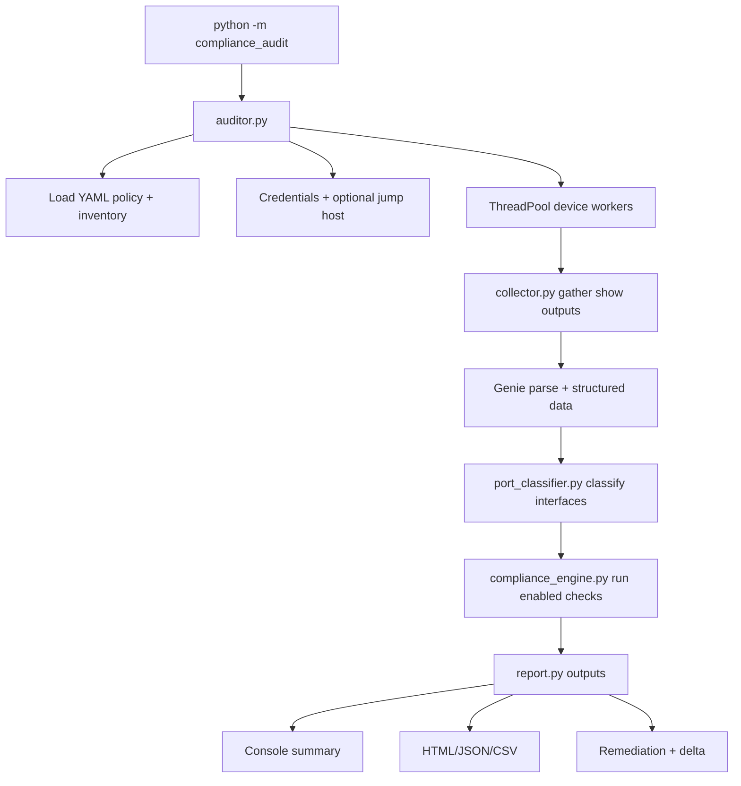

## Deep Dive: Cisco IOS-XE Compliance Audit

## "Policy-Driven Compliance, Engineered for Real Networks."

!!! info "Version Alignment"
  This deep dive reflects **Cisco IOS-XE Compliance Auditor v4.0** (March 2026) and includes the remediation lifecycle workflow (`--remediation-list`, approve/reject, apply, bulk apply) and ROI reporting features.

The **Cisco IOS-XE Compliance Audit** tool is a role-aware, policy-driven audit framework for Cisco switching and routing estates. It connects to devices (directly or through a jump host), collects operational and configuration state, classifies every interface by intent, runs 90+ toggleable compliance checks, and generates actionable reports with remediation commands.

This is one of the most comprehensive projects in the Nautomation Prime ecosystem, and this guide is intentionally thorough so your team can move from "we ran a script" to "we can defend every check and every result."

[:material-github: View Source Code on GitHub](https://github.com/Nautomation-Prime/Cisco-Compliance-Audit){ .md-button .md-button--primary }

---

## ✨ Why This Tool Matters

Most compliance scripts fail in production because they are:

- Hardcoded and brittle
- Blind to topology and role context
- Too noisy for operations teams
- Weak on remediation guidance

This auditor solves that with:

- **Policy-as-data in YAML**: Every check can be enabled or disabled
- **Role-aware logic**: Access vs core vs SD-WAN vs industrial behaviour
- **Port-intent classification**: ACCESS, TRUNK_UPLINK, TRUNK_DOWNLINK, TRUNK_ENDPOINT, UNUSED, ROUTED, and more
- **Operational output**: Rich console summaries, HTML dashboards, JSON, CSV, and per-device remediation scripts
- **Remediation lifecycle workflow**: Review packs, approvals, change-ticket linkage, expiry control, and guarded apply operations
- **Bulk operations**: `--remediation-approve-all` and `--remediation-apply-all` for scalable change windows
- **ROI reporting**: Optional estimated time/value saved in console, JSON, and HTML outputs
- **Offline mode**: Validate policies against saved command outputs without live SSH

---

## 🎯 PRIME Philosophy in Practice

### 1. Transparency Over Magic

Checks are explicit and traceable. Every finding maps to a check key in YAML and a specific evaluation path in the engine.

### 2. Hardened for Production

The auditor uses concurrent workers, optional jump-host access, fallback parsing strategies, and safe failure behaviour so one bad device does not invalidate an entire run.

### 3. Policy Before Code

Audit standards live in `compliance_config.yaml`, not hidden in Python conditionals. Teams can evolve policy without rewriting tooling.

### 4. Actionable Outcomes

A failed finding includes remediation intent, and the tool can compile per-device remediation snippets to accelerate fix cycles.

---

## 🧱 Project Architecture

```text
Cisco-Compliance-Audit/
├── compliance_audit/
│   ├── __init__.py             # Package exports + version (v4.0)
│   ├── __main__.py             # CLI entry point (python -m compliance_audit)
│   ├── auditor.py              # Orchestrator, threading, run pipeline
│   ├── collector.py            # Command collection + parsing (Genie + fallback)
│   ├── port_classifier.py      # Interface intent classification
│   ├── compliance_engine.py    # 90+ checks across policy categories
│   ├── report.py               # Rich console + HTML + JSON + CSV + delta + remediation
│   ├── credentials.py          # Keyring/env/prompt credential chain
│   ├── jump_manager.py         # Paramiko jump host channeling
│   ├── netmiko_utils.py        # Netmiko connection wrappers
│   ├── hostname_parser.py      # Role extraction from naming convention
│   ├── config_loader.py        # YAML loader and inventory resolution
│   ├── remediation_workflow.py # Review-pack lifecycle (list/approve/reject/apply)
│   ├── compliance_config.yaml  # Compliance policy and runtime settings
│   └── devices.yaml            # Inventory (can be overridden)
├── requirements.txt
├── README.md
└── LICENSE
```

### Runtime Flow



---

## 📦 Prerequisites and Platform Notes

- Python 3.10+
- SSH reachability to targets (direct or via jump host)
- Privileged access for command collection
- Dependencies from `requirements.txt`

!!! warning "Windows + PyATS/Genie"
    Native Windows is not the recommended runtime for full Genie parsing support. Use **WSL** on Windows for production runs.

Install pattern:

```bash
git clone https://github.com/Nautomation-Prime/Cisco-Compliance-Audit.git
cd Cisco-Compliance-Audit
python3 -m venv .venv
source .venv/bin/activate
pip install -r requirements.txt
```

---

## 🚀 Quick Start

```bash
# Single device
python -m compliance_audit --device GB-SITE1-001ASW001:10.1.1.1

# Entire inventory from devices.yaml
python -m compliance_audit

# Site-specific policy file
python -m compliance_audit -c configs/site_london.yaml

# Override inventory path
python -m compliance_audit -i inventories/site_london_devices.yaml

# List remediation review packs
python -m compliance_audit --remediation-list pending

# Approve all pending packs for a change ticket
python -m compliance_audit --remediation-approve-all --approver "john.doe" --ticket-id "CHG0012345"

# Dry-run apply across all approved packs
python -m compliance_audit --remediation-apply-all --apply-dry-run
```

---

## 🧭 CLI Reference (Operationally Important Flags)

```text
python -m compliance_audit [-h] [-c CONFIG] [-d DEVICE] [-i INVENTORY]
                           [--no-jump] [--categories CAT [CAT ...]]
                           [-o OUTPUT_DIR] [--fail-threshold PCT]
                           [--dry-run DIR] [--csv] [--no-csv] [-v]
                           [--remediation-list [STATUS]]
                           [--remediation-approve PACK_ID]
                           [--remediation-approve-all]
                           [--remediation-reject PACK_ID]
                           [--remediation-apply PACK_ID]
                           [--remediation-apply-all]
                           [--approver NAME] [--ticket-id ID] [--reason TEXT]
                           [--expires-hours HOURS] [--apply-dry-run]
                           [--allow-high-risk]
```

Most useful real-world options:

- `--categories management_plane control_plane` to run scoped audits
- `--dry-run ./saved_outputs` for validation in change windows and CI
- `--fail-threshold 80` for pipeline quality gates
- `--csv` / `--no-csv` for explicit report behaviour
- `--remediation-list pending` to view queued review packs
- `--remediation-approve PACK_ID --approver NAME --ticket-id CHG_ID` for approval control
- `--remediation-apply PACK_ID --apply-dry-run` before any production push
- `--remediation-apply-all` for approved bulk operations
- `-v` or `-vv` for run-time diagnostics

---

## 🆕 What's New in v4.0

Key enhancements reflected in this deep dive update:

1. **Enterprise remediation lifecycle**: Review packs are generated, tracked, and governed through approval and apply states.
2. **Ticket-aware approvals**: Optional enforcement of change ticket IDs during approvals.
3. **Risk controls**: High-risk command blocks are denied by default unless explicitly allowed.
4. **Preflight drift and identity checks**: Apply paths can verify findings still fail and target hostname matches expected identity.
5. **Bulk lifecycle operations**: Approve-all and apply-all workflows for large estates.
6. **ROI instrumentation**: Optional effort/value estimation embedded in reports.

---

## ⚙️ Configuration Model

The tool is centered around a primary YAML policy file and a separate inventory file.

### 1. Audit Settings

Examples include:

- `max_workers`
- `collect_timeout`
- `output_dir`
- `html_report`, `json_report`, `csv_report`
- `parking_vlan`, `native_vlan`

These govern runtime behaviour and report generation, not compliance logic itself.

### 2. Connection Settings

Controls transport behaviour:

- Jump-host usage
- Device type
- Credential backend mode
- Retry and timeout tuning

### 3. Inventory

Device list is maintained separately from policy, which is essential at scale.

```yaml
devices:
  - hostname: GB-SITE1-001ASW001
    ip: 10.1.1.1
  - hostname: GB-SITE1-001CSW001
    ip: 10.1.1.2
```

### 4. Classification Settings

- Hostname role-code mapping
- Endpoint-neighbor signature patterns

These values drive trunk direction inference and role-specific checks.

### 5. Compliance Policy

Every check follows the same pattern:

```yaml
some_check_name:
  enabled: true
  # check-specific parameters
```

This allows governance teams to tailor standards without code edits.

---

## 🧠 Core Engine Concepts

## 1) Structured Collection First

`collector.py` gathers key show commands and parses them into structured models (Genie preferred, with fallback behaviour when unavailable).

This provides stable inputs for compliance checks and avoids fragile single-line CLI scraping.

## 2) Parse Running Config Into Queryable Sections

The running config is transformed into:

- Global lines
- Per-interface blocks
- Per-line-config blocks (e.g., VTY/console)

This gives the engine consistent helpers for checks like "present globally" vs "present on interface".

## 3) Classify Every Interface by Intent

`port_classifier.py` combines signals from:

- STP root-port state
- CDP/LLDP neighbor identity
- Hostname role parsing
- EtherChannel mapping
- Interface config and operational metadata

Result: checks are applied to the right interfaces for the right reasons.

## 4) Execute Enabled Checks by Category

`compliance_engine.py` runs check families only when enabled:

- Management plane
- Control plane
- Data plane
- Role-specific checks

This avoids policy drift between intended standards and actual enforcement.

---

## 🧬 Code Walkthrough: Why the Implementation Looks Like This

This section is the "under the hood" explanation many engineers ask for: not just what the tool does, but why the code is structured this way.

!!! info "How to read this section"
  Snippets below are intentionally simplified to focus on the design pattern.
  They represent the production structure and decision logic used by the project.

## 1) CLI Entry Point and Exit Behaviour

The entrypoint keeps the interface thin and delegates implementation detail to the orchestrator.

```python
def main() -> None:
  parser = _build_parser()
  args = parser.parse_args()

  results = run_audit(
    config_path=args.config,
    device_overrides=args.devices,
    skip_jump=args.no_jump,
    categories=args.categories,
    output_dir=args.output_dir,
    dry_run_dir=args.dry_run,
    csv_report=args.csv_report,
    inventory_path=args.inventory,
  )

  if args.fail_threshold is not None:
    if any(r.score_pct < args.fail_threshold for r in results):
      sys.exit(1)
  elif any(r.fail_count > 0 for r in results):
    sys.exit(1)
```

### Why this design

- The CLI only parses intent and routes to `run_audit(...)`.
- Quality-gate semantics are explicit via exit codes.
- This makes the tool CI-friendly: policy violations can block merges or releases.

### Trade-off

- The process-level pass/fail is simple and strict.
- If teams need nuanced gating (for example, allow WARN but not FAIL in certain categories), that policy should be added intentionally rather than hidden in ambiguous CLI behaviour.

---

## 2) Orchestrator Pattern and Concurrency Safety

The orchestrator builds per-device jobs and executes them with a thread pool.

```python
with ThreadPoolExecutor(max_workers=max_workers) as executor:
  future_to_job = {
    executor.submit(_audit_single_device, job): job
    for job in jobs
  }
  for future in as_completed(future_to_job):
    job = future_to_job[future]
    result = future.result()
    if result is not None:
      results.append(result)
```

### Why this design

- Each device is isolated as an independent job.
- One failing device does not collapse the whole run.
- Throughput scales predictably with `max_workers`.

### Operational effect

- Large inventories complete quickly.
- Run outcomes stay deterministic enough for operations reporting.

### Trade-off

- More concurrency increases pressure on jump hosts and AAA backends.
- The tool caps workers and keeps job payloads explicit to reduce accidental overload.

---

## 3) ParsedConfig Model: Avoid Regex Chaos

Instead of scanning full running config text repeatedly, the parser creates queryable sections.

```python
@dataclass
class ParsedConfig:
  global_lines: list[str]
  interfaces: dict[str, list[str]]
  line_configs: dict[str, list[str]]

  def has_line(self, pattern: str) -> bool: ...
  def interface_has(self, intf: str, pattern: str) -> bool: ...
  def line_config_has(self, line_name: str, pattern: str) -> bool: ...
```

### Why this design

- Check code remains readable and testable.
- Management-plane, interface-plane, and line-level checks use a shared abstraction.
- Fewer parsing edge cases leak into compliance methods.

### Design decision

- The parser treats many indented non-interface lines as globally searchable lines to preserve practical matching for router, crypto, and nested blocks.

---

## 4) Signal Fusion for Port Classification

The classifier does not trust a single signal. It combines STP, CDP/LLDP, EtherChannel, and interface metadata.

```python
ports = build_from_interface_blocks(data.parsed_config)
enrich_with_show_interfaces(ports, data.interfaces)
mark_stp_root_ports(ports, data.stp)
map_cdp_neighbors(ports, data.cdp, role_config, endpoint_patterns)
map_lldp_neighbors(ports, data.lldp, role_config, endpoint_patterns)
map_etherchannel_members(ports, data.etherchannel)
assign_final_roles(ports)
```

### Why this design

- STP root-port signal is strong but not always complete.
- CDP/LLDP hostname signal adds role context.
- EtherChannel awareness avoids evaluating member links independently when policy should apply to the logical bundle.

### Failure mode prevented

- Without this fusion, trunk direction can be misclassified, which leads directly to incorrect root-guard decisions.

---

## 5) Policy-Driven Check Execution

Checks are method-based, but all enablement is policy-driven.

```python
checks = [
  ("management_plane", self._check_services),
  ("management_plane", self._check_ssh),
  ("control_plane", self._check_stp),
  ("data_plane", self._check_interfaces),
  ("role_specific", self._check_role_specific),
]

for category, fn in checks:
  if category in self.policy:
    findings.extend(fn(cfg, data, host_info, ports))
```

### Why this design

- New checks can be added without rewriting framework flow.
- Category filtering from CLI naturally maps to engine behaviour.
- Teams can disable checks in YAML without code edits.

### Trade-off

- There is intentional verbosity in check methods.
- That verbosity is a feature: explicit checks are easier to audit and safer to modify.

---

## 6) Finding Model: Standardised Audit Currency

Every check emits a normalized finding object.

```python
Finding(
  check_name="root_guard",
  status=Status.FAIL,
  detail="Gi1/0/48: root guard on uplink must be removed",
  category="data_plane",
  interface="Gi1/0/48",
  remediation="no spanning-tree guard root",
)
```

### Why this design

- A single schema powers console, HTML, CSV, JSON, and remediation generation.
- Reporting layers stay thin because they consume one consistent model.
- The remediation field converts detection into immediate action guidance.

---

## 7) Direction-Aware Guard Logic (Critical Example)

This is a signature implementation detail and a strong example of policy with topology context.

```python
if is_downlink:
  if has_root_guard:
    PASS
  else:
    FAIL("root guard missing", remediation="spanning-tree guard root")
elif is_uplink:
  if has_root_guard:
    FAIL("root guard on uplink", remediation="no spanning-tree guard root")
  else:
    PASS
else:
  if has_root_guard:
    WARN("direction unknown - verify manually")
```

### Why this design

- Security controls are not binary; they are context-dependent.
- The WARN path for unknown direction avoids false certainty.

### Operational value

- Prevents dangerous guidance that would break spanning-tree stability.

---

## 8) Native VLAN Validation with Structured-Then-Fallback Logic

The trunk native VLAN check attempts structured data first, then falls back to interface config parsing.

```python
native_vlan = None

if data.switchports:
  native_vlan = data.switchports.get(intf, {}).get("native_vlan")

if native_vlan is None:
  native_vlan = parse_native_vlan_from_interface_lines(pi.config_lines)

if native_vlan is None:
  WARN("native VLAN not determined")
elif native_vlan == expected_native:
  PASS
else:
  FAIL(f"expected {expected_native}, got {native_vlan}")
```

### Why this design

- Structured parsing gives better fidelity when available.
- Fallback logic keeps the check useful in imperfect collection conditions.

### Trade-off

- Fallback parsing is less authoritative, so uncertain states become WARN rather than hard FAIL.

---

## 9) Remediation Script Generation Strategy

The remediation builder only includes FAIL findings with remediation commands and then organizes commands by scope.

```python
fails = [f for f in findings if f.status == FAIL and f.remediation]

global_cmds, interface_cmds = split_by_scope(fails)

lines = ["configure terminal", "!"]
lines.extend(deduplicate(global_cmds))
lines.extend(render_interface_blocks(interface_cmds))
lines.extend(["end", "write memory", "!"])
```

### Why this design

- Keeps output practical for engineers during maintenance windows.
- Prevents duplicate command spam.
- Preserves interface-level context where needed.

### Important caution

- Generated snippets should still pass change control and peer review before deployment in production.

---

## 10) Delta Reporting for Continuous Compliance

The report layer compares the current JSON with the previous baseline.

```python
baseline = load_baseline(latest_previous_json)
delta = compute_delta(baseline, current_result)
save_delta_report(delta, hostname, output_dir)
print_delta_summary(delta, hostname)
```

### Why this design

- Compliance is a trend, not a one-time score.
- Delta outputs make improvements and regressions visible and measurable.

### Governance benefit

- Teams can prove that remediation work actually reduced risk over time.

---

## 11) Credential Chain and Operator Experience

Credential handling follows a strict lookup order: keyring, environment variables, then prompt.

```python
if store == "keyring":
  creds = from_keyring()
if not creds:
  creds = from_env([("SWITCH_USER", "SWITCH_PASS"), ...])
if not creds:
  creds = prompt_user()
```

### Why this design

- Supports both fully automated and interactive operations.
- Avoids hardcoded secrets in config files.
- Can become hands-free after first secure run when keyring mode is enabled.

---

## 12) Offline Mode as a First-Class Engineering Path

Dry-run mode reads command outputs from files and runs the same engine path.

```python
if dry_run_dir:
  collector = OfflineCollector(dry_run_dir)
else:
  collector = DataCollector(live_connection)

data = collector.collect(hostname, ip)
```

### Why this design

- Reduces risk in policy development.
- Enables repeatable testing and CI validation.
- Decouples standards engineering from live network access constraints.

---

## 13) Design Principles You Can Reuse in Other Automation Projects

If you are building your own automation framework, these patterns are worth copying:

- **Policy-as-data** rather than hardcoded checks
- **Normalized finding model** consumed by all report channels
- **Signal fusion** for topology-aware decisions
- **Structured-first, fallback-second parsing** for robustness
- **Delta tracking** to measure posture changes over time
- **Separation of orchestration, collection, classification, evaluation, reporting**

These are the reasons this implementation scales beyond a lab script into a platform pattern.

---

## 🔎 Line-by-Line Spotlights: 5 Critical Checks

This is the practical "show me exactly how it thinks" section.

Each spotlight below breaks down:

1. The logic path used by the check
2. Why the design decision exists
3. What operational outcome it creates

---

### Spotlight 1: Root Guard (Direction-Aware STP Safety)

```python
is_uplink = pi.role == PortRole.TRUNK_UPLINK
is_downlink = pi.role == PortRole.TRUNK_DOWNLINK

if is_downlink:
  if pi_has(pi, r"spanning-tree guard root"):
    PASS
  else:
    FAIL("root guard missing", remediation="spanning-tree guard root")
elif is_uplink:
  if pi_has(pi, r"spanning-tree guard root"):
    FAIL("root guard on UPLINK", remediation="no spanning-tree guard root")
  else:
    PASS
else:
  if pi_has(pi, r"spanning-tree guard root"):
    WARN("direction unknown - verify manually")
```

How to read this:

1. Interface role is decided first; the check never assumes all trunks are equal.
2. Downlinks are expected to enforce root guard.
3. Uplinks must not enforce root guard, because that can block valid root behaviour.
4. Unknown direction downgrades certainty to WARN.

Why this design:

1. STP controls are topology-dependent.
2. A strict but context-aware model avoids both false PASS and dangerous FAIL guidance.

Operational outcome:

1. Prevents outages caused by accidental root guard on uplinks.
2. Surfaces real risk on downlinks without over-asserting where context is incomplete.

!!! tip "Operator Checklist"
  1. Pre-check: Confirm the interface role classification (`TRUNK_UPLINK` vs `TRUNK_DOWNLINK`) from the report before changing STP guard settings.
  2. Change: Apply `spanning-tree guard root` only on validated downlinks, and remove it from validated uplinks.
  3. Post-check: Re-run the audit and verify downlinks show PASS for root guard while uplinks show PASS for no root guard.
  4. Safety check: If role remains unknown, do not enforce guard changes until topology intent is confirmed.

---

### Spotlight 2: Native VLAN Validation (Structured Data With Safe Fallback)

```python
native_vlan = None

if data.switchports:
  sw_data = data.switchports.get(intf) or data.switchports.get(pi.name)
  if isinstance(sw_data, dict):
    native_vlan = sw_data.get("native_vlan")

if native_vlan is None:
  for line in pi.config_lines:
    m = re.search(r"switchport trunk native vlan\s+(\d+)", line, re.I)
    if m:
      native_vlan = int(m.group(1))
      break

if native_vlan is None:
  WARN("native VLAN not determined")
elif native_vlan == expected_native:
  PASS
else:
  FAIL(f"native VLAN {native_vlan}, expected {expected_native}")
```

How to read this:

1. Try structured parser output first.
2. If unavailable, parse interface config lines.
3. If still unknown, emit WARN rather than hard FAIL.

Why this design:

1. Structured parser data is preferred for accuracy.
2. Fallback keeps checks useful in partial-data scenarios.
3. WARN-on-unknown prevents false confidence.

Operational outcome:

1. Better resilience during incomplete collection or parser variance.
2. Fewer noisy false negatives when evidence quality is mixed.

!!! tip "Operator Checklist"
  1. Pre-check: Verify expected native VLAN policy in YAML for uplinks, downlinks, and endpoint trunks.
  2. Change: Correct native VLAN on mismatched trunks using the defined policy value, not ad-hoc values.
  3. Post-check: Re-run the audit and ensure `trunk_native_vlan` findings move from FAIL or WARN to PASS.
  4. Hygiene check: Investigate recurring WARN states to improve parser fidelity or command coverage.

---

### Spotlight 3: DHCP Snooping Trust (Role-Based Interface Intent)

```python
trust_node = dp.get("dhcp_snooping_trust", {})
want_trust = (
  (is_uplink and trust_node.get("on_uplinks", True)) or
  (is_downlink and trust_node.get("on_downlinks", True))
)
has_trust = pi_has(pi, r"ip dhcp snooping trust")

if want_trust:
  if has_trust:
    PASS
  else:
    FAIL("DHCP snooping trust missing", remediation="ip dhcp snooping trust")
```

How to read this:

1. Policy decides where trust should exist, not hardcoded assumptions.
2. Check compares desired state against observed state.
3. Failure includes exact remediation command.

Why this design:

1. Some environments trust uplinks only; others trust specific downlinks too.
2. The model supports both without rewriting engine logic.

Operational outcome:

1. Reduces mis-scoped trust that can weaken DHCP protections.
2. Keeps policy portable across sites with different designs.

!!! tip "Operator Checklist"
  1. Pre-check: Validate trust intent in policy (`on_uplinks`, `on_downlinks`) against your DHCP relay and gateway topology.
  2. Change: Apply `ip dhcp snooping trust` only where policy indicates trust is required.
  3. Post-check: Confirm audit findings align with intended trust boundaries and no extra trusted ports remain.
  4. Risk check: Review unexpected trusted interfaces manually before closing the change.

---

### Spotlight 4: Unused Port Hardening (Defense-in-Depth by Default)

```python
if node.get("must_be_shutdown", True):
  if not pi.admin_down:
    FAIL("unused port not shutdown", remediation="shutdown")

if node.get("must_be_in_parking_vlan", True):
  if pi.access_vlan != parking:
    FAIL("unused port wrong parking VLAN", remediation=f"switchport access vlan {parking}")

if node.get("must_have_bpduguard", True):
  if not pi_has(pi, r"spanning-tree bpduguard enable"):
    FAIL("unused port missing BPDU guard", remediation="spanning-tree bpduguard enable")

if node.get("must_have_no_cdp", True):
  if not pi_has(pi, r"no cdp enable"):
    FAIL("unused port has CDP enabled", remediation="no cdp enable")
```

How to read this:

1. This is a layered control stack, not a single condition.
2. Each control is independently toggleable in policy.
3. Each miss creates a specific failure with direct corrective action.

Why this design:

1. Unused ports are frequent ingress points for misconfiguration and abuse.
2. Independent toggles let governance teams phase controls without code forks.

Operational outcome:

1. Hardens dormant edge interfaces consistently.
2. Improves auditability because every missed layer is explicit.

!!! tip "Operator Checklist"
  1. Pre-check: Confirm parking VLAN and unused-port standards for the site to avoid breaking reserved operational ports.
  2. Change: Apply shutdown, parking VLAN, BPDU guard, and CDP/LLDP restrictions in one controlled template pass.
  3. Post-check: Re-run the audit and verify all unused-port controls pass as a bundle.
  4. Exception check: Document approved exceptions in policy rather than leaving ports partially hardened.

---

### Spotlight 5: Remediation Script Builder (Actionable Output, Not Just Findings)

```python
fails = [f for f in result.findings if f.status == Status.FAIL and f.remediation]

global_cmds: list[str] = []
intf_cmds: dict[str, list[str]] = {}

for f in fails:
  if f.interface:
    intf_cmds.setdefault(f.interface, []).append(f.remediation)
  else:
    global_cmds.append(f.remediation)

lines.append("configure terminal")
lines.extend(dedup(global_cmds))
lines.extend(render_interface_blocks(intf_cmds))
lines.extend(["end", "write memory"])
```

How to read this:

1. Only FAIL findings with remediation are considered.
2. Commands are split into global and interface-scoped blocks.
3. Duplicates are removed before rendering.
4. Output is ready for controlled operational use.

Why this design:

1. Engineers need fix-ready artifacts, not just pass/fail data.
2. Scope separation avoids command ordering confusion.

Operational outcome:

1. Speeds up remediation during change windows.
2. Reduces human transcription errors from manual report reading.

!!! tip "Operator Checklist"
  1. Pre-check: Review generated remediation commands line-by-line and remove anything outside approved change scope.
  2. Change: Apply remediation in a maintenance window, preferably in staged blocks (global first, then interface blocks).
  3. Post-check: Re-run the audit immediately to verify FAIL findings were resolved and no regressions were introduced.
  4. Governance check: Attach the generated script and post-audit results to the change record for traceability.

---

### What These 5 Spotlights Demonstrate

Across all five examples, the core pattern is the same:

1. Infer context first (role, direction, evidence quality)
2. Apply policy second (enabled rules and expected states)
3. Produce an actionable finding third (clear detail + remediation)

That sequence is exactly why this auditor works well in real enterprise operations.

---

## 🔬 How Port Classification Avoids False Positives

A major challenge in network compliance is avoiding wrong conclusions on trunk links. This project handles that with a layered signal model.

### Trunk Direction Logic

Primary and secondary signals are combined:

1. STP root-port election (strong signal)
2. Neighbor role from CDP/LLDP hostname parsing (context signal)

This helps correctly label ports as:

- `TRUNK_UPLINK`
- `TRUNK_DOWNLINK`
- `TRUNK_UNKNOWN`
- `TRUNK_ENDPOINT`

### Why This Matters

Security checks are direction-sensitive. Example:

- Root guard on downlinks: expected
- Root guard on uplinks: dangerous and should fail

Without direction awareness, many "compliance" tools generate misleading guidance.

---

## 🌩️ Storm Control and STP Guard Enforcement

Two notable strengths of this auditor are speed-aware and direction-aware validations.

### Storm Control

Checks can enforce threshold behaviour based on interface speed tiers (10G/1G/100M), reducing one-size-fits-none policy mistakes.

### BPDU Guard and Root Guard Matrix

Operational intent is encoded clearly:

- BPDU guard expected on access ports
- Root guard expected on downlink trunks
- Root guard on uplinks flagged as failure
- Unknown-direction trunks may produce warn-level findings for review

This is exactly the kind of nuanced behaviour needed for enterprise-safe automation.

---

## 🛡️ Compliance Coverage by Domain

The check library spans governance domains rather than isolated commands.

### Management Plane (Examples)

- Service hardening
- SSH hardening
- AAA/TACACS/RADIUS posture
- SNMP restrictions (including public/private community handling)
- Logging/NTP standards
- Banner and local account hygiene
- VTY and console control standards

### Control Plane (Examples)

- STP global posture and priority behaviour
- VTP mode requirements
- DHCP snooping controls
- Dynamic ARP inspection controls
- UDLD / errdisable / CoPP-related controls

### Data Plane (Examples)

- Access-port hardening (portfast/BPDU guard/nonegotiate/port-security)
- Trunk policy (allowed VLAN pruning, native VLAN expectations)
- DHCP snooping trust and DAI trust by direction
- Unused-port lockdown patterns
- Routed-interface security checks

### Role-Specific (Examples)

- Core should be STP root where expected
- Access should not be root
- Access uplink redundancy via port-channel
- Additional role-bound checks for specialized topologies

---

## 🧾 Reporting and Artifacts

This project is built to support both operators and auditors.

### Console Summary

A compact score-driven table keeps terminal output readable while still surfacing pass/fail posture by device.

### JSON (Per Device)

Machine-readable artifact for downstream pipelines and baselining.

### CSV (Consolidated)

Cross-device tabular export suitable for governance dashboards, spreadsheets, and data ingest.

### HTML Reports

- Per-device interactive pages
- Consolidated dashboard for multi-device audits
- Filtering, searching, and collapsible sections

### Remediation Script Generation

For fail findings with known fixes, the tool can produce ready-to-apply IOS-XE snippets.

Important implementation detail:

- Commands are grouped globally and per-interface
- Duplicates are removed
- Port-channel members are remediated at the logical Port-channel where appropriate

---

## 📈 Baseline and Delta Tracking

The reporting pipeline can compare current results against the most recent baseline JSON for the same device.

This gives change visibility such as:

- New failures introduced
- Failures resolved
- Score movement over time

For teams running continuous compliance, this is essential for proving improvement rather than just generating snapshots.

---

## 🔐 Credential Strategy

Credential lookup order is intentionally practical:

1. OS keyring (when enabled)
2. Environment variables
3. Interactive prompt fallback

When keyring mode is active, prompted/env credentials can be written back for future non-interactive runs.

Enable-secret support is environment-driven when required for privileged workflows.

---

## 🧪 Dry-Run Mode for Safer Testing

Use `--dry-run` to validate policies against saved command outputs.

This is useful for:

- CI pipelines
- Pre-production policy tuning
- Reproducible bug reports
- Secure environments where live device access is restricted

Expected structure:

```text
saved_outputs/
  HOST_A/
    show_running-config.txt
    show_version.txt
    show_interfaces.txt
    show_etherchannel_summary.txt
    ...
```

---

## 🧩 Extending the Auditor Safely

### Add a New Global Check

1. Add a new key in the relevant YAML section with `enabled: true`
2. Implement logic in the corresponding engine method
3. Use existing helper patterns for consistency (`_present`, `_absent`, finding model)

### Add a New Per-Interface Check

1. Define policy node under `data_plane`
2. Implement in `_check_access_port`, `_check_trunk_port`, `_check_unused_port`, or `_check_routed_port`
3. Reuse interface helper matching patterns for deterministic behaviour

### Add a New Device Role

1. Extend `hostname_roles` in YAML
2. Add role-specific policy nodes
3. Add/extend logic only if simple policy toggles are insufficient

---

## 🧯 Troubleshooting Patterns

Common issues and high-confidence fixes:

- **Genie parser unavailable**: install PyATS/Genie in Linux/macOS/WSL runtime
- **No devices audited**: verify inventory path or use explicit `--device`
- **Role not parsed**: use `hostname:ip` format for stronger role inference
- **TRUNK_UNKNOWN proliferation**: verify CDP/LLDP visibility and hostname standards
- **Connection failures**: confirm SSH enablement, jump-host path, and credentials

---

## 🏁 Production Rollout Playbook

Recommended phased adoption:

1. **Start in dry-run mode** with saved outputs
2. **Run management-plane only** to validate baseline policy assumptions
3. **Enable full categories** and review false positives with operations
4. **Adopt fail thresholds** in CI/CD or pre-change validation
5. **Track deltas weekly** and measure risk reduction trendlines

---

## 📋 Runbook Summary (Change Window Ready)

Use this as a single operational workflow that combines all five spotlight controls.

Need a compact printable version?

- [Open the one-page runbook](./cisco-compliance-audit-runbook.md)

### Phase 1: Pre-Change Validation

1. Run the auditor and export current HTML, JSON, and CSV outputs.
2. Confirm interface direction classification for all trunk controls before applying STP guard changes.
3. Verify policy values for native VLAN, parking VLAN, and trust intent in YAML.
4. Identify unknown-direction or unknown-native-VLAN findings and mark them for manual review.
5. Prepare remediation script output, then review and prune to approved scope.

### Phase 2: Controlled Implementation

1. Apply root guard changes only where direction is validated.
2. Correct trunk native VLAN mismatches using policy-defined values.
3. Apply DHCP snooping trust only on policy-approved interfaces.
4. Enforce unused-port hardening as a complete bundle (shutdown, parking VLAN, BPDU guard, CDP/LLDP restrictions).
5. Execute remediation commands in staged order: global configuration first, interface blocks second.

### Phase 3: Post-Change Verification

1. Re-run the auditor immediately after changes.
2. Confirm target findings moved from FAIL or WARN to PASS.
3. Confirm no new failures were introduced in adjacent controls.
4. Review consolidated HTML dashboard for cross-device regressions.
5. Validate score movement and delta summary for each changed device.

### Phase 4: Evidence and Governance Closure

1. Attach before-and-after reports to the change record.
2. Include generated remediation script and final executed command set.
3. Document approved exceptions directly in policy, not as undocumented operational drift.
4. Schedule follow-up run to confirm controls remain stable after normal operations resume.
5. Capture lessons learned and update site-specific policy defaults.

!!! success "Fast Pass Criteria"
  1. No critical FAIL findings in changed scope.
  2. No unexpected score regressions on unaffected devices.
  3. Delta report shows resolved findings greater than or equal to new failures.
  4. Change record contains complete evidence package.

!!! note "v4.0 Operational Shift"
  In addition to command-level remediation scripts, v4.0 introduces a governed remediation lifecycle (review packs -> approval -> apply). For day-to-day operations, use the one-page runbook linked above.

---

## Final Takeaway

This project is not just a compliance checker. It is a full compliance platform pattern:

- Policy-driven
- Context-aware
- Report-rich
- Extensible
- Safe to operate at scale

If your goal is to move from ad-hoc standards checks to engineering-grade compliance automation, this is one of the strongest reference implementations currently in the Nautomation Prime portfolio.

---

> **Mission Alignment:** This deep dive reflects the **[PRIME Framework](../prime-framework/index.md)** focus on measurable outcomes, operational safety, and transparent engineering decisions that teams can sustain long-term.
