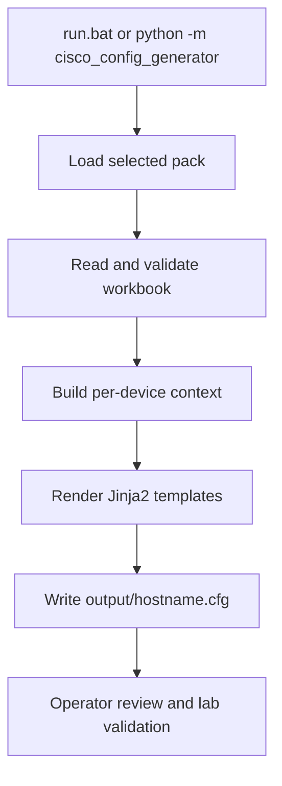
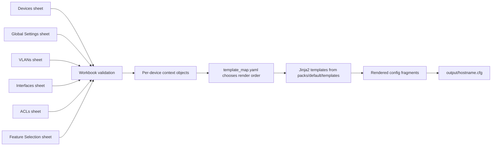

## Deep Dive: Cisco Config Generator

### "From Intent Workbook to Production-Ready Configurations."

!!! info "Version Alignment"
    This tutorial reflects the **current main branch state (May 2026)** of Cisco Config Generator and aligns with the current pack model, workbook flow, TUI experience, and headless CLI options.

The **Cisco Config Generator** turns structured Excel intent into per-device Cisco IOS-XE configuration files using a reusable Python core and Jinja2 templates. It is engineered as a repeatable delivery platform where customer-specific rules live in data and templates, not hardcoded branching logic.

If your team needs "complete transparency", this guide is built for exactly that. Every section explains:

- **What** happens
- **Why** it is designed that way
- **How** to run or verify it in practice
- **Where** to customise safely

[:material-github: View Source Code on GitHub](https://github.com/Nautomation-Prime/Cisco-Config-Generator){ .md-button .md-button--primary }

---

## ✨ Why This Tool Matters

Most configuration-generation projects become brittle because they mix customer policy directly into Python logic. Cisco Config Generator avoids that trap:

- **Intent is data** (Excel workbook)
- **Policy is data** (pack YAML)
- **Rendering is code** (stable Python + Jinja2)

This separation means you can change site standards quickly without rewriting core engine code.

---

## 🎯 PRIME Philosophy in Practice

### 1. Transparency by Design

Workbook input, template selection, and rendered output are all traceable. Nothing important is hidden behind opaque generation steps.

### 2. Hardened for Delivery

Validation happens before rendering, which reduces the chance of bad intent becoming bad production configuration.

### 3. Policy Before Python

Customer-specific behaviour belongs in packs, YAML, and templates. The engine stays stable while delivery standards evolve.

### 4. Reusable Engineering

One codebase can serve multiple estates because intent, policy, and rendering layers are cleanly separated.

---

## 🧭 Tutorial Roadmap

Follow this page in order for a practical, end-to-end understanding:

1. **Understand the architecture** and runtime flow.
2. **Run the tool once** with the sample workbook.
3. **Learn each workbook sheet** and how values map to rendered CLI.
4. **Understand packs and templates** so customisation is controlled.
5. **Use headless mode and tests** for repeatable operations.
6. **Apply troubleshooting and safety checks** before production rollout.

---

## 🔍 Transparency Contract

To align with Nautomation Prime principles, this deep dive explicitly covers:

- System boundaries and data flow
- Inputs, outputs, and transformation logic
- Operational commands that can be executed as shown
- Common failure modes and recovery paths
- Safe extension points for customer-specific behaviour

---

## 🧱 Project Architecture

```text
Cisco-Config-Generator/
├─ cisco_config_generator/   # Core Python package
│  ├─ workbook/              # Workbook parsing and validation
│  ├─ rendering/             # Jinja2 rendering and output writer
│  └─ tui/                   # Interactive Textual UI
├─ packs/                    # Customer packs (YAML + templates)
├─ scripts/                  # Utilities (e.g. workbook generation)
├─ assets/                   # Sample and generated workbooks
├─ output/                   # Generated configuration files
├─ tests/                    # pytest suite
├─ setup.bat                 # First-time setup (portable Python runtime)
└─ run.bat                   # Daily launcher
```

### Runtime Flow



### Why This Design

- **Pack isolation** keeps customer policy modular.
- **Workbook validation first** prevents half-generated outputs from bad data.
- **Per-device rendering** makes outputs deterministic and easy to review.

---

## 📦 Requirements and Installation Paths

### Standard Operator Workflow (Windows)

- Windows 10/11 (64-bit)
- Internet access for first-time setup only
- No system Python needed

```batch
:: One-time setup
setup.bat

:: Daily use
run.bat
```

### Developer Workflow (Optional)

If you prefer a normal development environment:

```bash
python -m venv .venv
.venv\Scripts\activate
pip install -e .[dev]
```

---

## 🚀 First Run Tutorial (Hands-On)

### Step 1: Run setup

```batch
setup.bat
```

What this does:

- Downloads portable Python into `python_runtime\`
- Installs dependencies inside the project folder
- Leaves system Python and global packages untouched

### Step 2: Open the sample workbook

Use `assets/sample_intent.xlsx` first.

Why: it provides a known-good reference for sheet structure and realistic values.

### Step 3: Launch the TUI

```batch
run.bat
```

In the UI:

1. Select pack (usually `default` first).
2. Select workbook path.
3. Run generation.
4. Review output summary.

### TUI Preview


Why this matters: the TUI gives operators a guided execution path, which reduces avoidable CLI mistakes during day-to-day use.

### Step 4: Verify generated files

Expected result:

- Per-device files in `output\`
- File naming pattern: `output\<hostname>.cfg`

### Rendered Output Callout

For the workbook example later in this guide, the generated artefact should conceptually look like this:

```text
output/
└── BRN1-ACC-01.cfg

! Base Configuration
hostname BRN1-ACC-01
...

! Access Port Configuration
interface GigabitEthernet1/0/10
 description Finance desk phone + PC
 switchport mode access
 switchport access vlan 20
 switchport voice vlan 30
 ...
```

The exact lines vary with workbook values, feature toggles, and selected pack, but the file-per-device pattern is stable.

### Step 5: Run headless mode (automation path)

```batch
python_runtime\python.exe -m cisco_config_generator --no-tui --workbook assets\sample_intent.xlsx
```

Why this matters: headless mode is the path for CI/CD and repeatable, non-interactive runs.

---

## ⚙️ CLI Reference and Working Examples

```text
run.bat [OPTIONS]
python_runtime\python.exe -m cisco_config_generator [OPTIONS]

Options:
  -p, --pack TEXT       Pack name (folder under packs/) or full path  [default: default]
  -w, --workbook PATH   Path to the intent workbook (.xlsx)
  -o, --output TEXT     Directory to write generated config files      [default: output]
  --no-tui              Run headless without the interactive TUI
  --version             Print version and exit
```

Examples:

```batch
:: Default pack, headless mode
python_runtime\python.exe -m cisco_config_generator --no-tui --workbook assets\sample_intent.xlsx

:: Explicit pack and output directory
python_runtime\python.exe -m cisco_config_generator --no-tui --pack default --workbook assets\sample_intent.xlsx --output output

:: Check installed version
python_runtime\python.exe -m cisco_config_generator --version
```

---

## 📘 Workbook Deep Dive (Every Sheet Explained)

The workbook is the source-of-truth input model.

| Sheet | What It Controls | Why It Exists | Common Pitfall |
| :--- | :--- | :--- | :--- |
| **Devices** | Device identity, model, uplink module, timezone metadata | Defines target inventory and hardware assumptions | Model/uplink mismatch to actual hardware |
| **Global Settings** | Shared controls (NTP, DNS, SNMP, AAA, banners, ACL refs) | Centralises site-wide standards | Referencing ACL names not defined in ACLs sheet |
| **VLANs** | VLAN IDs, names, descriptions | Builds deterministic VLAN config blocks | Missing VLAN used by interface profiles |
| **Interfaces** | Per-port intent for non-default behaviour | Keeps workbook concise while allowing exceptions | Assuming omitted interfaces are ignored (they default to unused) |
| **ACLs** | ACL statements referenced elsewhere | Keeps ACL logic structured and reusable | Invalid action/wildcard combinations |
| **Feature Selection** | Toggle config sections on/off | Allows phased adoption and scoped output | Forgetting a feature toggle is off |

### Key Behaviour: Omitted Interfaces

If an interface is not explicitly listed in the Interfaces sheet, the generator still derives full interface inventory from hardware definitions and treats omitted ports as unused/shutdown according to pack defaults.

Why this is important: you can model intent by exception instead of maintaining thousands of spreadsheet rows.

### Workbook-to-Config Mapping Flow

This is the core data path inside the tool:



Why this matters: each stage has a clear responsibility. If output is wrong, you can trace whether the problem came from workbook input, validation, context building, template selection, or the template itself.

### Worked Example: One Workbook Row to Cisco CLI

The example below uses the **current default pack** and the `interfaces_access.j2` template.

#### Example workbook inputs

**Devices sheet**

| Hostname | Model | Uplink Module |
| :--- | :--- | :--- |
| `BRN1-ACC-01` | `C9200-24P` | `C9200-NM-4X` |

**Interfaces sheet**

| Device | Interface | Profile | Description | Access VLAN | Voice VLAN |
| :--- | :--- | :--- | :--- | :--- | :--- |
| `BRN1-ACC-01` | `GigabitEthernet1/0/10` | `access-voip` | `Finance desk phone + PC` | `20` | `30` |

#### How the generator interprets it

- `Profile = access-voip` maps to `template_hint: interfaces_access` in `port_profiles.yaml`
- `interfaces_access` maps to `interfaces_access.j2` in `template_map.yaml`
- `access-voip` sets `qos_trust_dscp: true`, so the QoS line is rendered
- `Access VLAN` and `Voice VLAN` become `iface.access_vlan` and `iface.voice_vlan` in template context

#### Rendered CLI from the default template

```text
interface GigabitEthernet1/0/10
 description Finance desk phone + PC
 switchport mode access
 switchport access vlan 20
 switchport voice vlan 30
 switchport nonegotiate
 load-interval 30
 auto qos trust dscp
 storm-control broadcast level 1.00 0.70
 storm-control multicast level 1.00 0.70
 spanning-tree portfast
 spanning-tree guard root
 spanning-tree bpduguard enable
 no shutdown
```

#### Why this example is useful

It shows the exact separation of concerns:

- The **workbook** defines intent
- The **port profile** chooses behaviour class
- The **template map** chooses the render path
- The **Jinja template** emits the final IOS-XE syntax

That separation is what makes the tool explainable, testable, and safe to extend.

---

## 🔐 ACL Workflow (Transparent Path)

ACL handling is explicit and validated:

1. Define ACL entries in **ACLs** sheet.
2. Reference ACL names in **Global Settings**.
3. Generator validates that referenced ACL names exist.

Example pattern:

```text
ACL_VTY_ACCESS  permit 10.0.0.0 0.0.0.255
ACL_VTY_ACCESS  deny any
```

If ACLs are not required for a run, disable ACL rendering via **Feature Selection -> ACLs -> No**.

---

## 🧩 Pack System Deep Dive

All customer-specific behaviour lives in `packs/<name>/`.

```text
packs/default/
├─ settings.yaml          # Defaults (unused VLAN, native VLAN, log level)
├─ hardware_catalog.yaml  # Switch models and uplink modules
├─ port_profiles.yaml     # Port profile definitions
├─ template_map.yaml      # Maps profiles/features to Jinja2 templates
├─ features.yaml          # Feature toggle defaults
└─ templates/
   ├─ acls.j2
   ├─ base.j2
   ├─ vlans.j2
   ├─ interfaces_access.j2
   ├─ interfaces_access_server.j2
   ├─ interfaces_trunk.j2
   ├─ interfaces_trunk_portchannel.j2
   ├─ interfaces_trunk_server.j2
   ├─ interfaces_ap_trunk.j2
   └─ interfaces_unused.j2
```

### Safe Customer Onboarding Pattern

1. Copy `packs/default/` to `packs/<customer-name>/`.
2. Update YAML defaults and mapping files first.
3. Modify templates only where policy differs.
4. Run against sample workbook.
5. Diff output before production adoption.

Why this pattern works: it preserves a stable baseline and makes customer-specific deltas explicit in version control.

---

## 🧠 Template Context (What Templates Actually Receive)

All Jinja2 templates receive a structured context like:

```python
{
  "device": Device,
  "vlans": [VLAN],
  "interfaces": [Interface],
  "global": GlobalSettings,
  "hardware": HardwareProfile,
  "acls": [ACLEntry],
  "features": FeatureSelection,
  "settings": {"defaults": {}}
}
```

### Why This Matters

- Templates remain declarative.
- Logic stays centralised in Python validation/rendering layers.
- Outputs are predictable across engineers and environments.

---

## 🏗️ Hardware Catalogue and Port Profiles

### Hardware Catalogue

`hardware_catalog.yaml` defines supported switch models and uplink modules. This drives automatic port inventory derivation.

### Port Profiles

Profiles in `port_profiles.yaml` express intent classes such as:

- `access-user`
- `access-voip`
- `access-ap-trunk`
- `trunk-uplink`
- `trunk-uplink-portchannel`
- `unused`

Why profiles are powerful: they let teams apply standard policy repeatedly without rewriting line-by-line interface config in every workbook row.

---

## 🧪 Testing, Validation, and Quality Gates

### Run test suite

```batch
python_runtime\python.exe -m pytest tests/ -v
```

### Recommended delivery gate before deployment

1. Generate configs in headless mode.
2. Run tests.
3. Diff outputs against prior baseline.
4. Perform lab validation on representative hardware.
5. Promote to production only after peer review.

---

## 🔐 Security and Operational Safety

- Treat workbooks and generated configs as sensitive operational artefacts.
- Keep repository and output access role-scoped.
- Avoid storing secrets in workbooks where possible.
- Use controlled change windows and peer review before production push.

---

## 🛠️ Troubleshooting Guide

| Symptom | Likely Cause | Resolution |
| :--- | :--- | :--- |
| `setup.bat` fails | No internet or restricted proxy | Run from a network with package access or pre-stage dependencies |
| No output files generated | Workbook validation failed or wrong workbook path | Verify workbook path and required sheets/headers |
| Unexpected interface output | Model/uplink selection mismatch | Confirm `Devices` sheet model/uplink values |
| ACLs not rendered | Feature disabled or ACL names unresolved | Check Feature Selection and ACL name references |
| Pack not found | Wrong `--pack` value | Use folder name under `packs/` or full path |

---

## ✅ What Good Looks Like

A production-ready generation workflow should have:

- Version-controlled pack files
- Reviewed workbook changes
- Deterministic output diffs between versions
- Test and lab validation evidence
- Clear approval trail before deployment

---

## 🎓 Learning Outcomes

After completing this tutorial, an engineer should be able to:

- Explain the full intent-to-config pipeline end to end
- Build and validate workbooks confidently
- Extend packs without editing core engine logic
- Run both interactive and headless execution modes
- Troubleshoot common generation failures quickly
- Use headless mode for CI/CD pipelines and repeatable generation jobs
- Validate rendered output in a lab before production deployment

---

> **Mission Fit:** This deep dive supports the PRIME framework by showing how to turn operational intent into repeatable, governable outputs without sacrificing transparency or maintainability.
