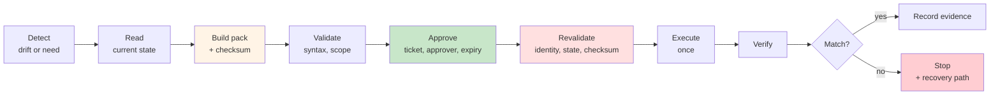

## Remediation Packs

Several pages on this site refer to "an approved, unmodified artifact" as the thing a change executes from. This page is what that artifact actually is.

The term used here is a **remediation pack**. Call it a change pack, a change record, a plan file — the name does not matter. What matters is that it exists as a *thing*, separate from the code that produced it and the code that will apply it.

---

## The Problem It Solves

Ask a team how a change is approved and you usually get a description of a conversation. Someone explains what they intend to do, a change manager agrees, and then the automation runs and does whatever it does.

The gap between those two events is the problem. What was approved was a description. What ran was a program. Nobody can prove they matched, because there was never an artifact in the middle to compare.

That gap is invisible while everything works. It becomes the whole story during an incident review, when the only honest answer to *was this change approved* is "a change like this was approved".

!!! quote "The shift"
    **You cannot approve a process. You can only approve an artifact.**

A remediation pack turns the intended change into something that can be read, reviewed, signed, stored, compared against what ran, and produced two years later when somebody asks.

---

## Where It Sits

The pack is created by a [proposal](../governed-ai-network-operations/tool-catalogue-design.md#the-four-execution-patterns) step and consumed by an execution step. Between them sit approval and revalidation.

The separation between **build** and **execute** is the design. Everything else on this page follows from refusing to let those two happen in one step.

---

## What a Pack Contains

Ten things. A pack missing any of them is a plan, not an approvable artifact.

| Element | Why it is there |
|---|---|
| **Target** | The resolved identifier, not the name someone typed |
| **Verified identity** | The expected, controller, and live evidence that this is the right device, captured at build time |
| **Current state** | What was true when the pack was built — the basis for the whole proposal |
| **Desired state** | What should be true afterwards |
| **Exact action** | The specific change, from an approved template. Not a description of a change |
| **Risk assessment** | Classification and expected impact, including who or what is affected during execution |
| **Pre-checks** | Conditions that must hold at execution time, not just at build time |
| **Verification method** | How success will be confirmed, defined before the change rather than after |
| **Rollback** | The specific recovery path for this specific change, or an explicit escalation route where none exists |
| **Integrity checksum** | Over the whole pack, so modification after approval is detectable |

Two of these are routinely left out and both matter more than they look.

**Current state** is what makes the pack reviewable by someone who was not there. An approver reading "set the native VLAN to 999" is approving an instruction. An approver reading "native VLAN is currently 1 on these four trunks; set it to 999" is approving a decision.

**Verification method, defined up front** is what stops verification from becoming whatever the engineer looked at afterwards. Deciding how you will know it worked *before* it runs is a materially different exercise from deciding once you already have the output in front of you.

---

## Immutability and the Checksum

The checksum is the cheapest control on this page and the one that does the most work.

Without it, "approved and unmodified" is an honour system. With it, a modified pack is a hard failure at execution, and the whole approval becomes meaningful — because the thing being executed is provably the thing that was signed.

Three rules:

- **The checksum covers the whole pack**, including the target and the scope. A checksum over only the configuration lines permits the same change to be redirected to a different device.
- **A modified pack is refused, not re-approved automatically.** If the change needs to be different, it is a new pack with a new approval. Editing an approved artifact is the failure mode the checksum exists to detect.
- **The checksum is verified at execution**, not at approval. Verifying it at the moment it is created proves nothing.

---

## Approval Binding

An approval that is not bound to a specific artifact is a general permission. Four bindings turn it into a specific one:

| Binding | What it prevents |
|---|---|
| **Ticket reference** | A change with no business record behind it |
| **Named approver** | Approval by a team, which is approval by nobody. Authority level should match the [risk class](./enterprise-control-matrix.md#automation-risk-classification) |
| **Expiry** | An approval from March being used in September, against a device that has changed |
| **Permitted window** | Execution outside the agreed change window, when the people who would notice are not there |

Expiry is the one teams resist, because it creates rework when a change slips. That rework is the control working. The state the pack was built against has a shelf life, and it is usually shorter than the approval process.

Between the Lines

The Stoics attached a quiet caveat to every intention — <em>fate permitting</em>. Not fatalism, and not hedging. A way of holding a plan firmly enough to act on it, and loosely enough that the world is still allowed to have changed since you made it.

An approval with an expiry date is that clause written down. It says this was the right decision on Tuesday, and Tuesday is not binding on Thursday.

---

## Revalidation Before Execution

Everything validated at build and approval time is validated again, immediately before the change runs. This looks redundant. It is not — time has passed, and each of these can have changed in the interval:

- **Identity** — is this still the same device? Hardware gets replaced, and the management address gets reused
- **Current state** — has someone already fixed it, or made it worse?
- **Checksum** — is the pack unmodified?
- **Approval** — still valid, not expired, not withdrawn?
- **Scope and window** — still in scope, still in the permitted window?

If current state no longer matches what the pack was built against, stop. The pack was a decision made about a situation that no longer exists, and executing it anyway is the most common way a well-governed change process produces a badly-targeted change.

This is the difference between a pack that is *approved* and a pack that is *still applicable*.

---

## Execution and Verification

**Execute once.** A change tool that retries on an ambiguous failure may apply the change twice. Where the outcome is unclear, verification establishes what actually happened, and retry — if appropriate at all — is a separate decision afterwards.

**Verify always.** Verification runs on success and on failure, and it has no bypass flag. The verification method was defined in the pack, so this is a comparison, not a judgement call.

**Stop on verification failure.** The device is now in a state nobody planned. Continuing to the next device in the batch multiplies an unknown, which is why [blast radius scoping](./scoping-automation-to-reduce-blast-radius.md) and this control work together — a batch that stops on first verification failure has bounded the damage to one device.

What follows a verification failure is the recovery path named in the pack. Not an improvised fix, and not a second change composed on the spot.

---

## When a Pack Is Overkill

This is R3-and-above machinery. Applying it everywhere produces governance theatre and teaches people to route around it.

**A pack is warranted when:**

- The change alters device state in production
- More than one device is affected, or one important one is
- The change needs an approval that someone may later have to justify
- An [agent](../governed-ai-network-operations/index.md) is anywhere in the chain

**A pack is not warranted when:**

- The workflow is read-only, however complex
- The change is in a lab or development environment with no production dependency
- A standard change process already provides an equivalent artifact — in which case use that, and do not build a parallel one

The test is not how risky the change feels. It is whether anyone might later need to prove what was approved.

---

## Adopting This Incrementally

The full model is a lot for a team that currently runs changes from a script and a ticket. In order:

1. **Serialise what you already compute.** Most change automation already determines current state, desired state, and the exact action. Writing that to a file before executing is a small change and gives you the artifact.
2. **Add the checksum and verify it at execution.** Two lines of code, and it converts the file from a log into a control.
3. **Bind the approval.** Ticket, approver, expiry. Your existing change record probably has the first two.
4. **Add revalidation.** Start with identity and current state; those catch the most.
5. **Make verification unskippable.** Usually the hardest, because it means removing a flag someone relies on.

Steps 1 and 2 alone move you from "a change like this was approved" to "this exact change was approved", which is most of the value.

---

## Continue the Series

- Series Index: [Production-Grade Network Automation Principles](./index.md)
- Related: [Human-in-the-Loop Automation Design](./human-in-the-loop-automation-design.md) · [Rollback Strategies](./rollback-strategies-what-works-and-what-doesnt.md) · [Separating Read and Write Phases](./separating-read-and-write-phases.md)
- Controls: [NP-CHG-02 to NP-CHG-06](../standards/control-catalogue.md#np-chg-change-control)
