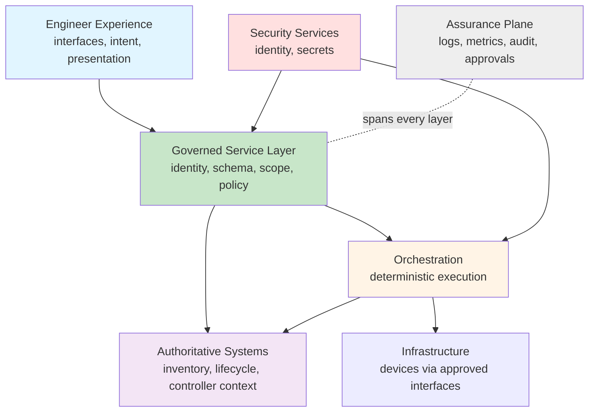

## Governed Automation Reference Architecture

Most network automation architectures are drawn backwards. Someone picks the orchestrator first, the inventory system second, and the architecture turns out to be whatever those two products do when connected together.

That works until the first product gets replaced, at which point it becomes clear there was never an architecture — only an integration. This page describes the shape underneath, in terms of **responsibilities rather than products**, so that the reasoning survives a tooling change.

!!! tip "Deliberately vendor-neutral"
    Every layer below is named for what it is accountable for, not for what you run in it. Substitute your own inventory system, controller, orchestrator, identity provider, and secret store. If a layer has no owner in your environment, that is the finding — not a reason to skip the layer.

---

## Architecture Principles

Ten principles. Each one is a constraint you can hold a design review against, which is the only useful test of an architecture principle.

| Principle | What it requires of a design |
|---|---|
| **Source of truth first** | Inventory, lifecycle, site, role, and management context resolve from an approved authoritative system — never from user input |
| **Verify before acting** | Expected, controller, and live identity are compared before any controlled action |
| **Read-only by default** | Observation is the default posture; change authority is explicit and separately granted |
| **Governed service boundary** | Capabilities are exposed as narrow services, never as unrestricted command or API execution |
| **Interface-driven** | Prefer supported structured interfaces over screen-scraping, in both directions |
| **Least privilege by phase** | Discovery, diagnostics, proposal, approval, execution, and rollback are separately authorised |
| **Fail closed** | Ambiguity, identity mismatch, missing approval, and unsupported actions produce no action |
| **Evidence as output** | Source, target, timestamp, validation, warnings, and outcome are returned, not just the answer |
| **Stateless where practical** | Critical state and secrets live outside the runtime |
| **Immutable promotion** | The same approved artifact moves through environments unchanged |

The one that generates most argument in review is **least privilege by phase**. It is worth holding: an identity that can discover, propose, approve, *and* execute is a segregation-of-duties failure wearing an architecture diagram.

---

## Logical Layers

| Layer | Responsible for | Explicitly not responsible for |
|---|---|---|
| **Engineer experience** | Translating intent, presenting evidence, explaining results | Enforcing policy, resolving targets, holding credentials |
| **Governed service layer** | Authentication, authorisation, input validation, scope, policy decisions, output normalisation, redaction, audit emission | Business orchestration, device protocol handling |
| **Orchestration** | Deterministic execution of approved workflows, sequencing, retry, idempotency | Deciding whether the caller is allowed |
| **Authoritative systems** | Inventory, lifecycle state, site and role context, controller-held operational truth | Being edited directly by automation as a side effect |
| **Security services** | User and workload identity, credential issuance and storage, rotation | Being bypassed for convenience in non-production |
| **Infrastructure** | Being the target, reached only through approved interfaces | Holding automation logic |
| **Assurance plane** | Operational logs, metrics, audit records, approvals, verification evidence | Being optional |

Two structural rules fall out of this diagram and are worth stating explicitly:

- **The engineer experience layer never talks to infrastructure.** Every path down goes through the governed service layer. That single rule is what makes the [governed AI](../governed-ai-network-operations/index.md) model possible — an agent is just one more client of the experience layer, with no privileged route around it.
- **The assurance plane spans every layer and is not a layer you pass through.** Evidence is emitted by each layer as it acts. A design where audit is generated at the end, by one component, is a design where audit can be forgotten.

---

## The Four Integration Patterns

Nearly all network automation is one of four shapes. Naming them makes design review faster, because the reviewer's first question becomes *which pattern is this* rather than *what is this*.

### 1. Inventory

Resolving what exists and what is in scope.

> Accept search criteria → resolve through source of truth → apply lifecycle and scope filters → correlate controller context → return records with their source and timestamp

The failure mode is returning results the caller did not have the right to see. Scope filtering belongs in this pattern, not in the caller.

### 2. Diagnostic

Collecting operational state without changing it.

> Resolve target → verify identity → authorise the specific diagnostic → invoke the approved adapter → normalise → redact → audit → return

The critical detail: the caller selects a **diagnostic identifier**, never a command string. The set of permitted diagnostics is knowable at build time, which means it can be an enumeration. See [Designing the Tool Catalogue](../governed-ai-network-operations/tool-catalogue-design.md).

### 3. Compliance

Evaluating observed state against an intended baseline.

> Resolve scope → read current state → read the approved baseline → evaluate deterministic policy → return findings with severity and evidence

Policy evaluation is deterministic and lives outside any model. A finding a language model produced is an opinion; a finding a rules engine produced against a versioned baseline is evidence. The [Cisco Compliance Audit](../deep-dives/cisco-compliance-audit.md) deep dive walks a real implementation of this pattern.

### 4. Controlled change

Altering state.

> Resolve → verify identity → read current state → build an immutable artifact → validate → approve → revalidate immediately before execution → execute once → verify → preserve evidence

This is the only pattern that writes, and it carries every [NP-CHG](./control-catalogue.md#np-chg-change-control) control. It is described in full in [Remediation Packs](../production-grade-network-automation-principles/remediation-packs.md).

---

## Identity and Data Flow

The architecture has to establish *who is asking* and *what they are asking about* before either question reaches infrastructure.

| Requirement | Design implication |
|---|---|
| Authenticate users and workloads separately | A workload identity is not a shared service account with a human's password |
| Map claims to actions and scope | Authorisation is a lookup against role and target scope, not a role name check in application code |
| Never pass caller credentials to devices | Device credentials are issued to the orchestration layer from the secret store, scoped to the operation |
| Establish target identity from three sources | Expected (source of truth), controller-held, and live device evidence |
| Record the decision | Allow, hold for manual review, or reject — with reasons, as an audit record |

The three-source identity check is the part teams most often reduce to two, usually dropping the live check because it costs a connection. It is also the only one of the three that can detect that the device in the rack is not the device in the database.

---

## Environment Model

| Environment | Purpose | What is different about it |
|---|---|---|
| **Development** | Engineering and unit-level validation | Non-production dependencies; no production credentials, ever |
| **Test** | Integration, security, resilience, end-to-end assurance | Production-shaped data and interfaces, non-production targets |
| **Pilot** | Tightly scoped demonstration with real users and real targets | Explicitly named users, sites, and devices; time-bounded; elevated monitoring |
| **Production** | Approved services under support, monitoring, audit, and change control | Everything this site describes applies in full |

Pilot is the one worth defining carefully, because it is where governance most often gets quietly suspended in the name of proving value. A pilot has real risk — real devices, real users — and needs real controls, narrowed scope, and an end date. A pilot without an end date is production without governance.

---

## Recording Deviations

No real environment matches a reference architecture exactly, and pretending otherwise produces a document nobody consults. What matters is that departures are **deliberate and recorded** rather than accidental and discovered.

Use an architecture decision record. Minimum contents:

- **Context** — what forced the decision
- **Options considered** — including the reference-architecture-conforming one
- **Decision** — what you chose
- **Rationale** — why, in terms someone outside the team can evaluate
- **Implications** — what this makes harder later
- **Constraints** — what must remain true for the decision to stay valid
- **Owner and review trigger** — who revisits it, and what event prompts that

A deviation with an ADR is architecture. A deviation without one is drift, and it will be rediscovered during an incident.

---

## Conformance Review

When reviewing a solution against this architecture, five questions do most of the work:

1. **Which layer holds each responsibility?** If any responsibility has no home, or two layers share one, that is the finding.
2. **Which of the four patterns is this?** If it is none of them, understand why before accepting it.
3. **Where is policy enforced?** If the answer is anywhere other than the governed service layer, the boundary has moved.
4. **What does it emit to the assurance plane, and when?** If evidence is produced only on success, the design cannot explain its own failures.
5. **What happens when identity cannot be established?** The only acceptable answer is that nothing happens.

---

## Continue

- Previous: [Python Engineering Standard](./python-engineering-standard.md)
- Standards Index: [Automation Standards](./index.md)
- Related: [Automation Control Catalogue](./control-catalogue.md) · [Governed AI for Network Operations](../governed-ai-network-operations/index.md)
