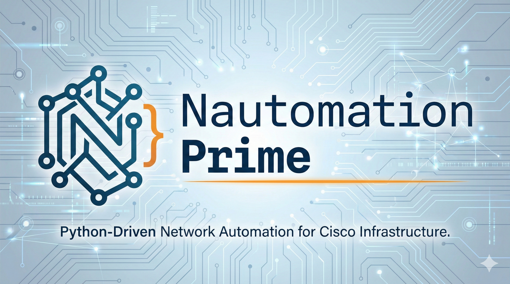

---

## Welcome

### 🚀 Enterprise-Grade Cisco Automation — Delivered Transparently, Explained Line-by-Line, Built to Last

Most network automation projects fail within 6 months. Not because the code breaks—but because nobody understands it, leadership can't prove ROI, and when requirements change, the whole thing collapses.

**Nautomation Prime is different.**

We deliver **hardened, production-ready Cisco automation** with **zero black-box code**. Every line explained. Every design decision documented. Every project structured for sustainable, measurable ROI and team empowerment.

### 🎯 The PRIME Framework

We deliver automation projects through a **proven 5-stage methodology** that ensures value, sustainability, and team empowerment:

**[Pinpoint](./prime-framework/pinpoint.md)** → **[Re-engineer](./prime-framework/re-engineer.md)** → **[Implement](./prime-framework/implement.md)** → **[Measure](./prime-framework/measure.md)** → **[Empower](./prime-framework/empower.md)**

**Why it works:**

- ✅ **[Pinpoint](./prime-framework/pinpoint.md)** high-impact opportunities (not guesswork)
- ✅ **[Re-engineer](./prime-framework/re-engineer.md)** workflows for scalability before coding
- ✅ **[Implement](./prime-framework/implement.md)** production-grade solutions with safety and testing
- ✅ **[Measure](./prime-framework/measure.md)** ROI with concrete metrics (not "it works")
- ✅ **[Empower](./prime-framework/empower.md)** your team for long-term ownership

**Typical ROI: Payback in 6–12 months, then pure savings thereafter.**

**[Learn about the PRIME Framework →](./prime-framework/index.md)** | **[Request Discovery Call](mailto:nautomationprime.f3wfe@simplelogin.com)**

---

## 🛠️ The PRIME Philosophy

Every tool and guide is built on **five core principles** that ensure your automation is transparent, measurable, owned, safe, and empowering:

1. **🔍 Transparency Over Obscurity** — Every line explained, every decision documented
2. **📊 Measurability Over Assumptions** — Data-driven decisions, proven ROI
3. **👤 Ownership Over Dependency** — Your team owns and controls the automation
4. **🛡️ Safety Over Speed** — Production-grade validation, rollback, and error handling
5. **💪 Empowerment Over "Magic Buttons"** — Understanding, not black-box automation

**[Read the complete PRIME Philosophy →](./prime-framework/philosophy.md)**

---

## 🎯 How Philosophy + Framework Work Together

**The PRIME Philosophy** defines **HOW** we build automation (our engineering values).

**The PRIME Framework** defines **WHAT** we deliver (our service methodology).

| Philosophy Principle | Framework Application |
| :--- | :--- |
| **🔍 Transparency Over Obscurity** | Implement with line-by-line documentation; Empower teams with detailed knowledge transfer so they understand every decision |
| **📊 Measurability Over Assumptions** | Pinpoint opportunities using data (not guesswork); Measure ROI with concrete metrics (not "it feels faster") |
| **👤 Ownership Over Dependency** | Empower teams to maintain and extend automation independently—no vendor lock-in |
| **🛡️ Safety Over Speed** | Re-engineer workflows with validation checkpoints; Implement with pre-flight checks, rollback mechanisms, and post-change verification |
| **💪 Empowerment Over "Magic Buttons"** | Empower teams with understanding and control, not black-box automation they can't troubleshoot |

**In practice:** The Philosophy ensures every line of code in the Framework is transparent, measurable, owned, safe, and empowering. The Framework ensures every automation project delivers measurable ROI, team capability, and sustainable value.

**[Learn more about the Philosophy →](./prime-framework/philosophy.md)** | **[Learn about the PRIME Framework →](./prime-framework/index.md)**

---

## 🧭 Choose Your Path

**First time here?** Select the path that best matches your experience and goals:

=== "🎯 Looking for Solutions"
    I have a specific network problem to solve or want production-ready tools.
    
    - **[📚 Script Library](./scripts/index.md)** — Browse available automation tools
    - **[🐳 Services](./services.md)** — Custom automation, portable bundles, Docker containers
    - **[📞 Contact Us](mailto:nautomationprime.f3wfe@simplelogin.com)** — Let's chat about your needs

=== "📖 Learning Code & Patterns"
    I want to understand how production network automation works.
    
    1. Read [**Getting Started**](./getting-started.md) (2 min overview)
    2. Pick a tutorial: [**Beginner**](./tutorials/beginner/index.md) or [**Intermediate**](./tutorials/intermediate/index.md)
    3. Deep dive into [**CDP Network Audit**](./deep-dives/cdp-audit.md) — see real production code

=== "🚀 Enterprise Automation"
    I need a structured approach to network automation for my organization.
    
    - **[PRIME Framework](./prime-framework/index.md)** — Our proven 5-stage methodology
    - **[Empower Phase](./prime-framework/empower.md)** — Building sustainable automation teams
    - **[Services](./services.md)** — Consulting and implementation

=== "👨‍💻 Improving My Python Skills"
    I know Python and want to apply it to network automation.
    
    1. Start with [**Show Command to Excel**](./tutorials/beginner/netmiko-show-command-to-excel.md) & [**Netmiko basics**](./tutorials/beginner/multi-device-show-command.md)
    2. Learn [**Nornir fundamentals**](./tutorials/intermediate/nornir-fundamentals.md) — frameworks for scale
    3. Study [**Deep Dives**](./deep-dives/index.md) for patterns (threading, configuration, error handling)

---

## 💰 Typical Investment

**Full PRIME Framework Engagement: £12,000 – £28,000**

Covers complete end-to-end delivery from opportunity discovery to team empowerment (6–12 weeks, typical).

**À La Carte Services:** Pinpoint (£2,500–£4,000) • Re-engineer (£3,000–£6,000) • Implement (£6,000–£18,000) • Measure (£2,000–£3,500) • Empower (custom)

**Timeline to ROI Payback: 6–12 months** (then pure savings thereafter)

[Get detailed pricing and options →](./services.md) | [Request Discovery Call](mailto:nautomationprime.f3wfe@simplelogin.com)

---

## 🚀 Quick Navigation

=== "Need Automation Services?"
    **[PRIME Framework](./prime-framework/index.md)** — Our proven 5-stage methodology.

    Pinpoint → Re-engineer → Implement → Measure → Empower

    [View Services](./services.md) | [Request Discovery Call](mailto:nautomationprime.f3wfe@simplelogin.com)

=== "New Here?"
    **[Get Started](./getting-started.md)** with our onboarding guide.

    Learn what Nautomation Prime offers and which path is right for you.

=== "Learn Step-by-Step"
    **[Tutorials](./tutorials/index.md)** teach practical automation skills.

    Start with [Show Command to Excel](./tutorials/beginner/netmiko-show-command-to-excel.md)—your first network automation script.

=== "Study Production Code"
    **[Technical Deep Dives](./deep-dives/index.md)** teach you the "why" behind production automation.

    Start with [CDP Network Audit](./deep-dives/cdp-audit.md)—learn threading, security, and enterprise patterns.

=== "Deploy Pre-Built Tools"
    **[Script Library](./scripts/index.md)** has production-ready automation.

    Tools are documented, hardened, and explained line-by-line.

=== "Bespoke Solutions"
    **[Services](./services.md)** covers custom automation, portable bundles, and Docker containers.

    We build automation tailored to your specific topology.

---

## What We Offer

> **Note:** This site assumes you already know Python. We don't teach Python itself — we teach you how to understand, adapt, and extend our production‑grade automation scripts. If you're new to Python, complete a fundamentals course first, then return to explore the internals of our tooling.

### 🎓 [Tutorials](./tutorials/index.md)

Step-by-step practical scripts with line-by-line explanations. Learn by building real automation tools.

**Start Here:** [Show Command to Excel](./tutorials/beginner/netmiko-show-command-to-excel.md) — Your first Netmiko script

### 📖 [Deep Dives](./deep-dives/index.md)

Detailed walkthroughs of production Python scripts. We explain the logic, the libraries, the safety checks, and the engineering decisions behind every line.

**Featured:** [CDP Network Audit Tool](./deep-dives/cdp-audit.md) — Multi-threaded topology discovery with hardened security

### 📚 [Script Library](./scripts/index.md)

Open-source, production-ready automation tools for Cisco infrastructure.

**Available:** CDP Network Audit, Access Switch Audit  
**Coming Soon:** IOS-XE Upgrade Orchestrator, Zero Touch Provisioning (ZTP)

### 🐳 [Scheduled Automation (Docker)](./services.md#scheduled-docker-containers)

Pre-built containers for continuous network oversight. Daily config audits, health checks, and automated reporting—no human intervention needed.

### 🚀 [Zero-Install Bundles](./services.md#zero-install-portable-bundles)

No Python installed? No problem. Portable, "plug-and-play" bundles run on Windows and Linux without installation or admin rights. Full source code included.

### 🛠️ [Bespoke Services](./services.md#standard-python-scripts)

Custom solutions tailored to your topology. Expert consultancy for Zero Trust deployment, bulk provisioning, ISE automation, and more.

---

##  Why Nautomation Prime?

Nautomation Prime was founded by a **CCNP-certified Senior Network Engineer** with **10+ years** in enterprise network infrastructure, Cisco technologies, and large-scale automation projects—including network upgrades across 200+ devices, NHS systems integration, and critical infrastructure hardening.

Built from **real-world experience**, not theory.

### What Makes Us Different

**❌ Most automation shops:**

- Build for one client, move on
- Leave you with code you don't understand
- Can't prove ROI
- Disappear when the project ends

**✅ Nautomation Prime:**

- **Transparent Code** — Every line explained. No black boxes. You own and understand your automation completely.
- **Proven Methodology** — The PRIME Framework is built on 10+ years of enterprise network deployments. It works because it's been battle-tested at scale.
- **Team Empowerment** — We don't just deliver code—we build your team's capability. After engagement, you own the solution and can extend it.
- **Measurable ROI** — We quantify the value: time saved, operational risk reduced, capital freed up. You get concrete metrics, not just "it's faster."
- **Production Grade** — Hardened error handling, security-focused credential management, enterprise-scale parallelization. Not hobbyist scripts.

### Real-World Outcomes We've Delivered

- **Reduced VLAN provisioning time** from 15 minutes to 30 seconds (per VLAN)
- **Automated IOS-XE upgrades** across 200+ devices with automatic rollback safety
- **Eliminated 90% of manual compliance checks** through continuous auditing
- **Removed vendor lock-in** by rebuilding legacy proprietary automation in portable Python

**[Get more details about what we've built →](./about.md)**

---

## Ready to Get Started?

- **Need Automation Services?** → [PRIME Framework](./prime-framework/index.md) for proven methodology | [Request Discovery Call](mailto:nautomationprime.f3wfe@simplelogin.com)
- **New to Nautomation Prime?** → [Getting Started Guide](./getting-started.md) for philosophy and pathways
- **Want to Learn Automation?** → [Tutorials](./tutorials/index.md) for hands-on, step-by-step learning
- **Study Production Code?** → [Technical Deep Dives](./deep-dives/index.md) for production-grade walkthroughs
- **Ready to Deploy?** → [Script Library](./scripts/index.md) or explore [Services](./services.md)
- **Have Questions?** → Check [Getting Started FAQ](./getting-started.md#frequently-asked-questions) or contact us via [email](mailto:nautomationprime.f3wfe@simplelogin.com) or [LinkedIn](https://www.linkedin.com/company/nautomationprime)

---

> **Mission:** To empower network engineers through the **[PRIME Framework](./prime-framework/index.md)**—delivering automation with measurable ROI, production-grade quality, and sustainable team capability built on the **[Prime Philosophy](./prime-framework/philosophy.md)** of transparency, reliability, and pragmatism.
