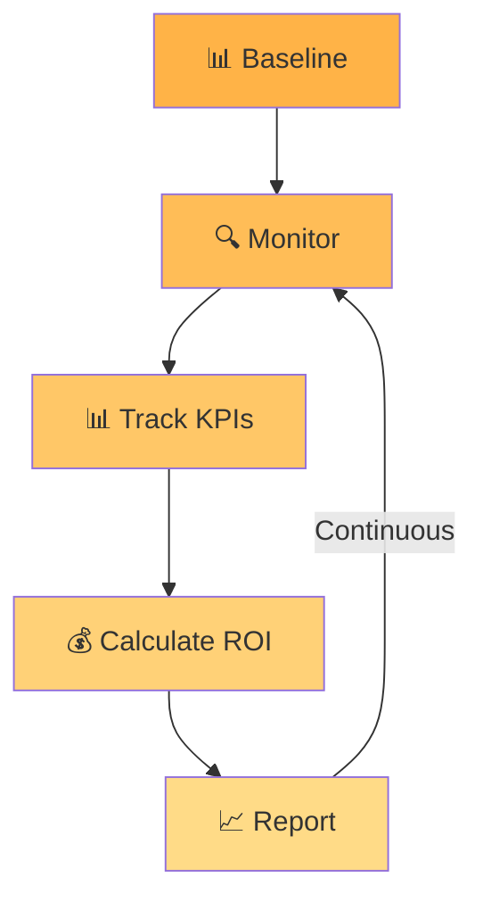

# Measure Performance

## Stage 4 of the PRIME Framework

> **"What gets measured gets improved. The Measure stage proves automation value and identifies opportunities for optimisation."**



**Prime Terminology Used:** Prime Overwatch™ monitoring, Prime Automation™ metrics

---

## 🎯 Objective

Quantify the impact of automation through systematic metrics collection, ROI tracking, and performance analysis to demonstrate value and guide future investment.

---

## 📊 What Happens During Measure

### 1. Baseline Metrics (Before Automation)

Before deploying automation, we capture baseline performance:

#### Time Metrics

| Metric | How to Measure | Example |
|:---|:---|---:|
| **Manual Task Duration** | Time study over 10 instances | 15 min/change |
| **Frequency** | Count from ticket system (90 days) | 40/month |
| **Total Annual Time** | Duration × Frequency × 12 | 120 hours/year |

#### Quality Metrics

| Metric | How to Measure | Example |
|:---|:---|---:|
| **Error Rate** | Rollbacks ÷ Total changes | 12% |
| **Rework Time** | Average time to fix failures | 45 min/failure |
| **Mean Time to Complete** | Ticket open → close | 4.2 hours |

#### Business Impact

| Metric | How to Measure | Example |
|:---|:---|---:|
| **Labor Cost** | Time × Blended rate | £6,000/year |
| **Opportunity Cost** | Blocked work value | Unknown |
| **User Impact** | Support tickets | 15 tickets/month |

**Baseline Documentation:**

```
Task: VLAN Provisioning (Pre-Automation)
─────────────────────────────────────────
Frequency:           40 changes/month
Duration:            15 minutes/change
Annual Volume:       480 changes
Annual Time:         120 hours
Error Rate:          12% (58 failures/year)
Rework Time:         43 hours/year
Total Time Cost:     163 hours/year
Financial Cost:      £8,150/year @ £50/hour
```

---

### 2. Instrumentation (During Implementation)

We build metrics collection into every automation:

#### Execution Metrics

```python
import time
import logging

def measure_execution(func):
    """Decorator to track execution time."""
    def wrapper(*args, **kwargs):
        start_time = time.time()
        logger.info(f"Starting {func.__name__}")
        
        try:
            result = func(*args, **kwargs)
            duration = time.time() - start_time
            logger.info(f"✓ {func.__name__} completed in {duration:.2f}s")
            
            # Log to metrics database/file
            record_metric(
                task=func.__name__,
                duration=duration,
                status="success",
                timestamp=datetime.now()
            )
            
            return result
            
        except Exception as e:
            duration = time.time() - start_time
            logger.error(f"✗ {func.__name__} failed after {duration:.2f}s: {e}")
            
            record_metric(
                task=func.__name__,
                duration=duration,
                status="failure",
                error=str(e),
                timestamp=datetime.now()
            )
            raise
            
    return wrapper

@measure_execution
def provision_vlan(devices, vlan_id, vlan_name):
    """VLAN provisioning with automatic metrics tracking."""
    results = []
    for device in devices:
        result = process_device(device, vlan_id, vlan_name)
        results.append(result)
    return results
```

#### Outcome Tracking

```python
def generate_execution_report(results):
    """Create detailed metrics report."""
    metrics = {
        "timestamp": datetime.now().isoformat(),
        "total_devices": len(results),
        "successful": sum(1 for r in results if r['status'] == 'success'),
        "failed": sum(1 for r in results if r['status'] == 'failure'),
        "total_duration": sum(r['duration'] for r in results),
        "average_duration": statistics.mean(r['duration'] for r in results),
        "error_types": Counter(r.get('error_type') for r in results if r['status'] == 'failure')
    }
    
    # Append to metrics log (CSV for easy analysis)
    append_to_metrics_log("vlan_provisioning_metrics.csv", metrics)
    
    return metrics
```

---

### 3. Performance Monitoring (Post-Deployment)

After automation goes live, we track:

#### Daily Task Execution

**Metrics Captured:**

- Execution count
- Success/failure rate
- Duration (total and per-device)
- Error types and frequencies
- User who triggered (if applicable)

**Sample Metrics Log:**

```csv
Date,Task,Devices,Successful,Failed,Duration_Sec,Triggered_By
2024-01-15,provision_vlan,12,12,0,47.3,jsmith
2024-01-16,provision_vlan,5,5,0,18.9,automated
2024-01-17,provision_vlan,8,7,1,41.2,mjones
2024-01-18,provision_vlan,15,14,1,63.1,jsmith
```

#### Weekly Summary Reports

Generated automatically:

```
VLAN Provisioning - Week of 2024-01-15
════════════════════════════════════════
Executions:       18 times
Total Devices:    156 devices
Success Rate:     97.4% (152/156)
Avg Duration:     38.2 seconds
Time Saved:       37.2 hours (vs 40 hours manual)
Est Labor Cost:   £660 saved vs £2,000 manual
Failures:         4 devices (3× auth timeout, 1× config rollback)
```

---

### 4. ROI Calculation

We prove value with concrete numbers:

#### Time Savings

**Manual Process (Baseline):**
```
40 changes/month × 15 min/change = 600 min/month = 10 hours/month
Annual: 10 hours/month × 12 = 120 hours/year
```

**Automated Process (Measured):**
```
40 executions/month × 0.6 min/execution = 24 min/month = 0.4 hours/month
Annual: 0.4 hours/month × 12 = 4.8 hours/year
```

**Time Saved:** 120 - 4.8 = **115.2 hours/year** (96% reduction)

#### Error Reduction

**Manual Error Rate:** 12% (58 failures/year, 43 hours rework)  
**Automated Error Rate:** 2.6% (12 failures/year, 0 rework—automatic rollback)

**Rework Hours Saved:** 43 hours/year

#### Total Financial Impact

```
Time Savings:        115.2 hours × £50/hour = £5,760
Error Reduction:     43 hours × £50/hour    = £2,150
─────────────────────────────────────────────────
Total Annual Savings:                        £7,910

Implementation Cost: £6,000 (one-time)
Payback Period:      9.1 months
Year 1 ROI:          32% (£7,910 - £6,000) / £6,000
Year 2 ROI:          132% (pure savings, no new cost)
```

---

### 5. Continuous Improvement Analysis

Metrics reveal optimisation opportunities:

#### Performance Bottlenecks

**Analysis of Execution Times:**

```
Device Connection:     22 seconds (58% of total time)
Config Application:    8 seconds (21%)
Validation:           7 seconds (18%)
Reporting:            1 second (3%)
```

**Improvement Opportunity:** Connection pooling could reduce device connection time by 60%

**Projected Impact:** 22s × 0.6 = 13.2s saved per execution  
40 executions/month × 13.2s = 528 seconds = **8.8 minutes/month**

#### Error Pattern Analysis

**Failure Analysis (90 days):**

```
Auth Timeouts:        8 occurrences (67%)
Config Rejected:      3 occurrences (25%)
Device Unreachable:   1 occurrence (8%)
```

**Root Cause Investigation:**  
Auth timeouts concentrated on IOS-XE devices during peak CPU times (backup window).

**Remediation:**  
Add pre-flight CPU check, defer if CPU >80%.

**Expected Impact:**  
Reduce auth timeout failures by 75% (8 → 2 annually).

---

### 6. Stakeholder Reporting

We create reports tailored to different audiences:

#### Executive Summary (Leadership)

**Format:** One-page dashboard

```
AUTOMATION PERFORMANCE - Q1 2024
================================

VLAN Provisioning Automation
────────────────────────────
✓ 480 changes executed (100% of volume automated)
✓ 97.5% success rate (467 successful, 13 failed)
✓ 115 hours saved vs manual process
✓ £7,910 cost avoidance
✓ ROI: 32% (Year 1), 132% (Year 2+)

Network Audit Automation
────────────────────────
✓ 12 audits completed (monthly)
✓ 600 devices per audit
✓ 30 hours saved vs manual
✓ £18,000 cost avoidance
✓ 23 security findings identified

Portfolio Summary
─────────────────
Total Time Saved:      248 hours (6.2 weeks)
Total Cost Avoidance:  £37,500
Total Investment:      £24,000
Portfolio ROI:         56% (Year 1)
```

#### Technical Report (Engineering)

**Format:** Detailed metrics with trends

- Execution time trends (weekly)
- Error rate by device platform
- Success rate by time of day
- Performance vs. SLA targets
- Failure root cause analysis
- optimisation recommendations

#### Operations Report (NetOps Team)

**Format:** Actionable insights

- Tasks automated this period
- Time saved per team member
- Errors requiring manual intervention
- Upcoming automation releases
- Feedback/enhancement requests

---

## 📊 Deliverable: Performance Dashboard & Reports

At the end of the Measure stage, you receive:

### 1. Metrics Collection System

- Python logging integrated into automations
- CSV/database for metrics storage
- Automated report generation scripts

### 2. Monthly Performance Reports

- Execution statistics
- Success/failure trends
- Time savings quantification
- ROI calculation
- Improvement recommendations

### 3. Executive Dashboards

- One-page KPI summary
- Portfolio-level ROI
- Strategic recommendations for next automations

### 4. Continuous Improvement Plan

- Identified bottlenecks
- optimisation roadmap
- Enhancement backlog

---

## 💡 Why Measure Matters

### Proves Business Value

Without measurement:

- ❌ "Automation saves time" (vague claim)
- ❌ Leadership questions investment
- ❌ Future projects harder to justify

With measurement:

- ✅ "VLAN automation saved 115 hours and £7,910 in Q1" (concrete proof)
- ✅ Leadership sees ROI
- ✅ Easier to secure budget for next automation

### Drives Improvement

Metrics reveal:

- Which automations deliver most value (prioritise similar projects)
- Where optimisation is worthwhile (focus effort)
- What's working well (replicate success patterns)

---

## 🚀 What Happens Next

After establishing measurement, proceed to [Stage 5: Empower](./empower.md) to transfer knowledge and build team capability.

---

## 📋 Measure Checklist

Ensure measurement success:

- [ ] Baseline metrics captured before automation
- [ ] Metrics collection built into automation code
- [ ] Automated report generation configured
- [ ] ROI calculation documented and validated
- [ ] Stakeholder reports tailored to audience
- [ ] Monthly review cadence established
- [ ] Continuous improvement process defined
- [ ] Success criteria for next automations defined

---

## 💼 Engagement Options

### Measurement as Part of Full PRIME Engagement

Included as Stage 4 when you engage for the complete framework. Typically ongoing over 3-6 months post-deployment.

### Standalone Measurement Service

For Organisations with existing automation needing ROI proof:

**Fixed Fee:** £2,000 - £3,500

**Includes:**

- Baseline metrics reconstruction
- Instrumentation added to existing scripts
- 3 months of performance tracking
- Executive summary report
- ROI calculation

---

## 🎓 Learn More

- **[PRIME Framework Overview](./index.md)** — See how all five stages work together
- **[Previous Stage: Implement](./implement.md)** — Building the automation we're now measuring
- **[Next Stage: Empower](./empower.md)** — Knowledge transfer and capability building
- **[Request Discovery Call](mailto:nautomationprime.f3wfe@simplelogin.com)** — Discuss your automation needs

---

> **Mission:** To empower network engineers through the **[PRIME Framework](./index.md)**—delivering automation with measurable ROI, production-grade quality, and sustainable team capability built on the **[PRIME Philosophy](./philosophy.md)** of transparency, measurability, ownership, safety, and empowerment.

---

[← Previous: Implement](./implement.md) | [Back to PRIME Framework](./index.md) | [Next: Empower →](./empower.md)
