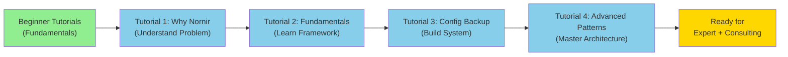

# Intermediate Tutorials: Nornir for Enterprise Scale

## "From Scripts to Systems — Scale Your Automation to Hundreds of Devices"

In the [Beginner Tutorials](../beginner/index.md), you built single-device and multi-device automation using loops. That's great for small networks, but **what happens when you have 500 devices? 5,000 devices?**

The answer is **Nornir** — a framework designed from the ground up for enterprise-scale network automation.

In these intermediate tutorials, we'll evolve your automation from sequential scripts to parallel, production-grade systems that complete in minutes instead of hours.

---

## 🎯 What You'll Learn

By completing these intermediate tutorials, you'll understand:

- ✅ Why parallelization matters and how Nornir delivers it
- ✅ Task-based architecture and reusable automation components
- ✅ Nornir's inventory system and device grouping
- ✅ Multi-device result aggregation and processing
- ✅ Error handling and resilience at enterprise scale
- ✅ Performance optimisation and benchmarking
- ✅ Credential management and security best practices
- ✅ How to architect systems for production deployment

---

## 📋 Prerequisites

### Required Knowledge
- ✅ **Completed all [Beginner Tutorials](../beginner/index.md)** — You should understand Netmiko, multi-device loops, and Python functions
- ✅ Comfortable with Python classes and object-oriented programming
- ✅ Familiar with Python dictionaries and list comprehensions
- ✅ Understanding of YAML file format (basic)

### Required Software
```bash
# Install Nornir and required plugins
pip install nornir nornir-netmiko nornir-utils netmiko pandas openpyxl pyyaml
```

### Required Access
- **Multiple Cisco devices** (5+) with:
  - SSH enabled
  - Same credentials
  - Reachable from your workstation
  - Privilege level 15 (to read running configs)

---

## 📚 Tutorial Series

### 1. [Why Nornir? — Understanding the Problem and Solution](./why-nornir.md)

**Before we build, understand WHY Nornir matters.**

Learn:
- Why loops are a bottleneck (theoretical and practical)
- Performance comparison: Sequential vs. Parallel
- The limitations of Beginner Tutorial #3 approach
- Nornir's architecture and core concepts
- When to use Nornir vs. simpler scripts

**What You'll Build:** None yet—pure understanding. But you'll benchmark your existing Beginner Tutorial #3 script and see concrete speedup numbers.

**Prerequisite:** Complete Beginner Tutorial #3 (Config Backup)

---

### 2. [Nornir Fundamentals — Write Your First Production Task](./nornir-fundamentals.md)

**Master the core concepts before tackling complex scenarios.**

Learn:
- Nornir installation and project structure
- Inventory management (YAML format)
- Task creation and the `@task` decorator
- Running tasks against devices
- Result processing and filtering
- Logging at enterprise scale

**What You'll Build:** A parallel config backup script in ~60 lines of code that's 20x faster than Beginner Tutorial #3.

**Prerequisite:** Complete Tutorial #1 above

---

### 3. [Enterprise Config Backup Deep Dive — Building a Real System](./enterprise-config-backup-nornir.md)

**Apply Nornir to the problem you already know: config backups.**

Learn:
- Advanced task composition
- Multi-step workflows (backup → validate → report)
- Database integration for backup metadata
- Change detection and compliance checking
- Complete production architecture
- Performance optimisation

**What You'll Build:** A complete enterprise backup system with timestamped backups, change detection, database logging, and compliance scoring.

**Prerequisite:** Complete Tutorial #2 above

---

### 4. [Advanced Nornir Patterns — Production-Grade Architecture](./advanced-nornir-patterns.md)

**Master the patterns used in real enterprise deployments.**

Learn:
- Custom inventory plugins
- Middleware and execution pipelines
- Advanced error handling and retry strategies
- State management across tasks
- Memory optimisation for large networks (10k+ devices)
- Multi-vendor support and platform abstraction
- Integrating with external systems (APIs, databases, message queues)
- Testing and debugging Nornir tasks

**What You'll Build:** Reusable patterns and architectures you can apply to any enterprise automation problem.

**Prerequisite:** Complete Tutorial #3 above

---

## 🔧 Setup Requirements

Before starting these tutorials:

### 1. Python Environment

```bash
# Create a virtual environment
python -m venv nornir_env
source nornir_env/bin/activate  # On Windows: nornir_env\Scripts\activate

# Install required packages
pip install nornir nornir-netmiko nornir-utils netmiko pandas openpyxl pyyaml
```

### 2. Test Devices

You'll need at least 5 Cisco devices accessible via SSH. If you don't have a lab:
- Use Cisco Devnet Always-On sandboxes (free)
- Use Cisco modeling labs (CSR1000v virtual routers)
- Use GNS3 or EVE-NG for local simulation

### 3. Project Structure

Create a directory for your Nornir projects:

```
my-nornir-project/
├── inventory/
│   ├── hosts.yaml      # Device inventory
│   ├── groups.yaml     # Device groupings
│   └── defaults.yaml   # Default settings
├── tasks/
│   └── my_tasks.py     # Your automation tasks
├── configs/            # Where backups will be stored
└── nornir_config.yaml  # Nornir configuration
```

We'll build this structure in Tutorial #2.

---

## 💡 How to Use These Tutorials

1. **Read the "Why" sections first** — Understand the problem before the solution
2. **Review complete working code** — Copy and run each script in your lab
3. **Study the line-by-line breakdown** — Learn exactly what each line does
4. **Experiment and modify** — Change parameters, try different devices
5. **Build on the patterns** — Use Tutorial #4 patterns in your own automation

---

## 🎓 Learning Path



---

## 🎯 Connection to PRIME Framework

These tutorials align with the **[Implement](../../prime-framework/implement.md)** stage of the PRIME Framework:

**Philosophy Principles:**

- **🎯 Pragmatic:** Nornir solves real problems (scale) with minimal overhead
- **🔍 Transparent:** Extensive logging and result processing for complete visibility
- **🛡️ Reliable:** Built-in error handling, result aggregation, and validation patterns

**Framework Application:**
When we move from tutorials to consulting engagements, Nornir becomes the foundation of the **Implement** stage—delivering production automation at enterprise scale.

---

## 📊 What You'll Achieve

After completing all 4 intermediate tutorials, you'll be able to:

| Capability | Before | After |
|:---|:---|:---|
| **Max devices per script** | 50 (before slowness) | 5,000+ (easily) |
| **Config backup time** | 30+ minutes | 3-5 minutes |
| **Error visibility** | Per-device try/catch | Unified result aggregation |
| **Code reusability** | One-off scripts | Composable tasks |
| **Extensibility** | Hard to modify | Plugins and middleware |
| **Enterprise readiness** | Partial (manual scaling) | Full (handles production issues) |

---

!!! success "Next Steps"
    Ready? Start with **[Tutorial #1: Why Nornir](./why-nornir.md)** to understand the problem Nornir solves.

---

## 🆘 Troubleshooting

**"I'm not sure if I'm ready for these tutorials"**

- Complete all [Beginner Tutorials](../beginner/index.md) first
- These tutorials assume you're comfortable with Python functions, loops, and basic OOP

**"I don't have 5+ devices to practice with"**

- Use Cisco Devnet Always-On labs (free, no lab equipment needed)
- Use GNS3 or EVE-NG with CSR1000v images
- Virtual labs work perfectly for learning

**"Nornir seems complex"**

- Yes, it's more complex than Beginner scripts—but the complexity is worth it
- Tutorial #1 explains WHY complexity is justified
- Each tutorial builds gradually; don't skip ahead

---

## 📖 Additional Resources

- **[Nornir Official Docs](https://nornir.readthedocs.io/)** — Authoritative reference
- **[Nornir Community](https://github.com/nornir-automation/nornir)** — GitHub repository
- **[Netmiko Documentation](https://github.com/ktbyers/netmiko)** — For device connections
- **[Network to Code Blog](https://networktocode.com/blog/)** — Real-world Nornir examples

---

## 💬 Questions or Feedback?

Found these tutorials helpful? Have questions about Nornir?

[Contact us](../../about.md#contact) — We'd love to hear how you're using Nornir!

---

[← Back to Tutorials](../index.md) | [Continue to Tutorial 1 →](./why-nornir.md)
